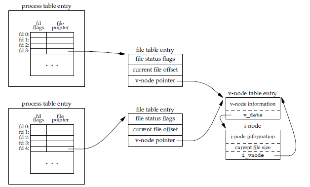

# APUEv3

重读APUE，获益良多。

## 第一章，UNIX基础知识

操作系统也是一种软件，它控制计算机硬件资源，提供程序运行环境。通常我们称之为
内核，内核提供的接口被称为系统调用公用函数库构建在系统调用接口之上，应用程序
既可以使用公用函数库也可以使用系统调用。


## 第二章，UNIX标准及其实现

- POSIX - Portable Operating System Interface 可移植操作系统接口

- Single UNIX Specification POSIX.1的超集

- `sysconf`, `pathconf`, `fpathconf` 可以打印出系统各个限制

- 基本系统数据类型如 `size_t`, `clock_t`, `ssize_t`等

## 第三章，文件I/O(unbuffered I/O)

- `STDIN_FILENO`, `STDOUT_FILENO`, `STDERR_FILENO` 在 `<unistd.h>`中定义

- open

```c
#include <fcntl.h>

int open(const char *path, int oflag, ... /* mode_t mode */)`
int openat(int fd, const char *path, int oflag, ... /* mode_t mode */)
```

> openat函数和open的区别在于，多了一个fd参数，后面的章节还有一批类似的函数，
> 将不再另外说明和列出。openat函数中：
> 1, 如果`path`参数指定的绝对路径名，将忽略`fd`参数
> 2, `path`参数指定的是相对路径名，`fd`参数将作为相对路径名的起始地址
> 3, `path`参数指定了相对路径名，`fd`参数为特殊值`AT_FDCWD`，路径从当前目录开始

open函数有很多种mode，详见APUEv3 P50。

- creat

```c
#include <fcntl.h>

int creat(const char *path, mode_t mode);
```

creat 函数只能以只写方式打开文件，相当于
`open(path, O_WRONLY | O_CREAT | O_TRUNC, mode)`

- close

```c
#include <unistd.h>

int close(int fd);
```

- lseek

```c
#include <unistd.h>

off_t lseek(int fd, off_t offset, int whence);
```

lseek执行成功时返回新的文件偏移量，其中 `whence` 可以为：

    - `SEEK_SET` 偏移量为据文件开始处offset字节
    - `SEEK_CUR` 偏移量为当前值+offset, offset可正可负
    - `SEEK_END` 偏移量为文件长度+offset, offset可正可负

- read

```c
#include <unistd.h>

ssize_t read(int fd, void *buf, size_t nbytes);
```

read成功返回读到的字节数，若到文件尾端则返回0

- write

```c
#include <unistd.h>

ssize_t write(int fd, const void *buf, size_t nbytes);
```

write函数成功时返回值通常和nbytes相同，否则表示出错。出错原因通常为磁盘已满
或者是达到了文件长度限制。

- 文件共享



- dup和dup2

```c
#include <unistd.h>

int dup(int fd);
int dup2(int fd, int fd2);
```

dup返回当前可用的最小的文件描述符，dup2返回fd2，如果fd2已打开，则先关闭再打开。
若失败则返回-1。

- sync

```c
#include <unistd.h>

int fsync(int fd);
int fdatasync(int fd);
void sync(void);
```

其中sync不等待实际写磁盘操作结束，fsync和fdatasync则会等待。

- fcntl

```c
#include <fcntl.h>

int fcntl(int fd, int cmd, ... /* int arg */);
```

fcntl 有以下五种功能，详见 APUEv3 P66：

    - 复制已有描述符(cmd=`F_DUPFD`/`F_DUPD_CLOEXEC`)
    - 获取/设置文件描述符标志(cmd=`F_GETFD`/`F_SETFD`)
    - 获取/设置文件状态标志(cmd=`F_GETFL`/`F_SETFL`)
    - 获取/设置异步I/O所有权(cmd=`F_GETOWN`/`F_SETOWN`)
    - 获取/设置记录锁(cmd=`F_GETLK`/`F_SETLK`/`F_SETLKW`)

- ioctl

io操作杂物箱
