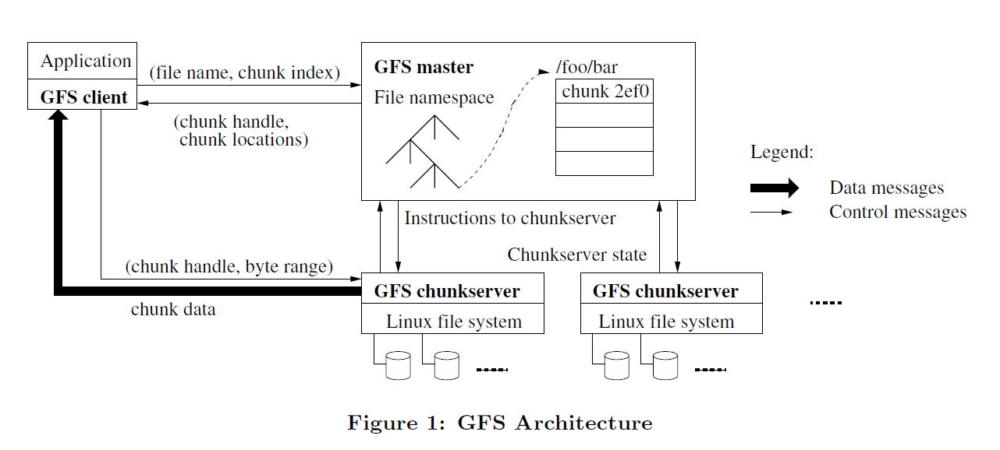

# GFS 论文阅读

- 预期背景

    - Component failures are the norm rather than the exception. So constant
    monitoring, error detection, fault tolerance, and automatic recovery must
    be integral to the system.

    - Files are huge by traditional standards. Multi-GB files are common.

    - Most files are mutated by appending new data rather than overwriting
    existing data.

    - Co-designing the applications and the file system API benefits the
    overall system by increasing our flexibility.

- Architecture

    - A GFS cluster consists of a single master and multiple chunkservers and
    is accessed by multiple client.

    - Files are divided into fixed-size chunks. Each chunk is identified by an
    immutable and globally unique 64 bit chunk handle assigned by the master
    at the time of chunk creation. Chunkservers store chunks on local disks as
    Linux files and read or write chunk data specified by a chunk handle and
    byte range. Each chunk is replicated on multiple chunkservers.

    - The master maintains all file system metadata. This includes the
    namespace, access control infomation, the mapping from files to chunks,
    and the current locations of chunks. It also controls system-wide activities
    such as chunk lease management, garbage collection of orphaned chunks, and
    chunk migration between chunkservers.

    - Neither the client nor the chunkserver caches file data.

        - for client, that's too big
        - for chunkserver, Linux's buffer cache already do this

- Single master, to prevent the single master become a bottleneck, clients
never read and write file data through the master, instead, a client asks the
master which chunkservers it should contact, and it caches this infomation
for a limited time and interacts with the chunkservers directly for many
subsequent operations.

- Chunk Size

A large chunk size offers serveral important advantages.

    - Reduces clients' need to interact with the master

    - A client is more likely to perform many operations on a given
    chunk, it can reduce network overhead by keeping a persistent TCP
    connection to the chunkserver over an extended period of time.

    - Reduces the size of the metadata stored on the master.

and it's disadvantage:

    - A small file consists of a small number of chunks, perhaps just one, so
    it is more likely to become hot spots.

- Metadata

The master stores three major types of metadata:

    - The file and chunk namespaces

    - The mapping from files to chunks

    - The locations of each chunk's replicas

All metadata is kept in the master's memory. And the first two types(namespaces
and the mapping from files to chunks) are also kept persistent by logging
mutations to an operation log stored on the master's local disk and replicated
on remote machines. Chunkserver store chunk location infomation, and the master
asks every chunkserver for chunk location infomation.

    - Chunk Locations. The master does not keep a persistent record of which
    chunkservers have a replica of a given chunk, it can keep itself up-to-date
    by monitor chunkserver status with regular HeartBeat messages.

    - The operation log contains a historical record of critical metadata
    changes. So it is central to GFS. Also, it's been kept both in local disk
    and remote, and the file size should be small.

- Chunk replicas

Chunk replicas are created for three reasons: chunk creation, re-replication,
and rebalancing.
