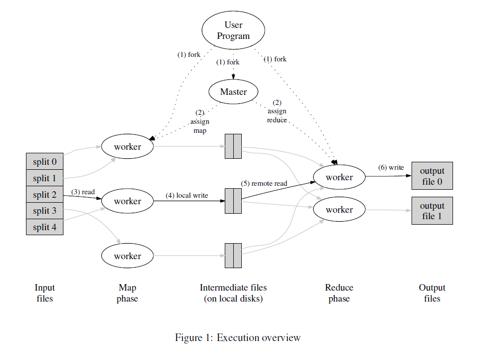

# MapReduce

> MIT 6.824

## 论文阅读笔记

- Users specify a map function that processes a key/value pair to generate a
set of intermediate key/value pairs, and a reduce function that merges all
intermediate values associated with the same intermediate key.

    - Map接受用户输入然后产生一系列的键值对。`key1, key2, key3, key2`

    - MapReduce库将Map产生的键值对根据Key进行分组，然后传给Reduce。`key1:1, key2:1, key3:1, key2:1`

    - Reduce接受键值对，然后产生一个更小的键值对。`key1:1, key2:2, key3:1`

- MapReduce启发自Lisp的map和reduce。在Haskell中的对应示例为：

```haskell
Prelude> map (+1) [1..10]
[2,3,4,5,6,7,8,9,10,11]
Prelude> foldl (+) 0 [1..10]
55
Prelude>
```

- 试图通过MapReduce这个库让没有分布式开发经验的程序员也能利用分布式集群的
性能。MapReduce这个库需要提程序员解决的问题包括但不限于：

    - 分拆输入数据

    - 任务调度和数据分发

    - 管理机器间通信

    - 容错性

    - 负载均衡

    - etc...

- 流程概览



    1. MapReduce先把数据分拆成16-64M之间的大小，然后fork自身，成为worker和master

    2. master将会分配任务给worker们

    3. 被分配执行map任务的程序读取被切割的文件块。调用用户的map函数，将其产生的
    键值对存在内存里

    4. 内存中的键值对会被持久化到硬盘上。然后将路径返回给master。

    5. master将路径告知给执行reduce任务的程序，根据key将上一个环节的键值对排序
    （因为数据量可能非常大以至于不能全部放在内存里）

    6. 执行reduce任务的程序遍历排序后的键值对然后调用用户的reduce函数。将其返回值
    追加到最终文件中。所以最终会产生n个输出文件，n为用户指定的reduce任务的数量。

    7. 所有任务完成后，MapReduce返回，然后开始执行用户的其他代码。

- 容错性

    - worker failure: The master pings every worker periodically. If no response
    is received from a worker in a certain amount of time, the master marks the
    worker as failed. Any map task or reduce task in progress on a failed
    worker is also reset to idle and becomes eligible for rescheduling.

    - master failure: It is easy to make the master write periodic checkpoints
    of the master data structures described above. If the master task dies, a
    new copy can be started from the last checkpointed state.（不过此论文发布时
    采用了简单的实现，即如果master失败，直接终止执行）

## Lab

- Part I: 正确实现 `doMap` 和 `doReduce`。根据figure1里的描述写代码，基本就不会错。
我在这里遇到的坑是没有仔细读论文，以为所有reduce函数公用一个输出文件。此处核心代码
为：

```go
// doMap
for _, kv := range mapF(inFile, string(contents)) {
    i := ihash(kv.Key) % nReduce
    encs[i].Encode(&kv)
}

// doReduce
mergeFileName := mergeName(jobName, reduceTaskNumber)
mergeFile, err := os.Create(mergeFileName)
```

- Part II：统计单词。只要跟着描述来就行。仔细读一下给出的Hint和go的文档。

- Part III：更改schedule.go。这里我花了点时间，因为大坑在于，我没想到在这一步
就要开始处理错误，还以为是在下一步呢，直到调试的时候看log，总是说没有reduce
的输出文件。然后果断给RPC调用加了个重试机制---死循环。然后就通过测试了。

```go
for {
    if call(worker, "Worker.DoTask", doTaskArgs, nil) {
        wg.Done()
        break
    } 
}
```

- Part IV：处理worker出错。处理方式为如果worker失败，就把任务分配给其他worker执行，
所以也就是在上面的代码小改一下：

```go
for {
    if call(worker, "Worker.DoTask", doTaskArgs, nil) {
        wg.Done()
        break
    } else {
        worker = <-registerChan
    }
}
```

- Part V：统计单词出现的文件名。这个其实应该就是考是不是对MR真正的掌握了吧。
思路就是生成键值对的时候，单词为key，文件名为value然后进行MR。

--------

总结：好玩儿！
