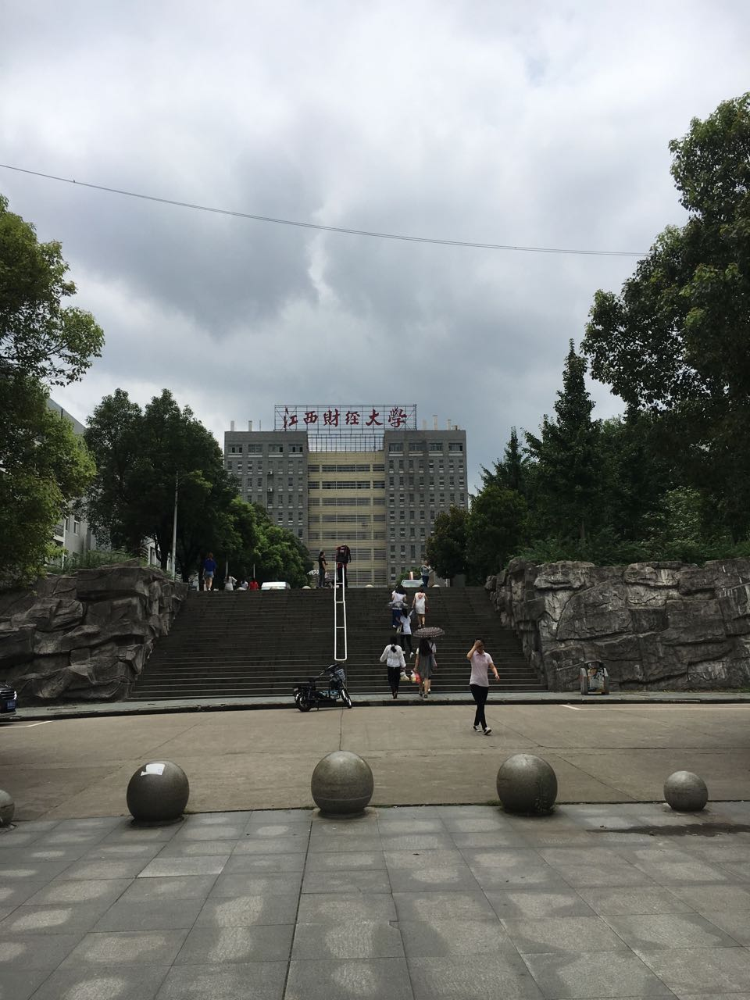

# 毕业后一年

去年的这个点，约莫我已经打包回家了。记得我是倒数第二个走的，帮室友搬着东西，目送
他们回家，心里还是有点不是滋味的，毕竟这两个鸡崽子原本说好了在我后面的才回家的，tmd。

晃眼一年就过去了，不知道周哥是否成了煤老板，谢尼玛是否当上了高官，王尼玛在澳大利亚
有没有被扔鸡蛋。回首过去的时候总是觉得时间飞快。我们都在花儿一样的年纪，走向了不同
方向的道路，我非常希望我们都能在各自的道路上走的一帆风顺，也大放异彩。
