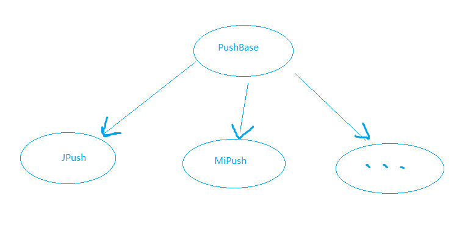
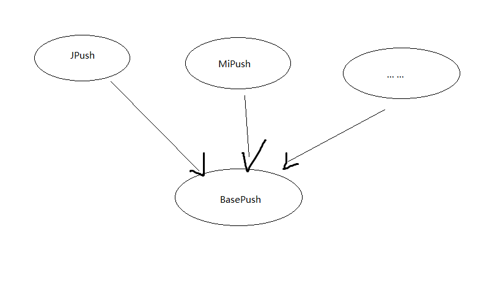

# Haskell简明教程（二）：从命令式语言进行抽象

> 这一系列是我学习 `Learn You a Haskell For Great Good` 之后，总结，编写的学习笔记。

这个系列主要分为五个部分：

- [从递归说起](./2017_09_11-learn_you_a_haskell_part_1.md.html)
- [从命令式语言进行抽象](#)
- [Haskell初步：语法](./2017_09_18-learn_you_a_haskell_part_3.md.html)
- [Haskell进阶：Monoid, Applicative, Monad](./2017_09_25-learn_you_a_haskell_part_4.md.html)
- [实战：Haskell和JSON](./2017_09_26-learn_you_a_haskell_part_5.md.html)

## 从移动端推送看什么是抽象以及如何抽象

这一篇我们讲要讲述一个实际的开发案例。在移动互联网时代，iOS家有APNs推送技术一统天下，
Android有GCM，只不过在国内几乎都被国产厂商给阉割了。于是乎国内的Android推送服务
百花齐放，系统厂商提供的有华为，小米等，第三方提供的有极光，个推等。今天我们就讲讲如何
同时接入极光和小米的推送，从实际业务中看看如何进行抽象。

在建模过程中我们可以想象到，这是一个很好的应用面向对象思维的案例，首先推送服务
都需要提供这样几个功能：

- 按 `push_id` 发推送
- 按 `tag(标签，第三方提供的便利的群发推送方式)` 发推送
- 根据 `push_id` 更新其所属tag
- 根据 `push_id` 查询所属tag

于是我们可以写出这样一个基类：

```python
import abc

import requests


class AbstractPush(metaclass=abc.ABCMeta):
    @abc.abstractmethod
    def push_by_push_id(self, push_id_list):
        pass

    @abc.abstractmethod
    def push_by_tag(self, tag_list):
        pass

    @abc.abstractmethod
    def update_tag(self, push_id, add_tag_list, remove_tag_list):
        pass

    @abc.abstractmethod
    def query_tag(self, push_id):
        pass
```

所有的子类都必须实现这些方法，例如我们有极光推送：

```python
# jpusn.py

from .base import AbstractPush


class JPush(AbstractPush):
    def push_by_push_id(self, push_id_list):
        pass

    def push_by_tag(self, tag_list):
        pass

    def update_tag(self, push_id, add_tag_list, remove_tag_list):
        pass

    def query_tag(self, push_id):
        pass
```

和小米推送：

```python
# mipusn.py

from .base import AbstractPush


class MiPush(AbstractPush):
    def push_by_push_id(self, push_id_list):
        pass

    def push_by_tag(self, tag_list):
        pass

    def update_tag(self, push_id, add_tag_list, remove_tag_list):
        pass

    def query_tag(self, push_id):
        pass
```

所以上面的代码实际上是这样的一种关系：



我们使用的时候就可以分别实例化不同的推送对象，然后调用对应的方法。
例如：`MiPush().push_by_push_id("the_given_mi_push_id")`。

这就是经典的面向对象的思维。

如果我们反过来呢看看呢？我们已知所有的推送都实现了以上的方法，但是实际上我们
根本不需要知道它具体是什么推送，只需要知道它实现了这个方法就行。其实就是我们
常说的桥接模式，看一下
[维基百科](https://zh.wikipedia.org/wiki/%E6%A9%8B%E6%8E%A5%E6%A8%A1%E5%BC%8F)
的解释。

那么就会变成这样一种关系：



这是基于一种什么样的想法呢？我们假设每种推送都是一个黑盒子，没个黑盒子上都有四个洞
ABCD，不论是哪个黑盒子，从同一个编号的洞里丢东西进去，总是会从另一个固定的洞里出来。
就好象：`A->C`，`B->C` 这样。这就是传说中的抽象。在Haskell中我们将会大量运用这种
能力。

其实我们在日常的编程中已经用到了这种能力，在Java中我们称之为接口(`interface`)。
Golang中也是，Python中虽然没有明确的接口的概念，但是通过上面的示例代码我们便可以
够造出这种抽象，在C中我们往往通过函数指针和结构体指针来达到这种效果。

我们把上述的代码用Go来描述，就当作是我们的总结。

```go
type Push interface {
    push_by_push_id(push_id_list []string)
    push_by_tag(tag_list []string)
    update_tag(push_id string, add_tag_list []string, remove_tag_list []string)
    query_tag(push_id string)
}
```

抽象是软件开发中的一把利器，编程其实就是一个将复杂的任务拆解成无数个小任务，然后各个击破
的过程。而抽象则是将无数个小任务的共同点找出来，然后一箭n雕的一种能力。

这一篇其实是 https://jiajunhuang.com/articles/2017_08_12-tcp_ip.md.html 第一节
"为什么要分层" 的一个更详细的重复，但是抽象这么重要的能力，就算再多重申一百遍都
不为过。

## 总结

通过这一篇文章，我们从一个实际生产的案例看到了如何进行抽象，以及抽象和面向对象
过程的一些微小而又巨大的差异。接下来我们将从命令式语言跳到Haskell的具体语法，
看看在Haskell中，是否也有我们所谓的抽象和接口这些概念。
