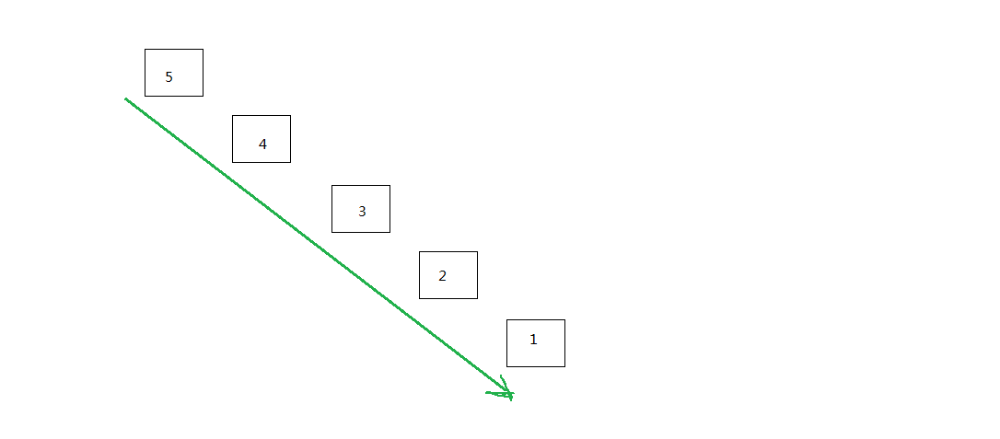
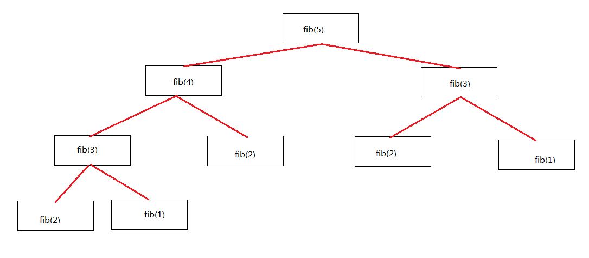
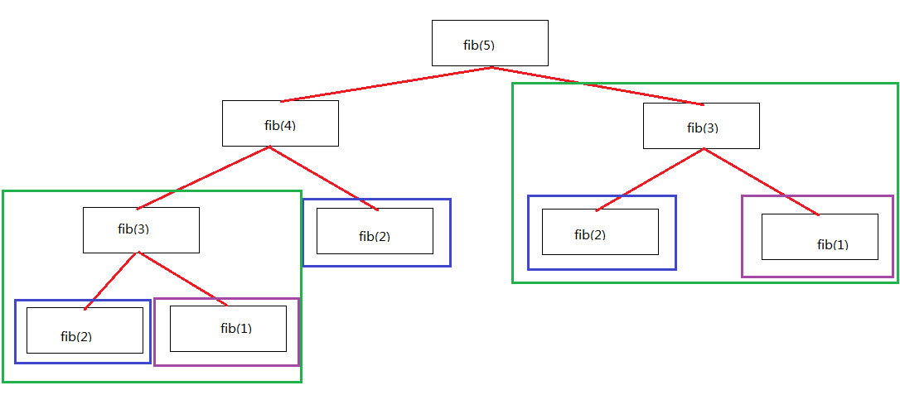

# 动态规划民科教程

> 这是我本人近段时间学习和练习动态规划的总结，因为本人不是练过ACM的，所以自称民科。文章末尾是一些有用的引用。

动态规划(Dynamic Programming)[^1]，一听就是一个高大上的词语，我们先来看看维基百科是怎么说的：

```
动态规划（英语：Dynamic programming，简称DP）是一种在数学、管理科学、计算机科学、经济学和生物信息学中使用的，
通过把原问题分解为相对简单的子问题的方式求解复杂问题的方法。

动态规划常常适用于有重叠子问题和最优子结构性质的问题，动态规划方法所耗时间往往远少于朴素解法。

动态规划背后的基本思想非常简单。大致上，若要解一个给定问题，我们需要解其不同部分（即子问题），再合并子问题的解以得出
原问题的解。

通常许多子问题非常相似，为此动态规划法试图仅仅解决每个子问题一次，从而减少计算量：一旦某个给定子问题的解已经算出，
则将其记忆化存储，以便下次需要同一个子问题解之时直接查表。这种做法在重复子问题的数目关于输入的规模呈指数增长时特别有用。
```

总结一下，动态规划是：

- 一类问题的解法的总称，而不是某个具体算法的名称
- 通过将原问题分解成子问题，并且记忆子问题的解，从而解出原问题

将一个问题分解成子问题，然后解决子问题并且记住结果，从而解决原问题。我们先忽略记住子问题的结果这一部分，这句话就变成
了："将一个问题分解成子问题，然后解决子问题，从而解决原问题。"。是不是感觉似曾相识？在归并排序中，我们就曾经用过这样
的手法，先将数组无限划分，一直到只剩下一个元素，然后逐层往上归并。我们就是这样把原问题划分成子问题，然后解决子问题，
最后原问题也得以解决的。

而这里，我们用到了一个非常有助于抽象的工具，那就是递归。

## 递归

确切的来说，只要自身调用自身，就可以称之为递归，但是本文中所说的递归，都是有把问题划分成子问题，然后调用自身的。
比如，打印一个列表，我们可以这样递归的打印：

```python
def print_list(alist):
    if len(alist) == 0:
        return

    print(alist[0])

    print_list(alist[1:])


if __name__ == "__main__":
    print_list([5, 4, 3, 2, 1])
```

我们先来看看上面的程序是怎么工作的，首先，我们检查基本情况，那就是列表是空的，那么我们无需打印什么，直接退出。否则，
我们把列表分割成两份，一个 item，和一个列表，例如 `[5, 4, 3, 2, 1]` 就可以分割成 `5` 和 `[4, 3, 2, 1]`，打印5之后，
我们再调用当前执行的这个函数自身，并且把 `[4, 3, 2, 1]` 作为参数，于是最后，就打印出了 `5 4 3 2 1`。把上面的函数调用
画出来，就是这样：



通过逐次减小问题的规模，最终我们解决了原问题。

## 暴力递归

接下来我们看另外一个比较经典的问题：斐波那契数列[^2]
我们要求斐波那契数列中的第n位。经典的定义是：

```haskell
fib :: Int -> Int
fib 1 = 1
fib 2 = 1
fib n = (+) (fib $ n - 1) (fib $ n - 2)
```

我们把计算 `fib(5)` 的所有计算和递归所产生的子问题画出来：



## 记忆化

如果仔细观察，我们会发现，上图的fibbnacci其实包含了很多重复计算，如下图所示：



那如果我们通过把已经计算过的结果存储下来，每次计算先检查是否已经计算过，从而消除重复计算，速度会不会快很多呢？答案是会。
看下面的跑分：

```python
In [1]: def fib1(n):
   ...:     if n in (1, 2):
   ...:         return 1
   ...:     return fib1(n - 1) + fib1(n - 2)
   ...: 

In [2]: %timeit fib1(20)
1.89 ms ± 39.2 µs per loop (mean ± std. dev. of 7 runs, 1000 loops each)

In [3]: cache = {1: 1, 2: 1}

In [4]: def fib2(n):
   ...:     if n in cache:
   ...:         return cache[n]
   ...:     cache[n] = fib2(n - 1) + fib2(n - 2)
   ...:     return cache[n]
   ...: 

In [5]: %timeit fib2(20)
181 ns ± 4.17 ns per loop (mean ± std. dev. of 7 runs, 10000000 loops each)
```

1.89ms 大概是 181ns 的10441倍！

告诉你一个不幸的消息，这就是动态规划。没错，就这么简单，这就是动态规划，还记得我们上面说过的吗？定义子问题，我们做到了
，fibnacci原生的定义就已经告诉了我们子问题是什么。解决子问题并且记住子问题的解，我们做到了，每次计算出结果后，先存到
cache里，然后才返回。最终解决原问题。

嗯，递归，总感觉有点跳，是的，为什么突然原问题就被解决了呢？要理解递归，需要一段时间，也许要仔细的思考。接下来我们看一
些真实的例子，让我们的思维从迭代跳到递归。

### 递归的思考

递归这种技巧非常的巧妙，就好象我们从山顶看到山脚一样的感觉，通常我们称之为 "top-down"，自顶向下。我们举几个常见的东西，
然后我们用递归的方式把他们分解：

- 字符串可以看作是左边一个字符，加右边一个字符串，比如 "hello" 可以是 'h' + "ello"，而递归下去，"ello" = 'e' + "llo" ...
- 字符串可以看作是左边的一个字符串，加右边一个字符，比如 "hello" 可以是 "hell" + 'o'，而递归下去，"hell" = "hel" + 'l'...
- 字符串也可以看作是两个字符串拼接而成，通常我们会按照一定比例，比如1:1，那么 "hello" 就可以看作是 "he" + "llo"，递归下去，
    "he" = 'h' + 'e', "llo" = 'l' + "lo"...
- 链表我们可以看作是一个元素，加一个链表
- 树我们可以看作是一个顶点，加两棵树
- 森林我们可以看作是一棵树，加无数棵树
- ...

解决了子问题，原问题就自然而然的得以解决，这叫递归跳跃。 更多可以参考 C程序设计的抽象思维[^5]，这本书很好的介绍了递归，
以及我们所需要克服的递归跳跃。

## bottom-up

终于我们克服了递归跳跃，已经可以很自然的理解递归的思维了。不过，仔细想想，如果我们反其道而行之，从底层逐次拼接，自底
向上的思考会怎样呢？两个字符串可以拼接成一个字符串，一个字母和一个字符串也可以拼接成一个新的字符串。。。

我们试着这样想想fibnacci，由数列我们可以推出规律，两个相邻的数列之和，就是下一个数字的值，那我们把它写成程序，就是这样的：

```python
In [1]: def fib3(n):
   ...:     left, right = 1, 1
   ...:     for i in range(2, n):
   ...:         left, right = right, left + right
   ...:     return right
   ...: 

In [2]: %timeit fib3(20)
1.1 µs ± 56.6 ns per loop (mean ± std. dev. of 7 runs, 1000000 loops each)
```

我个人更习惯，更容易想到的是 "top-down" 的形式，不过我的朋友更习惯，更容易想到的是 "bottom-up" 的形式，所以这可能是
不同的人的思维习惯造成的差异吧，我觉得各位喜欢就好，不过通常后者效率更高，因为递归不断的调用函数是有一定开销的，通常
如果想优化，可以把 "top-down" 改造成 "bottom-up"。

## 解题步骤

接下来我们框定一下解题步骤，或者说总结一下上面我们解题的思路：

- 定义子问题：前缀型(比如"hello"分解为'h' + "ello")，后缀型(比如"hello"分解为"hell" + 'o')还是子序列型(比如"hello"分解为
  "he"和"llo")？
- 猜测其中最可能的一种
- 开始对2进行尝试
- 递归计算并且保存结果
- 原问题得到解决，或者方法行不通，则跳到2尝试另一种

上面的介绍中，我们的思路似乎一气呵成，但是实际解题中，我们的想法可能会有很多种，而有可能很多种都是动态规划并且都能得出
结果，所以这里我们进行一些解题步骤的框定。其中最重要的步骤就是第二步，猜测。而且我们需要不停的猜测，如果这一种不行，
那么就试试下一种，很多时候，直觉就会告诉我们会是哪种形式，然而拥有直觉的前提就是做足够多的题目，深刻理解题目，那么下次
遇到相似问题的时候，你的直觉就会冒出来了。

## 思路讲解

接下来我们介绍几道经典的动态规划问题。我只写出我的思路，代码就不贴了，因为就算你看懂了代码也无济于事，最重要的是理解
思路。

### 最大连续子数组和

输入一个整型数组，数组里有正数也有负数。数组中一个或连续的多个整数组成一个子数组。求所有子数组的和的最大值。

- 对于数组中的每一个元素，要么是某个数组中的一员，要么是某个数组中的起点，我们选择更大的那个，便是答案。

### 编辑距离/最长公共子序列

> https://leetcode.com/problems/edit-distance/description/

对于两个字符串，把其中一个变成另外一个最少需要用多少步骤？

- 例如对于字符串 "hello" 和 "el"，我们要怎么把一个变成另外一个呢？假设他们代号分别为a, b。i表示当前坐标。

    - 如果两个字符串的首字母相同，那么我们继续考虑两个字符串的其他部分就可以，即考虑a[i + 1:]和b[i + 1:]
    - 如果不同，那么考虑较长字符串的下一个和较短字符串的当前情况，即考虑a[i + 1:]和b[i:]，或者是a[i:]和b[i + 1:]，我们选取
    这两者中较长的那个，便是编辑步骤较少的那个 

### 0-1背包问题

我们有一个背包，容量为S，有一堆宝石，每个的价值为W[i]，体积为S[i]。求怎么在有限的背包容量带走最高价值的宝石？

- 对于每一个宝石，我们可以选择拿，或者不拿。但是，分为很多种情况：

    - 没有宝石
    - 背包容量为0
    - 装不下当前宝石
    - 当前宝石，我们可以选择拿，或者不拿

- 也许问题属于前缀型，我们从第一个宝石开始考虑，除去上面列出来的第一第二个是基本条件外，第三个，如果装不下，那么就
看下一个。第四个，如果装得下，那么我们选择拿或者不拿中，较大的那一个结果。

### 爬楼梯

> https://leetcode.com/problems/min-cost-climbing-stairs/description/

问题的定义是我们爬楼梯，每一步都会有代价，例如第i步代价为 `cost[i]`，你可以从第0个台阶爬起，也可以从第一个台阶爬起，同时，
每次你可以跳一步，也可以跳两步。求爬完楼梯的最小代价是多少。

- 我的想法是从最后一步开始考虑，这样问题就变成了最后一步，加上除去最后一步之外，前面改怎么跳
- 也许问题属于后缀型

## 总结

最后我们总结一下动态规划的解题相关的知识：

### 思路的起点

    - 列举前面一些例子，找出规律
    - 从最后一步开始，然后想倒数第二步。。。
    - 划分成子序列会怎样？能解决这个问题吗？

### 递归的三种形式

    - 前缀型
    - 后缀型
    - 子序列型

### 缓存的几种常见形式

    - 二维数组：通常用于表示从i到j，例如cache[i][j]表示从i到j
    - 一维数组：通常用于表示只需要保存一个状态的地方，例如和，差等
    - 字典：一般和一维数组类似

### 常见问题形式

    - 求最大/最小值
    - 求可不可行
    - 求方案总数

我们用官方一些的话语来总结一下动态规划，动态规划的关键是状态转移方程，也就是刻画如何将原问题缩减为子问题，或者将
子问题扩充为原问题。动态规划的核心在于充分利用已经得出的结果，这也是状态转移的目的。

尾注中包括一些基本概念和资料，其中包括 Leetcode[^3] 中动态规划类的题目，和 MIT的算法公开课[^4]等。希望对大家都有所帮助。

- https://zh.wikipedia.org/wiki/%E5%8A%A8%E6%80%81%E8%A7%84%E5%88%92
- https://zh.wikipedia.org/wiki/%E6%96%90%E6%B3%A2%E9%82%A3%E5%A5%91%E6%95%B0%E5%88%97
- Leetcode动态规划练习题：https://leetcode.com/tag/dynamic-programming/
- MIT算法公开课：https://www.youtube.com/watch?v=OQ5jsbhAv_M&index=19&list=PLUl4u3cNGP61Oq3tWYp6V_F-5jb5L2iHb
- C程序设计的抽象思维：https://book.douban.com/subject/10754300/
- 背包九讲：https://github.com/tianyicui/pack
