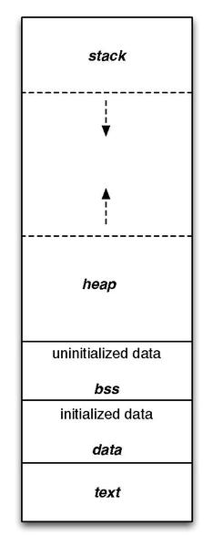
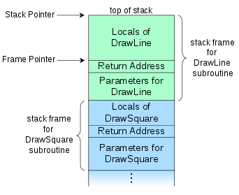

# 协程(coroutine)简介 - 什么是协程？

> 如果涉及到具体的操作系统和CPU等，则为 Linux/amd64

## 程序内存布局



首先介绍一下内存布局，从高地址到低地址，依次是：

- kernal space
- stack
- heap
- BSS segment(未初始化或者为0值的的全局或者static变量)
- data segment(显式初始化的全局变量或者static变量)
- text segment(也叫`code segment`，存储的是具体的指令)

当然，这个还不完全，还有很多段没有列出来例如stack和heap中间可能有mmap的内存段。此外此处还没有考虑到多线程的情况下，不过为了热热身，已经够了。

## 栈和帧

栈的作用主要是用来保存函数调用之后的该返回哪里。通常，调用一个函数，进行的步骤有把参数从右向左依次压栈，
然后把返回地址压栈，然后开始执行函数。当然，这是实现细节，只是目前比较常用的一种方式。当函数执行完之后，就取出返回地址，
继续执行。有一个寄存器，PC(Program Counter)就是用来存储下一条要执行的指令的。

计算机中有一句名言，所有的问题都可以引入一个中间层来解决，那么，为什么会有帧呢？解决了什么问题？我个人的看法是，将多个
函数调用分别包装起来，从而进行了隔离，当然，这里的“包装”是一个抽象概念，实际上，只要你想，仍然可以访问到其他函数的栈
内的内容。



## 协程(coroutine)

### 无栈协程(stackless coroutine)

Python中的协程一般是通过yield来实现，有yield的函数，其返回结果就是一个generator。而Python中的协程就属于无栈协程。
那我们来看一下generator object长啥样：

```c
/* _PyGenObject_HEAD defines the initial segment of generator
   and coroutine objects. */
#define _PyGenObject_HEAD(prefix)                                           \
    PyObject_HEAD                                                           \
    /* Note: gi_frame can be NULL if the generator is "finished" */         \
    struct _frame *prefix##_frame;                                          \
    /* True if generator is being executed. */                              \
    char prefix##_running;                                                  \
    /* The code object backing the generator */                             \
    PyObject *prefix##_code;                                                \
    /* List of weak reference. */                                           \
    PyObject *prefix##_weakreflist;                                         \
    /* Name of the generator. */                                            \
    PyObject *prefix##_name;                                                \
    /* Qualified name of the generator. */                                  \
    PyObject *prefix##_qualname;

typedef struct {
    /* The gi_ prefix is intended to remind of generator-iterator. */
    _PyGenObject_HEAD(gi)
} PyGenObject;
```

为什么叫做无栈协程呢？因为generator没有自己的栈，只有它自己的帧。每次执行到这个coroutine的时候，是把其帧丢到调用者的
栈上的。

### 有栈协程(stackful coroutine)

而Go的协程则属于有栈协程，在[这篇文章](https://jiajunhuang.com/articles/2018_03_29-goroutine_schedule.md.html)里有说到
具体切换的时候，涉及到哪些东西。我在这里再列出来一下，我们看看G长啥样：

```go
type g struct {
        // Stack parameters.
        // stack describes the actual stack memory: [stack.lo, stack.hi).
        // stackguard0 is the stack pointer compared in the Go stack growth prologue.
        // It is stack.lo+StackGuard normally, but can be StackPreempt to trigger a preemption.
        // stackguard1 is the stack pointer compared in the C stack growth prologue.
        // It is stack.lo+StackGuard on g0 and gsignal stacks.
        // It is ~0 on other goroutine stacks, to trigger a call to morestackc (and crash).
        stack       stack   // offset known to runtime/cgo
        stackguard0 uintptr // offset known to liblink
        stackguard1 uintptr // offset known to liblink

        _panic         *_panic // innermost panic - offset known to liblink
        _defer         *_defer // innermost defer
        m              *m      // current m; offset known to arm liblink
        sched          gobuf
        ...
}
```

其中的gobuf就是协程中保存的东西，我们看看：

```go
type gobuf struct {
	// The offsets of sp, pc, and g are known to (hard-coded in) libmach.
	//
	// ctxt is unusual with respect to GC: it may be a
	// heap-allocated funcval, so GC needs to track it, but it
	// needs to be set and cleared from assembly, where it's
	// difficult to have write barriers. However, ctxt is really a
	// saved, live register, and we only ever exchange it between
	// the real register and the gobuf. Hence, we treat it as a
	// root during stack scanning, which means assembly that saves
	// and restores it doesn't need write barriers. It's still
	// typed as a pointer so that any other writes from Go get
	// write barriers.
	sp   uintptr
	pc   uintptr
	g    guintptr
	ctxt unsafe.Pointer
	ret  sys.Uintreg
	lr   uintptr
	bp   uintptr // for GOEXPERIMENT=framepointer
}
```

把好几个重要的寄存器的值全部保存了，如 SP, PC等。其实就是把整个G的栈全部保存下来，换成新的要执行的G的栈的值。

### 对比

stackful coroutine的优势在于可以在栈执行到任意一步的时候端走，而stackless则只能端走栈中最顶部的那个frame。
如果要说stackful coroutine的缺点的话，我觉得应该是实现比较复杂，goroutine的实现还算简单，是因为它没有用到所有的
寄存器，只用到栈底，栈顶，framepointer，PC等几个。例如传参数，都是统一往栈里丢，当然，它这样实现也是为了简单。
一般的C程序，都是前几个参数丢某某寄存器，更多的参数才丢栈里。

-------------------------------

参考资料：

- https://en.wikipedia.org/wiki/Program_counter
- https://en.wikipedia.org/wiki/Data_segment
- https://en.wikipedia.org/wiki/Call_stack
