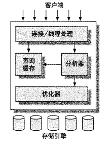
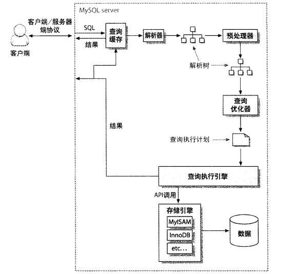

# High Performance MySQL阅读笔记

    - 第一层是连接处理，授权认证等方面
    - 第二层是查询解析，分析，优化，缓存和所有内建函数如日期，时间等，
    此外还有所有存储引擎都提供的功能例如存储过程，触发器，视图等。
    - 第三层是存储引擎，存储引擎负责存储和提取所有存放在MySQL中的和数据。
    服务器通过存储引擎API与具体的存储引擎来进行通信。

- MySQL中默认的操作模式是AUTOCOMMIT模式，即，除非显式的开始一个事务，否则它将每个
查询视为一个单独的事务自动执行

- 选择优化的数据类型

    - 更小通常更好，选择能表示数据的最小的类型。更小的数据需要更少的磁盘，内存和CPU缓存，通常所需要的CPU周期也更少
    - 更简单通常更好，简单地数据类型所需要的CPU周期也更少
    - 尽量避免NULL，尽量将列定义成NOT NULL

- MySQL数据类型

    https://dev.mysql.com/doc/refman/8.0/en/data-types.html

- 索引基础知识

    - 能够使用B-Tree索引的查询类型

        - 匹配全名
        - 匹配最左前缀
        - 匹配列前缀，如 `LIKE 'J%'`
        - 匹配范围值
        - 精确匹配一部分并且匹配某个范围中的另一部分
        - 只访问索引的查询，即索引覆盖

    - 高性能索引策略

        - 避免使用表达式和计算，如 `SELECT actor_id FROM sakila.actor WHERE actor_id + 1 = 5;` 就不能有效的用上索引。也不能缓存。
        - 选择区分度高的列。如UNIQUE索引，其区分度为1，是最高效的。
        - MySQL产生排序结果有两种方式：使用文件排序，或者扫描有序的索引。EXPLAIN语句
        中 `type` 列的值如果是 `Index`，则说明MySQL会扫描索引。MySQL按照索引对结果进行
        排序，只有当索引的顺序和ORDER BY子句中的顺序完全一致，并且所有列的方向一样才可以，
        如升序或者降序。
        此外，如果查询联接了多个表，只有在ORDER BY子句的所有列引用的是第一个表才可以。
        - 分页时可以限制用户可以查看的最大页数，例如 `LIMIT 10000, 10` 时，一定会慢，
        因为要排序然后丢弃前面的数据。可以限制用户的行为来进行优化。

    - 聚集索引中键值的逻辑顺序决定了表中相应行的物理顺序。聚集索引确定表中数据的
    物理顺序。聚集索引类似于电话簿，后者按姓氏排列数据。由于聚集索引规定数据在表
    中的物理存储顺序，因此一个表只能包含一个聚集索引。但该索引可以包含多个列（组
    合索引），就像电话簿按姓氏和名字进行组织一样。InnoDB一般把主键设置成聚集索引

    - 覆盖索引是指三星索引中的第三星。即 `SELECT xxx` 中xxx直接从索引的节点中取值。
    如果是用了覆盖索引，那么EXPLAIN语句中，Extra列会显示 `Using index`

- 查询性能优化

    - 是否访问了太多的数据，是否获取了不需要的数据？（如果是用ORM的话，那么十之八九是的）
    - 检查MySQL是否检查了太多的数据，一般通过以下三个指标
        - 执行时间
        - 检查的行数
        - 返回的行数
    - 在应用端进行“JOIN”操作。可以加速的原因是MySQL可以很好的缓存查询结果。
    - 缩小查询量。例如一共需要500万行数据，分解成5万行乘以100次会比较好。最少MySQL不会被拖垮。
    - 减少使用MySQL的表达式和计算
    - 索引覆盖

- MySQL查询的过程

    - 客户端将查询发送到服务器
    - 服务器检查查询缓存，如果找到了，就从缓存中返回结果，否则进行下一步
    - 服务器进行解析，预处理和优化查询，生成执行计划
    - 执行引擎调用存储引擎API进行查询
    - 服务器将结果发送给客户端

- MySQL客户端服务器协议

MySQL客户端/服务器协议是半双工的，也就是说，客户端和服务器在某一个时刻只能发送
或者接受数据。不能同时进行。优点是简单，缺点是不能控制行为，例如客户端发送了查询
的请求，接下来能做的事情就只有等待，而不能中断查询，除非去MySQL Server上kill。

- 一些细节

    - IN比OR快。因为MySQL会对IN进行排序，然后用二分法查找某个值是否在列表中，时间
    复杂度是lg(n)而不是n。
    - 提示MySQL优化器使用索引可以使用 `USE INDEX`也可以使用 `FORCE INDEX`
    - 使用prepared语句可以加快速度，因为只需要parse一次。节省了解析和其他开销。

- 索引合并优化

MySQL 5.0之前一次查询只能用一个索引。此后可以使用多个索引，然后将结果合并。即例如
`SELECT * FROM user WHERE mobile='110' OR user_id=10`，MySQL会分别使用mobile和
id两个索引，然后将结果合并。

- 对MySQL进行查询优化的时候，要考虑到的东西

    - MySQL检查的行数
    - MySQL返回的行数
    - 查询过程中的随机IO
