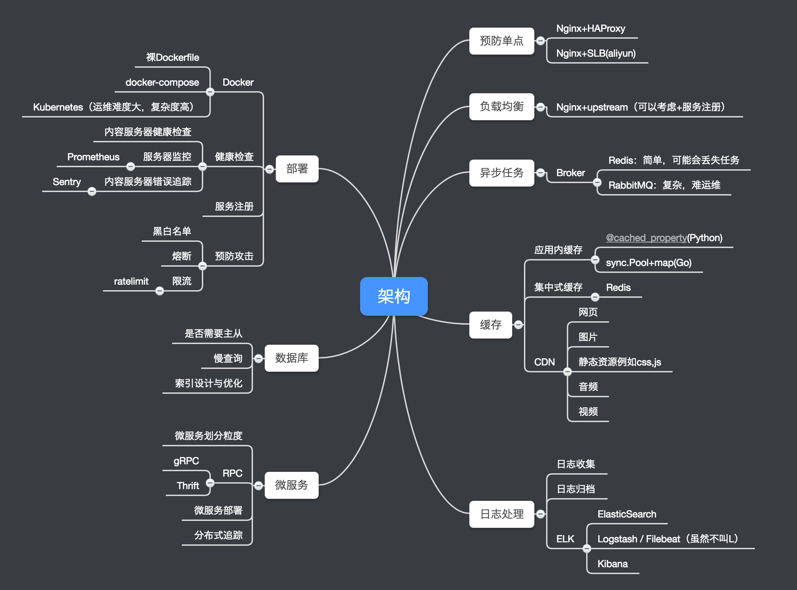

# Web后端工程师进阶指南(2018)

作为一名后端工程师，毕业两年有余，从实习到现在，回头一看，成长还是有的！所以我把这六年（加大学四年）从入门到进阶的经验
整理、总结了一下，分享给大家。本文主要是针对三年以内的，中高级工程师以下的进阶指南。针对读者：大学生，毕业生，初级工程
师，中级工程师。如果你是架构师以上，TL;DR，哈哈。

首先我们来看一下技能图：

其实工程师技能的进阶就像武侠小说里修炼功夫一样，有的是花拳绣腿，有的是基本功。基本功是底子，变化很少，但是所有高人的
基本功都很扎实。我把编程技能也这样分了一下，从上往下，越下面便越是基本功，例如操作系统，计算机网络，几十年来变化都
不算太大，上面就像是表面上的招式，框架这类东西，用着不爽换一个就是。下面是技能分类：

## 技能分类

- 工具的使用：
    - Web框架
    - 异步任务框架
    - 数据库使用
    - 缓存使用
- 工具的原理和实现
    - 熟悉某一语言例如Go, Python, Java等
    - 如何实现一个Web框架
    - 如何实现一个异步任务框架
    - 数据库调优
    - Redis提供了哪些数据结构，他们有何特点，什么情况下用哪种
    - Web安全知识
- 底层协议
    - HTTP协议
        - HTTP/1.1
        - HTTP/2.0
    - RPC
        - gRPC
    - TCP/IP
- 基础知识
    - 计算机网络
    - 操作系统
    - 编译原理
    - 算法和数据结构
    - 应用如何架构: 用户请求到最后抵达内容服务器，中间流程应该如何规划

上面的技能图不算完善，但是可以做一个基本的指引。接下来推荐一些 **我看过的好书**。还有很多好书，但是我没有看过，所以
就不做推荐，例如代码大全，我实在是还没有耐心啃完。

## 书籍推荐

- C语言：
    - C程序设计
    - C程序设计的抽象思维
    - C陷阱与缺陷
    - C和指针 Pointers On C
    - C专家编程
- Go语言：
    - Go程序设计语言(英文版)
    - The Go Programming Language Specification: https://golang.org/ref/spec
- Python：
    - Python Essential Reference
    - The Python Language Reference: https://docs.python.org/3.7/reference/index.html
    - Python源码剖析
- UNIX/Linux
    - APUE: Advanced Programming in the UNIX® Environment
    - UNP: UNIX Network Programming
- TCP/IP:
    - TCP/IP协议详解：卷一
    - 图解TCP／IP协议
- 设计模式：
    - 设计模式
    - Head First 设计模式
- 编译：
    - 程序员的自我修养:链接、装载与库
- 算法和数据结构：
    - 算法导论
    - 算法（红色的）
    - 数据结构与算法分析:C语言描述
    - 编程珠玑 & 更多的编程珠玑
- 操作系统：
    - 现代操作系统(原书第4版)
    - 编程范式：http://open.163.com/special/opencourse/paradigms.html
- MySQL:
    - 高性能MySQL
    - 数据库索引设计与优化
- Redis:
    - Redis数据结构简介：https://redis.io/topics/data-types-intro
    - Redis官方文档：https://redis.io/documentation
    - 当Redis作为缓存的时候：缓存更新的套路 - https://coolshell.cn/articles/17416.html
- Nginx:
    - Nginx如何处理HTTP请求：http://nginx.org/en/docs/http/request_processing.html
    - Nginx官方文档：http://nginx.org/en/docs/
- 代码修养：
    - 程序员修炼之道:从小工到专家
    - 程序设计实践 英文版
- 其他：
    - 程序员：
        - 黑客与画家
        - 软技能:代码之外的生存指南
        - 软件随想录 卷1 & 软件随想录 卷2
    - 心理学：
        - 少有人走的路
        - 亲密关系
    - 理财：
        - 穷爸爸富爸爸

其实最重要的是要对计算机有兴趣，不仅要知道一个东西怎么用，还要知道它是怎么运转的，愿意去探索背后的实现和原理。

## 我该学什么语言？

编程语言那么多，我该学什么语言？下面是我个人的推荐。按顺序。

- Python：Python语法十分简洁，学习Python我们可以快速的写出一个网站，也有助于培养初学者的兴趣
- C语言：学习C语言可以快速了解内存相关的知识，了解编译，操作系统的知识，也是读APUE的前置条件
- Go语言：学完了Python，很好用，再去学C，很“繁琐”，这种时候就需要Go语言了，既有Python那样的动态性，又有接近C的性能
- Haskell：我没有学完Haskell，只是读了几遍Learn You a Haskell for Great Good，以及Real World Haskell，但是这对我了解
函数式有了巨大的帮助。

### 为什么推荐这几门语言？

选择学习什么语言的时候，我们需要注意不要重复，如果两门语言重复性在各方面都很大，那完全没有学习的必要。我个人一直认为
从编程范式上来看，面向过程，面向对象，函数式编程需要了解一下，从语言的动态性来说，解释型，编译型语言都要了解一下。

结合上面的语言，这些全都占了。所以以后如果还需要学习一门新的语言，可能就从市场，或者当时需要来看了。

## 我需要加入什么样的公司？

无疑，一个好的公司能给我们自身带来的成长是非常可观的，无论是从能力，履历或者其他方面来看。我个人建议，毕业的时候还是
要去大公司走一遭，去大公司体验流程，说实话，真的可以锻炼你的耐心。然后要去创业公司走一遭，真的可以锻炼你的全栈能力。

然后，最重要的，就是上面所说的话，最重要的是你对计算机有兴趣，不仅要知道一个东西怎么用，还要知道背后的原理，愿意去
学习，去探索。

公司的选择至关重要，To B的业务会让你知道稳定性是多么的重要，To C的业务会让你知道什么叫快速迭代（或者什么叫通宵发版），
这些都是不可多得的宝贵经验。玩过To C你就知道什么叫做高并发，玩过To B你就知道判断完全边界情况有多么重要。

其他的建议可以参考 [这篇 作为面试官的总结](https://jiajunhuang.com/articles/2018_03_10-interview.md.html)
