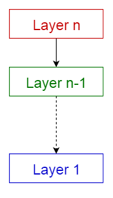
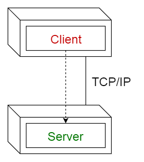
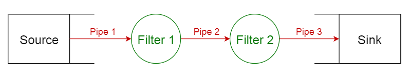
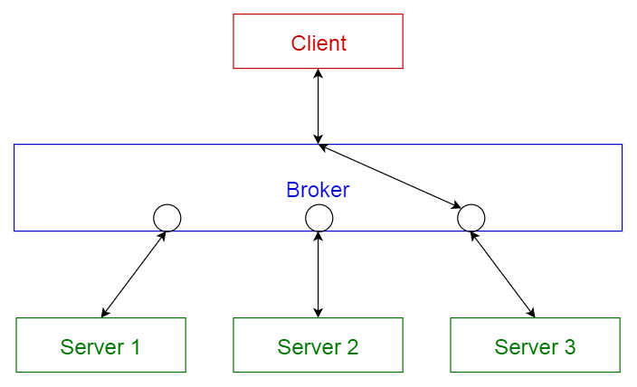
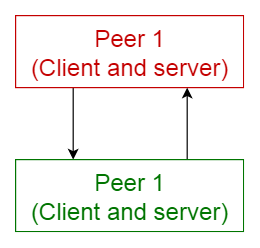
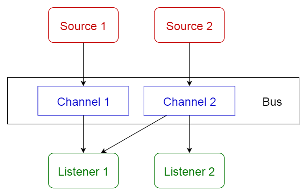
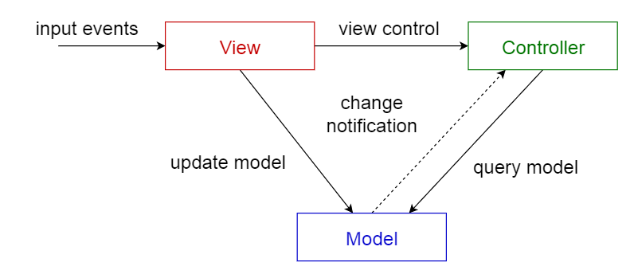

# 常见的软件架构套路

本文主要翻译来源：https://towardsdatascience.com/10-common-software-architectural-patterns-in-a-nutshell-a0b47a1e9013 。有删减。

## 分层模式

这种模式主要是将设计分层，每一层为其上层提供服务。例如：web开发中我们常常将某些常用的RESTful接口抽象出一个service层。

## 客户端-服务端模式

客户端和服务端分离，从而解耦。通过这样设计，服务端可以同时为多个客户端提供服务。例如：微信。手机上的微信就是一个客户端，
而服务器则在腾讯。

## 主从模式

将整个软件区分为两块，一个是master，中文常叫做主，另一个是slave，中文常叫做从。例如：Nginx就使用了这种模式，因此master
可以方便的管理多个slave。

## 管道模式

将一个函数或者软件的输出作为下一个函数或者软件的输入，然后把他们串起来，就形成了管道模式。例如：bash中的 `|`。

## 消息传递模式

broker，最常见到这个词语的地方就是任务队列。我们通过一个中间介质，把消息的发布者和消费者解耦。例如：Celery。

## 点对点模式

大名鼎鼎的P2P，这是一种没有中央服务器的模式。例如：种子。

## event-bus模式

这种模式和消息传递模式很像，区别在于，消息传递模式，消费者主动监听可以消费的队列，而这种模式，是注册事件，由owner调用，例如：安卓中的路由监听。

## MVC模式

这是web开发中最常见的一种模式了。 通过将Model（提供数据），View（处理视图），Controller（粘合两者）区分开来，Model和View提供服务，Controller负责整合。

--------

- https://towardsdatascience.com/10-common-software-architectural-patterns-in-a-nutshell-a0b47a1e9013