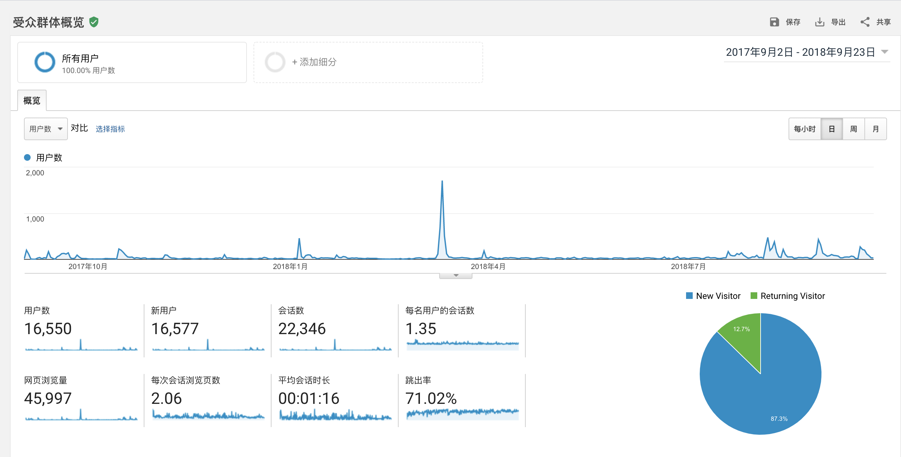
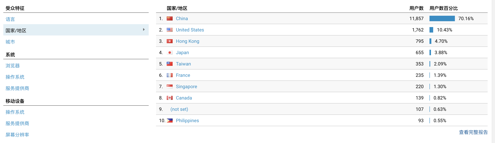
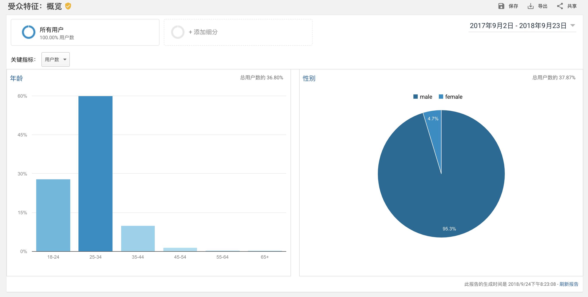
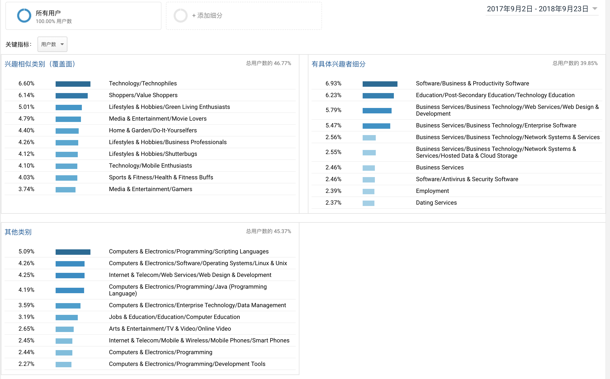
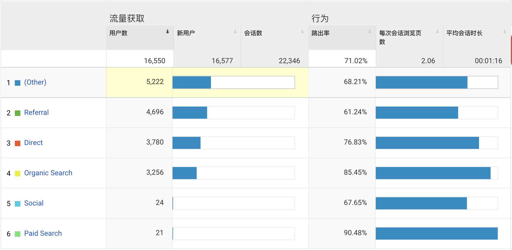
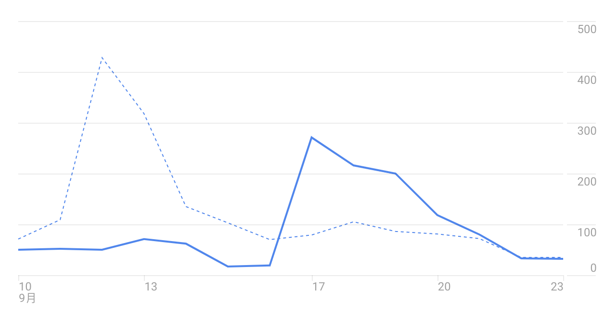

# 独立运营博客一年的一些数据分享

说是运营，其实都是野生啦。大学时期就开始写博客，但是一直在各个地方分散，有试过Github Repo，Github issue，github.io 托管，
然后后来买了VPS，又转换到VPS。

这篇博客主要是分享一下，独立托管一年的数据。

## 用户访问量

可以看见几个比较有用的指标：

- 这一年来，一共有16550个用户，其中16577个是新用户（这个应该是统计数字上的问题）
- 网页浏览量是45997，大约46k
- 平均每个用户会访问两个页面
- 平均会话时长01:16，这其中的主要原因应该是我写的博客文章普遍偏短（因为我耐心不是很好），所以用户可以比较快的浏览完
- 按天统计，峰值时，日UV大约在2k，低谷为4

## 用户来自哪个国家

可以看到大部分用户还是来自国内，事实上，我的博客几乎都是中文的，所以即便是其他国家的访问，很大概率也是通过代理或者跳板等
进行访问的。这其实就遇到了一个比较尴尬的问题，我的博客访问用户绝大部分都是在国内，但是因为博客没有备案，无法使用国内CDN，
无法针对国内用户优化从而提升用户体验。

## 用户特征

可以看出来，博客的访问用户大多是年轻人，35岁以下，这应该和博客本身内容相关，因为我本身是刚毕业不到三年，写出来的东西深度
自然是大部分吸引到这个年龄段的人。而用户的兴趣特征自然就是和技术相关。

## 流量来源

流量来源中可以看出来，搜索引擎仍然是占了很大一块的流量，从Search Console上，大约每天都有0-50次访问是来自搜索引擎。为什么会有
Paied Search呢，因为之前有交智商税[试一试Google Ads的效果](https://jiajunhuang.com/articles/2018_09_10-google_ads.md.html)。

## 投稿前后的流量区别

这是在投稿之后的日访问量变化图，说明，博客如果不投稿，日访问量基本靠搜索引擎，投稿当天流量剧增，之后逐日衰竭。

## 总结

这些数据说明了本博客的几个问题：

- 第一，用户跳出率高，访问时间短，说明之后的博客需要写的更长，内容质量更高
- 第二，大量用户来自中国，但是CDN使用的是Cloudflare，没有备案所以无法使用国内节点，还是应该想办法优化加载速度
- 第三，应该做SEO，提高在搜索引擎中的排名，这就包括好好地取标题，多创作，提高内容质量
- 第四，想靠写博客，把流量运营起来然后投放广告（例如ruanyifeng.com, coolshell.cn）赚钱，不如去捡垃圾
