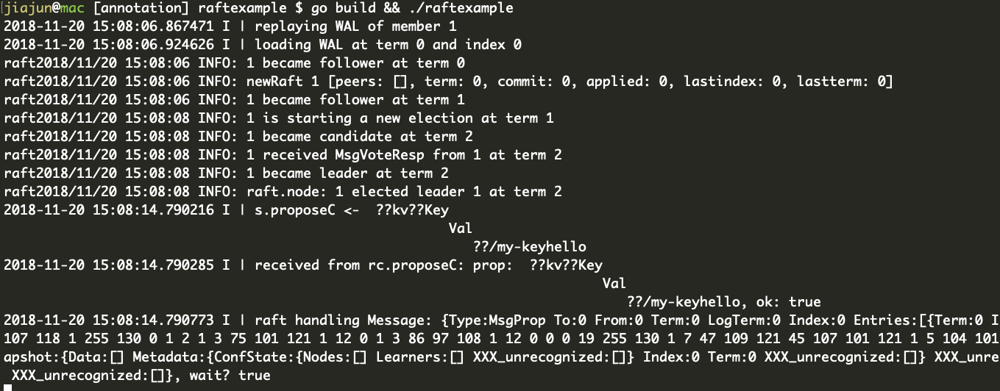

# etcd源码阅读与分析（一）：raftexample

> 开始读etcd的源代码，今天首先来看的是 raftexample，这是一个基于 raft 的简单内存KV，希望通过 raftexample 能对 etcd 有一个大概的认识。

首先看一下目录结构：

```
$ tree -d -L 1 .
.
├── Documentation  # 文档
├── auth  # 认证？还没细看
├── bin  # 编译出来的二进制文件
├── client  # 应该是v2版本的客户端代码
├── clientv3  # 应该是v3版本的客户端代码
├── contrib  # 今天我们要看的raftexample就在这里面
├── default.etcd  # 运行编译好的etcd产生的，忽略之
├── docs  # 文档
├── embed  # 封装了etcd的函数，以便别的程序封装
├── etcdctl  # etcdctl命令，也就是客户端
├── etcdmain  # main.go 调用了这里
├── etcdserver  # 服务端代码
├── functional  # 不知道是干啥的，看起来是用来验证功能的测试套件
├── hack  # 开发者用的，不知道干啥的
├── integration  # 不知道干啥的，忽略
├── lease  # 实现etcd的租约
├── logos
├── mvcc # MVCC存储的实现
├── pkg  # 通用库
├── proxy  # 代理
├── raft  # raft一致性协议的实现
├── scripts  # 各种脚本
├── tests  # 不晓得干啥的，忽略
├── tools  # 一些工具，不知道干啥的，忽略
├── vendor  # go的vendor，忽略
├── version  # 版本信息
└── wal  # Write-Ahead-Log的实现

27 directories
```

我的 [如何阅读源代码](https://jiajunhuang.com/articles/2018_08_04-how_to_read_source_code.md.html) 这篇文章里介绍过几种阅读
源代码的方式，今天我们就要用上。

首先，看 `main.go` 文件：

```go
package main

import (
	"flag"
	"strings"

	"go.etcd.io/etcd/raft/raftpb"
)

func main() {
	cluster := flag.String("cluster", "http://127.0.0.1:9021", "comma separated cluster peers")
	id := flag.Int("id", 1, "node ID")
	kvport := flag.Int("port", 9121, "key-value server port")
	join := flag.Bool("join", false, "join an existing cluster")
	flag.Parse()

	proposeC := make(chan string)
	defer close(proposeC)
	confChangeC := make(chan raftpb.ConfChange)
	defer close(confChangeC)

	// raft provides a commit stream for the proposals from the http api
	var kvs *kvstore
	getSnapshot := func() ([]byte, error) { return kvs.getSnapshot() }
	commitC, errorC, snapshotterReady := newRaftNode(*id, strings.Split(*cluster, ","), *join, getSnapshot, proposeC, confChangeC)

	kvs = newKVStore(<-snapshotterReady, proposeC, commitC, errorC)

	// the key-value http handler will propose updates to raft
	serveHttpKVAPI(kvs, *kvport, confChangeC, errorC)
}
```

可以看出来，大概就是弄了两个channel，然后呢，新建了一个Raft的Node，新建了一个KV存储，然后就开始提供HTTP服务。

然后跟进去，读 `newRaftNode`:

```go
func newRaftNode(id int, peers []string, join bool, getSnapshot func() ([]byte, error), proposeC <-chan string,
	confChangeC <-chan raftpb.ConfChange) (<-chan *string, <-chan error, <-chan *snap.Snapshotter) {

	commitC := make(chan *string)
	errorC := make(chan error)

	rc := &raftNode{
		proposeC:    proposeC,
		confChangeC: confChangeC,
		commitC:     commitC,
		errorC:      errorC,
		id:          id,
		peers:       peers,
		join:        join,
		waldir:      fmt.Sprintf("raftexample-%d", id),
		snapdir:     fmt.Sprintf("raftexample-%d-snap", id),
		getSnapshot: getSnapshot,
		snapCount:   defaultSnapshotCount,
		stopc:       make(chan struct{}),
		httpstopc:   make(chan struct{}),
		httpdonec:   make(chan struct{}),

		snapshotterReady: make(chan *snap.Snapshotter, 1),
		// rest of structure populated after WAL replay
	}
	go rc.startRaft() // 启动raft
	return commitC, errorC, rc.snapshotterReady
}
```

就是实例化了一个 raftNode，然后呢，调用了 raftNode.startRaft 这个方法，那就继续跟进去：

```go
func (rc *raftNode) startRaft() {
	if !fileutil.Exist(rc.snapdir) {
		if err := os.Mkdir(rc.snapdir, 0750); err != nil {
			log.Fatalf("raftexample: cannot create dir for snapshot (%v)", err)
		}
	}
	rc.snapshotter = snap.New(zap.NewExample(), rc.snapdir)
	rc.snapshotterReady <- rc.snapshotter

	oldwal := wal.Exist(rc.waldir)
	rc.wal = rc.replayWAL()

	rpeers := make([]raft.Peer, len(rc.peers))
	for i := range rpeers {
		rpeers[i] = raft.Peer{ID: uint64(i + 1)}
	}
	c := &raft.Config{
		ID:                        uint64(rc.id),
		ElectionTick:              10,
		HeartbeatTick:             1,
		Storage:                   rc.raftStorage,
		MaxSizePerMsg:             1024 * 1024,
		MaxInflightMsgs:           256,
		MaxUncommittedEntriesSize: 1 << 30,
	}

	// 设置 rc.node
	if oldwal {
		rc.node = raft.RestartNode(c)
	} else {
		startPeers := rpeers
		if rc.join {
			startPeers = nil
		}
		rc.node = raft.StartNode(c, startPeers) // 配置节点
	}

	rc.transport = &rafthttp.Transport{
		Logger:      zap.NewExample(),
		ID:          types.ID(rc.id),
		ClusterID:   0x1000,
		Raft:        rc,
		ServerStats: stats.NewServerStats("", ""),
		LeaderStats: stats.NewLeaderStats(strconv.Itoa(rc.id)),
		ErrorC:      make(chan error),
	}

	rc.transport.Start()
	for i := range rc.peers {
		if i+1 != rc.id {
			rc.transport.AddPeer(types.ID(i+1), []string{rc.peers[i]})
		}
	}

	go rc.serveRaft()     // 启动HTTP服务
	go rc.serveChannels() // 开始监听各个channel然后消费
}
```

可以看出来，这个方法呢，就是先检查是不是有快照，是不是有WAL日志，如果有的话，就恢复到上一个状态，如果没有的话，就新建。
然后调用 `raft.RestartNode`，这里就是真正启用raft一致性协议的地方了，这里的raft就是最开始我们看的目录里的raft。这里
接下来做的事情就是启动一个transport，这嘎达呢，就跟指定的集群里其他节点通信。然后起一个循环去消费之前建立的的channel里的数据。
可以看到 `rc.serveChannels` 的代码：

```go
func (rc *raftNode) serveChannels() {
	snap, err := rc.raftStorage.Snapshot()
	if err != nil {
		panic(err)
	}
	rc.confState = snap.Metadata.ConfState
	rc.snapshotIndex = snap.Metadata.Index
	rc.appliedIndex = snap.Metadata.Index

	defer rc.wal.Close()

	ticker := time.NewTicker(100 * time.Millisecond)
	defer ticker.Stop()

	// send proposals over raft
	go func() {
		confChangeCount := uint64(0)

		for rc.proposeC != nil && rc.confChangeC != nil {
			select {
			case prop, ok := <-rc.proposeC:
				log.Printf("received from rc.proposeC: prop: %+v, ok: %t", prop, ok)
				if !ok {
					rc.proposeC = nil
				} else {
					// blocks until accepted by raft state machine
					// 在此处，是kvstore.go里的kvstore
					rc.node.Propose(context.TODO(), []byte(prop))
				}

			case cc, ok := <-rc.confChangeC:
				if !ok {
					rc.confChangeC = nil
				} else {
					confChangeCount++
					cc.ID = confChangeCount
					rc.node.ProposeConfChange(context.TODO(), cc)
				}
			}
		}
		// client closed channel; shutdown raft if not already
		close(rc.stopc)
	}()

	// event loop on raft state machine updates
	for {
		select {
		case <-ticker.C:
			rc.node.Tick()

		// store raft entries to wal, then publish over commit channel
		case rd := <-rc.node.Ready():
			rc.wal.Save(rd.HardState, rd.Entries)
			if !raft.IsEmptySnap(rd.Snapshot) {
				rc.saveSnap(rd.Snapshot)
				rc.raftStorage.ApplySnapshot(rd.Snapshot)
				rc.publishSnapshot(rd.Snapshot)
			}
			rc.raftStorage.Append(rd.Entries)
			rc.transport.Send(rd.Messages)
			if ok := rc.publishEntries(rc.entriesToApply(rd.CommittedEntries)); !ok {
				rc.stop()
				return
			}
			rc.maybeTriggerSnapshot()
			rc.node.Advance()

		case err := <-rc.transport.ErrorC:
			rc.writeError(err)
			return

		case <-rc.stopc:
			rc.stop()
			return
		}
	}
}
```

这段代码就比较长了，先看第一个 `go func()` 里的循环，就是监听最开始建立的两个channel，然后分别调用对应的接口，要注意，
`rc.node` 的类型是 `raft.Node`，这是一个接口。上面说了，实例化的时候，是调用 `raft.StartNode` 或者 `raft.RestartNode`，
其返回结果是一个 `raft.Node`，实际上代码返回的是 `raft.node`，而 `raft.node` 实现了 `raft.Node` 这个接口，会不会有点晕？

所以呢，接下来我们要看看 `rc.proposeC` 这个channel，`rc.confChangeC` 我们就不看了，虽然不知道是干啥的，但是呢，从名字我们先
猜测它是用来做配置变更的（实际上就是）。看 `rc.proposeC`，我们就要看这个channel在哪些地方用到了，也就是说，哪里有生产者，
哪里有消费者。搜索一下：

```bash
$ ack proposeC
raftexample_test.go
29:	proposeC    []chan string
44:		proposeC:    make([]chan string, len(peers)),
51:		clus.proposeC[i] = make(chan string, 1)
53:		clus.commitC[i], clus.errorC[i], _ = newRaftNode(i+1, clus.peers, false, nil, clus.proposeC[i], clus.confChangeC[i])
73:		close(clus.proposeC[i])
123:		}(clus.proposeC[i], clus.commitC[i], clus.errorC[i])
126:		go func(i int) { clus.proposeC[i] <- "foo" }(i)
151:		clus.proposeC[0] <- "foo"
152:		clus.proposeC[0] <- "bar"

kvstore.go
29:	proposeC    chan<- string // channel for proposing updates
40:func newKVStore(snapshotter *snap.Snapshotter, proposeC chan<- string, commitC <-chan *string, errorC <-chan error) *kvstore {
41:	s := &kvstore{proposeC: proposeC, kvStore: make(map[string]string), snapshotter: snapshotter}
61:	log.Printf("s.proposeC <- %s", buf.String())
62:	s.proposeC <- buf.String()

raft.go
42:	proposeC    <-chan string            // proposed messages (k,v)
80:// current), then new log entries. To shutdown, close proposeC and read errorC.
81:func newRaftNode(id int, peers []string, join bool, getSnapshot func() ([]byte, error), proposeC <-chan string,
88:		proposeC:    proposeC,
401:		for rc.proposeC != nil && rc.confChangeC != nil {
403:			case prop, ok := <-rc.proposeC:
404:				log.Printf("received from rc.proposeC: prop: %+v, ok: %t", prop, ok)
406:					rc.proposeC = nil

main.go
31:	proposeC := make(chan string)
32:	defer close(proposeC)
39:	commitC, errorC, snapshotterReady := newRaftNode(*id, strings.Split(*cluster, ","), *join, getSnapshot, proposeC, confChangeC)
41:	kvs = newKVStore(<-snapshotterReady, proposeC, commitC, errorC)
```

可以看出来，`kvstore.go` 的62行应该是生产者，而 `raft.go` 的403行应该是消费者。基于这种假设，我们要去验证一下，所以我加了几行日志，
那就运行一下：

```bash
$ curl -v -L http://127.0.0.1:9121/my-key -XPUT -d hello
```

下图是服务端的日志输出：



可以看出来，顺序是先调用了 `s.proposeC <-` 然后 `received from rc.proposeC`，然后raft对消息进行处理，把它还原成函数调用，就是：

- `func (s *kvstore) Propose(k string, v string)`
- `func (rc *raftNode) serveChannels()`
- `func (n *node) Propose(ctx context.Context, data []byte) error`，这里的node是 `etcd/raft/node.go` 里的结构体 `type node struct`

为啥呢，我们要和raftexample里的代码对应上。继续看 `raftexample/main.go`：

```go
commitC, errorC, snapshotterReady := newRaftNode(*id, strings.Split(*cluster, ","), *join, getSnapshot, proposeC, confChangeC)

kvs = newKVStore(<-snapshotterReady, proposeC, commitC, errorC)

// the key-value http handler will propose updates to raft
serveHttpKVAPI(kvs, *kvport, confChangeC, errorC)
```

可以看到，`main.go` 最后其实是执行了 `serveHttpKVAPI`，然后跳进去一看，会发现，调用了 `httpKVAPI`，我们知道，go的HTTP服务
代码满足 `ServeHTTP` 这个接口就可以了，如果你不知道的话，说明没有读过 `net/http` 的代码，那么你现在知道了。所以直接跳过去看
`httpKVAPI` 的 `ServeHTTP` 这个方法，可以看到：

```go
type httpKVAPI struct {
	store       *kvstore
	confChangeC chan<- raftpb.ConfChange
}

func (h *httpKVAPI) ServeHTTP(w http.ResponseWriter, r *http.Request) {
	key := r.RequestURI
	switch {
	case r.Method == "PUT":
		v, err := ioutil.ReadAll(r.Body)
		if err != nil {
			log.Printf("Failed to read on PUT (%v)\n", err)
			http.Error(w, "Failed on PUT", http.StatusBadRequest)
			return
		}

		h.store.Propose(key, string(v))

		// Optimistic-- no waiting for ack from raft. Value is not yet
		// committed so a subsequent GET on the key may return old value
		w.WriteHeader(http.StatusNoContent)
```

`h.store.Propose(key, string(v))` 这里就是入口了。按照我们之前说的顺序，`h.store.Propose(key, string(v))` 会调用 `s.proposeC <- buf.String()`，
然后这个时候就会唤醒 `serveChannels` 里的 `case prop, ok := <-rc.proposeC`，然后调用 `rc.node.Propose(context.TODO(), []byte(prop))`，
接下来就会调用 `etcd/raft/node.go` 里的 `func (n *node) Propose(ctx context.Context, data []byte) error` 这个函数。

好了，到此为止我们就知道etcd大概是怎么一个工作法，这篇博客到此结束。

接下来我们会继续探索真正的etcd里的各个细节。

---

### etcd源码阅读与分析系列文章

- [etcd源码阅读与分析（一）：raftexample](https://jiajunhuang.com/articles/2018_11_20-etcd_source_code_analysis_raftexample.md.html)
- [etcd源码阅读与分析（二）：raft](https://jiajunhuang.com/articles/2018_11_22-etcd_source_code_analysis_raft.md.html)
- [etcd源码阅读与分析（三）：wal](https://jiajunhuang.com/articles/2018_11_24-etcd_source_code_analysis_wal.md.html)
- [etcd源码阅读与分析（四）：lease](https://jiajunhuang.com/articles/2018_11_27-etcd_source_code_analysis_lease.md.html)
- [etcd源码阅读与分析（五）：mvcc](https://jiajunhuang.com/articles/2018_11_28-etcd_source_code_analysis_mvvc.md.html)
