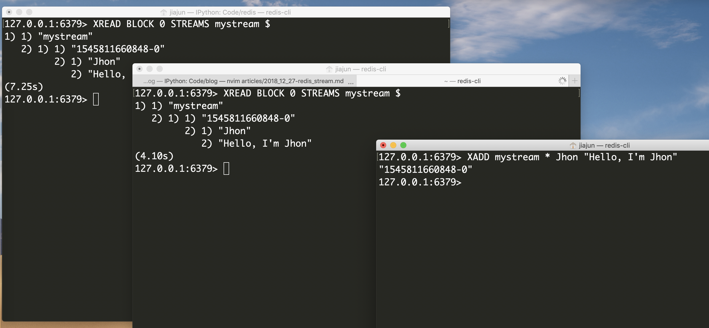
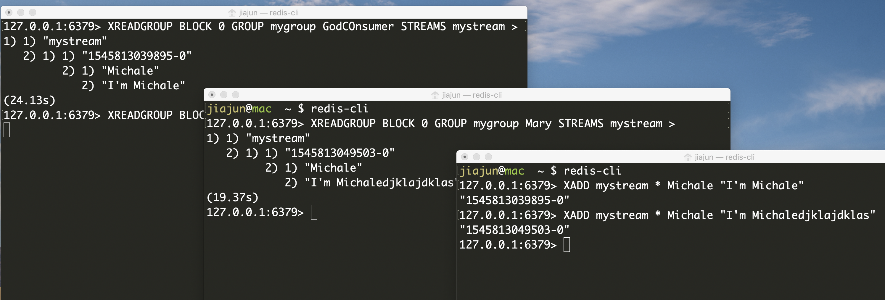

# Redis 5.0 Stream简明教程

Redis是我最喜欢的工具之一。Redis 5.0推出了一个新的数据结构：Stream。当然是要好好的研究研究。首先，Stream就是一个流处理
的数据结构，例如：任务流，消息流等等。因此，借助Stream模块，我们可以做分布式任务分发，消息订阅，可以做类似IRC的聊天软件等等。

## 和pub/sub以及blpop/rpop的区别

其实从形式上，Stream做到的功能，都能由PUB/SUB或者是BLPOP/BRPOP来做到，他们之间最大的区别就是，Stream会记住所有历史，而前者
消费了消息之后，就在内存里丢失了。

## 环境准备

首先，在接触Stream之前，我们需要安装一个5.0的Redis，我推荐使用Docker来快速准备环境：

```bash
jiajun@mac  ~ $ docker pull redis:latest
latest: Pulling from library/redis
Digest: sha256:bf65ecee69c43e52d0e065d094fbdfe4df6e408d47a96e56c7a29caaf31d3c35
Status: Image is up to date for redis:latest
jiajun@mac  ~ $ docker run -d --restart=always --name=redis -p 127.0.0.1:6379:6379 redis
9b7f4920561669243ae5974ede1f1cebcc0a380c434a07d639eec10be3f7f5d9
jiajun@mac  ~ $ redis-cli
127.0.0.1:6379> info version
127.0.0.1:6379> info
# Server
redis_version:5.0.3
redis_git_sha1:00000000
...
```

## 基本的几个命令

- `XADD` 是用来创建一个Stream的，其基本参数如下，`XADD` 后接的第一个参数key，就是所创建的Stream的名字，ID可以选择自己指定，也可以选择
使用 `*`，这样Redis会自己分配一个ID。field和string就是key和value了。可以看出来，返回值由两部分组成，第一部分是一个精确到毫秒的时间戳，
第二部分是自增的整数。时间戳精确到时间范围是毫秒，因此就需要一个自增ID来确保同一毫秒内发送的消息的唯一性。

```bash
127.0.0.1:6379> XADD key ID field string [field string ...]
127.0.0.1:6379> XADD mystream * foo bar
"1545810188872-0"
127.0.0.1:6379> XADD mystream * hello world
"1545810192120-0"
```

> 此外，XADD后面的field string是成双成对出现的，并且可以接多对。ID可以自己指定，例如 `0-1`, `0-2`等等。

可以看到ID的结构，是由两个无符号64位整数组成的，因此，可以算出来，要用完这两，一毫秒内得发送 `2 ** 64 = 18446744073709551616` 条数据，
地球上目前应该没有哪个高并发系统能高到这个程度。

```c
/* Stream item ID: a 128 bit number composed of a milliseconds time and
 * a sequence counter. IDs generated in the same millisecond (or in a past
 * millisecond if the clock jumped backward) will use the millisecond time
 * of the latest generated ID and an incremented sequence. */
typedef struct streamID {
    uint64_t ms;        /* Unix time in milliseconds. */
    uint64_t seq;       /* Sequence number. */
} streamID;
```

- `XLEN` 是用来查看某个Stream中有多少条消息的：

```bash
127.0.0.1:6379> XLEN mystream
(integer) 2
```

- `XRANGE` 和 `XREVRANGE` 则是范围查找的命令，一个是正序排列，一个是倒序排列：

```bash
127.0.0.1:6379> XRANGE key start end [COUNT count]
127.0.0.1:6379> XRANGE mystream - +
1) 1) "1545810188872-0"
   2) 1) "foo"
      2) "bar"
2) 1) "1545810192120-0"
   2) 1) "hello"
      2) "world"
127.0.0.1:6379> XREVRANGE key end start [COUNT count]
127.0.0.1:6379> XREVRANGE mystream + -
1) 1) "1545810192120-0"
   2) 1) "hello"
      2) "world"
2) 1) "1545810188872-0"
   2) 1) "foo"
      2) "bar"
```

可选项COUNT是用来做达到多少数量消息之后就停止查找的。关于start和end需要提几点：

    - `-`和`+` 分别代表最小和最大，或者说最老和最新的消息
    - start和end可以使用时间戳，而不加上后面的自增ID部分来查询，例如 `XRANGE mystream 1518951480106 1518951480107`

- `XREAD` 是用来读取消息的：

```bash
127.0.0.1:6379> XREAD [COUNT count] [BLOCK milliseconds] STREAMS key [key ...] ID [ID ...]
127.0.0.1:6379> XREAD BLOCK 1000 STREAMS mystream $
(nil)
(1.04s)
127.0.0.1:6379> XREAD BLOCK 0 STREAMS mystream $

```

可以看出来，BLOCK是阻塞读，如果填0，则是一直到有消息，否则都是阻塞。此外STREAMS后原本写ID的地方，如果使用 `$` 则是代表
最新的消息的ID，设想，如果你加入一个群聊，但是看不到历史消息，但是从你加入之后的消息都能读到，该怎么做？这种时候就可以用这个了。

## 高级一点的：消费组

假设我们在做一个分布式任务分发框架。我们可能会面临这么一种情况，我们需要：

- 每个worker收到消息，消费完成之后回复ACK确认消息已经被消费
- 每个worker之间不会重复消费消息
- 同一条消息，既能被worker消费，又能被一个专门用来写日志记录的worker消费，这个日志worker专门负责持久化所有的消息

这个需求，听起来很像 [NSQ](https://github.com/nsqio/nsq) 的适用场景，不过今天我们使用Redis。

刚才说，我们可以使用XREAD来消费一个Stream里的消息，上面说的我们直接用XREAD能不能完成呢？试试就知道了：



可以看出来，不行，重复消费了。因此，这里就要引入今天的主角，消费组(Consumer groups)。

- `XGROUP` 是用来创建删除和管理消费组的
- `XREADGROUP` 是用来通过消费组从Stream里读消息的
- `XACK` 是用来确认消息已经消费的

```bash
127.0.0.1:6379> XGROUP [CREATE key groupname id-or-$] [SETID key id-or-$] [DESTR
127.0.0.1:6379> XREADGROUP GROUP group consumer [COUNT count] [BLOCK millisecond
127.0.0.1:6379> XACK key group ID [ID ...]
```

看看下面的例子：

```bash
127.0.0.1:6379> XADD mystream * hello world
"1545812637199-0"
127.0.0.1:6379> XGROUP CREATE mystream mygroup $
OK
127.0.0.1:6379> XREADGROUP GROUP mygroup GodCOnsumer STREAMS mystream >
(nil)
127.0.0.1:6379> XADD mystream * Michale "I'm Michale"
"1545812666393-0"
127.0.0.1:6379> XREADGROUP GROUP mygroup GodCOnsumer STREAMS mystream >
1) 1) "mystream"
   2) 1) 1) "1545812666393-0"
         2) 1) "Michale"
            2) "I'm Michale"
127.0.0.1:6379> XREADGROUP GROUP mygroup GodCOnsumer STREAMS mystream >
(nil)
127.0.0.1:6379> XREADGROUP GROUP mygroup Michale STREAMS mystream >
(nil)
127.0.0.1:6379> XADD mystream * Michale "I'm Michale"
"1545812693203-0"
127.0.0.1:6379> XREADGROUP GROUP mygroup Michale STREAMS mystream >
1) 1) "mystream"
   2) 1) 1) "1545812693203-0"
         2) 1) "Michale"
            2) "I'm Michale"
127.0.0.1:6379> XREADGROUP GROUP mygroup GodCOnsumer STREAMS mystream >
(nil)
127.0.0.1:6379> XREADGROUP GROUP mygroup GodCOnsumer STREAMS mystream 0
1) 1) "mystream"
   2) 1) 1) "1545812666393-0"
         2) 1) "Michale"
            2) "I'm Michale"
```

> XREADGROUP 中，最后一个参数 `>` 代表消费者希望Redis只给自己没有发布过的消息。如果使用具体的ID，例如0，则是从那个ID之后的
> 消息。

注意，`XGROUP` 中给的STREAM的参数 `mystream` 这个，必须在执行这个命令前就存在，否则就报错了。从上面的例子可以看出来，
发布消息之后，使用 `XREADGROUP` 可以读取消费组中的消息。那会不会重复消费呢？我们试试就知道了：



可以看到，消费组中，每次只有一个消费者能够消费一条消息。

## 其余命令

其余的命令就请大家自行参阅官方文档了：https://redis.io/commands#stream

- `XPENDING`
- `XCLAIM`
- `XINFO`
- `XDEL`

注意一点，当stream中没有消息之后，不会被删除，因为通常stream还会有一批关联的消费组。而其他的Redis数据结构，当其中没有内容
时是会被删掉的，这一点需要稍微注意一下。

---

- https://redis.io/topics/streams-intro
- https://redis.io/commands#stream
