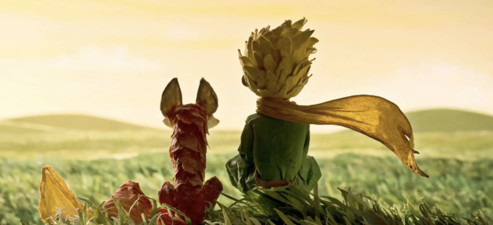

# 再见，2018，你好，2019

距离2018年真正结束尚有一些时日，可是我却忍不住先开始总结了起来。总的来说，2018年，过得并不是那么开心。此外去年定下的目标几乎全军覆没🙄️。先来碎碎念回顾一下全年：

- 1月的时候，写了一个熔断器，开源到了Github，这也是我目前为止开源项目里星星最多的一个项目了。
- 2月回家过春节，开开心心。
- 3月在万科物业做了一套认证系统，也算是在万科物业发展的顶峰时期了吧。
- 4月，5月就开始跳槽了。5月底的时候，谈恋爱了，还记得那天晚上我高兴的像个傻逼，凌晨两三点才睡着，可是我绝对想不到，两个月之后，我就会哭的像个傻逼。
- 6月我跳槽到了新的公司。6月和7月过的挺开心，挺幸福，但同时也有很多的不开心，不幸福，这也是后面会分开的原因。
- 8月，分手了。小心维护一份感情，然后，却没有然后。我还记得那种心痛的感觉，也记得我跟姐姐说的时候，眼泪不争气的就会流出来。原来一向以敢于直面问题为傲的我，也有想要像鸵鸟一样挖个洞藏起来逃避问题的时候。
- 9，10月。就是失恋的人最难受的时间。失恋真是一种独特的体会，经过整个过程，可以更好的了解自己。不过，我特么再也不想来第二次了。
- 11, 12月，就是我爬起来，再度起航的日子了😎。我想感谢所有帮助我的人，谢谢你们😁。

2018年，不开心主要有两件事情：

- 技术提升上遇到了瓶颈期。在上家，我花了很长时间才摆脱CRUDer的身份，证明了自己的能力，去做了基础架构(less-CRUDer)。那里的同事都很nice，可是因为技术上的成长就快要走到抛物线的顶峰，还有一些其他重要的原因，我还是选择了离开。然后就进入了瓶颈期，瓶颈期是很痛苦，也是很迷茫的，会感觉自己一直在原地踏步，接触到的东西都觉得太简单，但是太难的东西又没有100%的把握，真正陷入一种眼高手低的境况。甚至有时候我在问自己，我是真的喜欢编程吗？我真的适合这个行业吗？前老大说，一个人最可怕的就是意志力被磨灭，我把这句话记下了，并且时刻提醒自己。我想，走出瓶颈期的唯一方式就是坚持下去，然后开始探索我不那么了解的领域，就跟一个企业一样，原有业务走到顶峰的时候，就要开始寻求新的增长点。当然，这件事儿，这需要耐心。

- 第二件不开心的事情呢，就是恋爱了❤️，然后失恋了💔。最后的结局并不美好，并不如我意，但是这份短暂的感情让我更加明白了自己对于感情的原则和坚持（当然，此处仅是我的自我反省，并无他意）：

    

    - 好的感情，一定是要用心去经营的。这一点我自认为做的很好，给自己99分，留1分防止骄傲。“因为你为你的玫瑰花了那么多时间，它才变得那么重要” --- 《小王子》。
    - 合适的人，一定是势均力敌的。势均力敌是什么意思呢？能够相互抗衡。这是我一贯坚持的观点，它是对的。也许就是中国传统的“门当户对”的另一种说法吧。
    - 两个人能走下去，是需要互相尊重，互相体谅，互相为对方改变的。永远都不要想去叫醒一个装睡的人，如果没有 **互相** 这两个字，迟早这艘小船都会翻的。这一点我给自己打70分吧，我还有很多可以变得更好的地方，比如更多的耐心。
    - 要注意沟通和表达的方式。这一点我做的明显不够好。分手的直接导火索就是我说了一句很直接，很伤人的话（当然根本原因肯定不是这个）。我说话一向都很直（所以，对不起大家啦！），我以为这样会有最高执行效率。可是现在我觉得，能接受这种直接的大实话的人，不多，甚至可以说太少了。要接受这种直接的话，需要很强的心理抗压能力。表达是一门艺术，我该要换一种方式来表达，更多的考虑到听者的感受和接受程度。

> 所谓患难见真情。谢谢那些不断鼓励我前行的人 :)

生活不只是只有不开心，还有很多开心的事情值得分享和记录：

- 价值投资。2017年年末的时候，我开始玩基金，2018年的时候我接触的是价值投资论，现在回过头来看，之前那都是瞎搞啊，2018年这一年的阴跌让我损失了一点，值得庆幸的是，2018年年初的时候才3500点，不算高。现在我在构建自己的投资理论，在此要感谢人民的好朋友，Mr.张，从他那里我学习到了很多经验和知识，以及对我观点的不断斧正。相比说投资是一种赚钱工具，我更乐意把它当作一场我和市场先生的博弈，看我能从市场先生的口袋里拿出多少钱(或者反之，而我要做的首要的事情就是避免这种情况的发生)，you know, that's funny :)

- 做正确的事情，等着被开。这是我偶然在一篇博客里读到的，初看起来，这句话十分的激进，散发着鸡汤味。可是，仔细的回想起来，工作的这两年半里，每次我失意的时候，就是我没有追随自己的内心，没有坚定自己的立场的时候；而当我重新找到增长点的时候，就是我追随了自己的内心和判断，并且付诸行动的时候。它有这么一句附加的解释：如果我做正确的事情，公司认同，那么我赢了，如果我做正确的事情，公司不认同，那么说明我进错公司了。从两方面来看，我都赢了。

- 学钢琴。其实呢，练钢琴本身是一件及其枯燥无味的事情，我深刻的体会到台上一分钟，台下十年功这句话的含义：同一段曲子，需要反复去练习，为了让手指更听话，需要每天都练习指法。但是，钢琴让我觉得开心的地方，是再一次学习自己如何学习，我称之为meta-learning，了解自己是如何学习的，这对我而言是最核心的能力；第二，是耐心，我的耐心不好，但是出于上述的原因，我不得不忍着继续练习，这极大的锻炼了我的耐心；第三，很多事情，如果当时坚持下来了，现在就会有不一样的结果。

最后，我要以一种跌到了，重新站起来的姿态看看2019年的目标：

- 技术上继续提升：
    - 做一个[自己的容器调度系统](https://github.com/jiajunhuang/huang)
    - 研究研究基于磁盘的应用怎么做的，例如etcd，TiDB
    - 继续加深基础核心能力
        - 算法
        - 数据结构
        - 网络
        - 操作系统
        - 计算机组成原理
- 提高输入：看更多的书。2018年粗略统计应该是只看了30本左右，2019年需要加大输入。
- 提高输出：写更多干货型的博客，2018年一共写了81篇。对于读过的好书，我要写读后感记录下来。
- 坚持把钢琴练下去：先定一个小目标，把哈农和拜厄过一遍，每天都练上半小时。
- 由于未来不可知，所以，当然是继续提升自己的理财能力啦！

------

我的人生目标只有一个：会当凌绝顶，一览众山小。

2019, I'm Ready!
