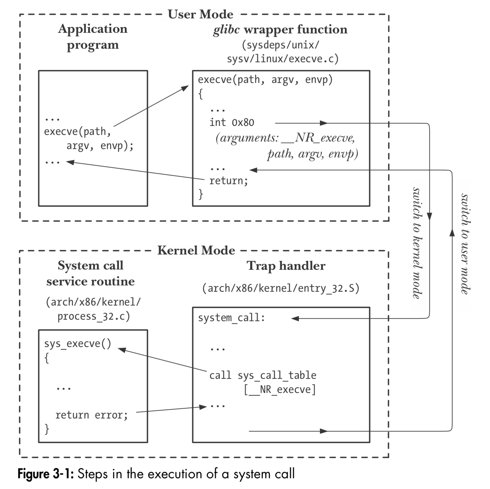

# Linux下系统调用的过程

> TLPI, Chap 3

- The application program makes a system call by invoking a wrapper function in the C library.
- The wrapper function must make all of the system call arguments available to the system call trap-handling routine (described shortly). These arguments are passed to the wrapper via the stack, but the kernel expects them in specific reg- isters. The wrapper function copies the arguments to these registers.
- Since all system calls enter the kernel in the same way, the kernel needs some method of identifying the system call. To permit this, the wrapper function copies the system call number into a specific CPU register (%eax).
- The wrapper function executes a trap machine instruction (int 0x80), which causes the processor to switch from user mode to kernel mode and execute code pointed to by location 0x80 (128 decimal) of the system’s trap vector.
- In response to the trap to location 0x80, the kernel invokes its system_call() rou- tine (located in the assembler file arch/i386/entry.S) to handle the trap. This handler:
    - a) Saves register values onto the kernel stack (Section 6.5).
    - b) Checks the validity of the system call number.
    - c) Invokes the appropriate system call service routine, which is found by using the system call number to index a table of all system call service rou- tines (the kernel variable sys_call_table). If the system call service routine has any arguments, it first checks their validity; for example, it checks that addresses point to valid locations in user memory. Then the service routine performs the required task, which may involve modifying values at addresses specified in the given arguments and transferring data between user memory and kernel memory (e.g., in I/O operations). Finally, the service routine returns a result status to the system_call() routine.
    - d) Restores register values from the kernel stack and places the system call return value on the stack.
    - e) Returns to the wrapper function, simultaneously returning the processor to user mode.
- If the return value of the system call service routine indicated an error, the wrapper function sets the global variable errno (see Section 3.4) using this value. The wrapper function then returns to the caller, providing an integer return value indicating the success or failure of the system call.

