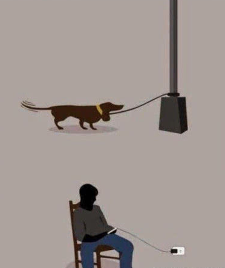

# 关闭手机通知，修复碎片化的生活

我以前做过一个推送系统，其任务就是，把给用户的消息推送到手机上，这样，手机就会收到一条弹窗推送。

想象一下从我们用上智能手机以后的生活，每当需要一个功能，就去软件商店搜索相关的软件，安装，之后App第一件事情就是问你，
是否允许发送通知(从技术角度，也叫推送，下文混用两者)。为什么推送是兵家必争之地？因为一个App，在上面花的时间越多，你就会越依赖它，
从而在上面花更多的时间，从而形成循环。而推送则是一种有效的提醒用户的手段：“我还在哟！App里有人给你发消息了，快来看吧！”。

从方式上来说，手机通知有这么几种：

- 弹窗提醒(看网页时从屏幕顶部向下弹出一个小窗口)
- 通知栏(锁屏时在时钟下方弹出一个小窗口)
- 角标数字(App图标的右上角，红色的数字)
- 小红点(App下方底栏，一个红色的小点)
- 小图标(朋友圈有朋友发送了新的分享时，他/她的头像)

还原一下我们日常学习和工作的场景：

- 看书看的正入迷，登登登，突然手机屏幕亮了。不自觉地就瞄了一眼，屏幕上xxx发来了一条消息，然后点开，回复，锁屏，继续看书。但是往往
需要一小会儿才能重新进入状态，而且不一定能有刚才的入迷程度。
- 走路正听着歌，开心的跟着哼，音乐突然被打断，登登登，提示你有一条消息，这个时候是该掏出手机来看看呢还是不该看呢？
- 准备入睡，半梦半醒间，突然有人给你弹出了视频聊天请求，于是从梦中惊醒，睡意全无。

有漫画巧妙的展现出了我们的状态：

为了突破这种困境，我在自己身上进行了一项长达一年的实验，实践表明，方案可行，副作用极小，收益极大，腰不疼了，腿不酸了，吃嘛嘛香，一口气上五楼。

- 卸载新闻软件：不看新闻，对我一点影响都没有，不用担心会错过大事，该知道的事情，通过身边的人(同事，朋友)，我还是会知道。
- 关闭不必要的手机通知，例如淘宝：想买的东西我还是会去买，但是不会被App提醒我要去买啥啥啥了。
- 社交类软件关闭声音和通知中心，仅保留角标数字：我主动打开手机的时候，再一次性集中处理所有未处理的消息(同时屏蔽那些所有群消息)。
- 开启睡眠模式：晚上11点以后不会发出任何声音。

我会因此错过重要的消息吗？

- 不会。如果在微信上联系不到我，而又是重要的紧急的事情，肯定会电话通知我。
- 那些促销活动，错过了就错过了，还防止自己剁手，而且一般大型促销活动都会提前预热（例如双11），不会错过的。
- 重大事件，一件都没有错过。因为除了App通知你，还可以从身边的人知道这些大事件。

我得到了：

- 成块的时间，可以用来睡觉，看书，思考，学习，娱乐等等。
- 不被频繁打断的生活。
- 我用手机和App，不是App用我(虽然我还是被用了)。

---

而作为生产力工具，电脑上我倾向于：

- 关闭通知（图标，声音，数字等等）
- 社交软件装到虚拟机里，然后大脑想休息的时候再去主动轮询

不过我的个人电脑上因为是用ArchLinux作为Host+Windows虚拟机，可以完美达到上述要求。公司的macOS就没法做到了，角标没找到去掉的方式。
