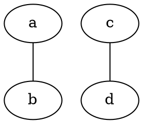
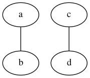
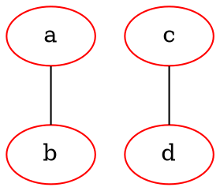
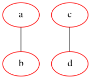
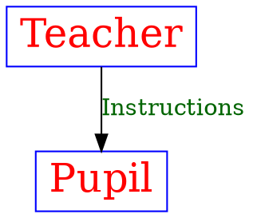
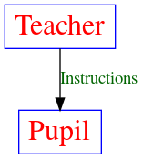

# Graphviz dot简明教程

graphviz是一个用特殊的文本语言来生成图片的应用，可以生成有向图和无向图。dot就是那个特殊的文本语言。

dot大概长这样：



生成图片：

```bash
$ dot -Tpng -o dot_demo.png dot_demo.dot
```

图片长这样：



## 安装

```bash
$ sudo pacman -S graphviz
```

## 语法

首先我们要声明一个图，可以使用 `graph`，代表无向图，也可以使用 `digraph` 代表有向图。


`graph_name` 是可选的，如果没有，就是一个匿名图。其中，`a`, `b`, `c`, `d` 都是一个节点，可以使用
`node` 关键字来进行属性设定，例如上面的变成：



生成的图片就会变成：



这些关键字包括：

- `node`: 修饰节点
- `edge`: 修饰连线

而常见的可以修饰的属性包括下面这些：

- `bgcolor`: 背景颜色
- `shape`: 形状
- `size`: 大小

详见：https://graphviz.gitlab.io/_pages/doc/info/attrs.html

## 标注和变量声明

有的时候我们需要在连线上做一些标注，或者是声明节点以便重复使用，看个例子就晓得了：



生成的图片是：



好了，就介绍这么多，其余的还是需要自己翻文档，不过这些知识已经够日常使用了。

---

- https://www.graphviz.org/doc/info/lang.html
- http://www.tonyballantyne.com/graphs.html
