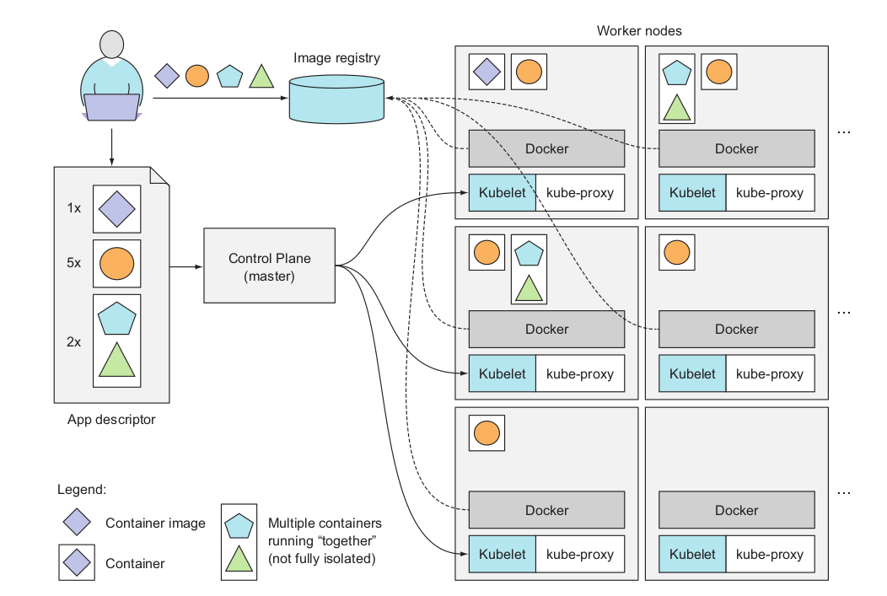
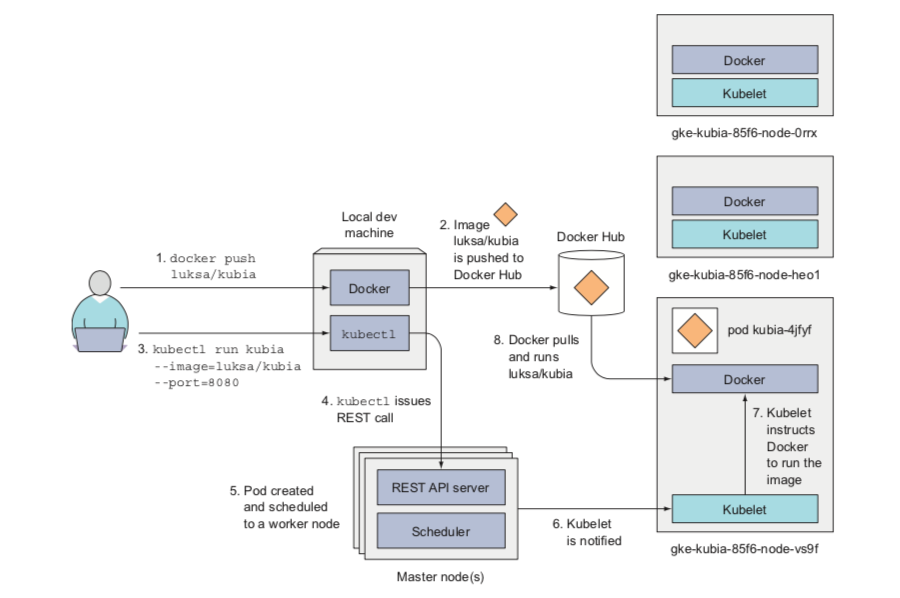
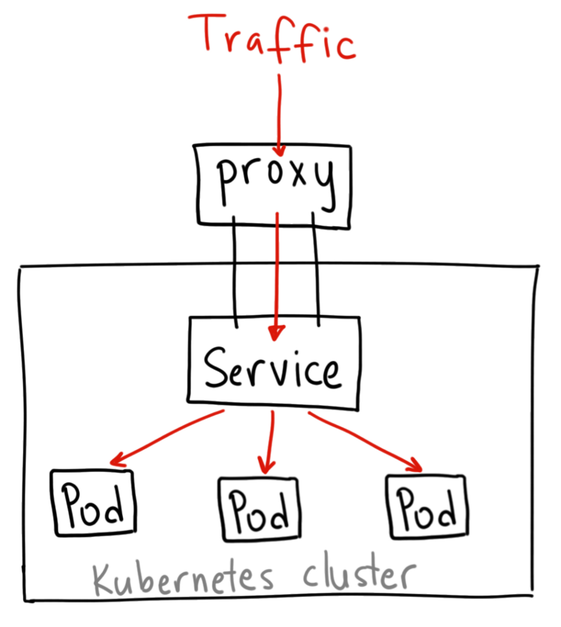

# Kubernetes 笔记

> 读《Kubernetes in Action》后整理而来

我们可以把一个或者多个容器打包在一起，就像用 `docker-compose` 时那样。我们把这样一个组合成为一个 `pod`。 pod是一个节点上，一个或多个容器的组合。
为什么需要pod？Container的最佳实践是一个进程一个Container，我们经常遇到两个程序互相配合或者成对出现的状况，这种时候pod就比较适用。

pod与pod之间的网络和pid命名空间是互相隔离的，但是一个pod内的各个容器却是共享一个网络和pid命名空间的。



## 试水

```bash
jiajun@idea $ kubectl run kubia --image=luksa/kubia --port=8080
kubectl run --generator=deployment/apps.v1 is DEPRECATED and will be removed in a future version. Use kubectl run --generator=run-pod/v1 or kubectl create instead.
deployment.apps/kubia created
jiajun@idea $ kubectl get deploy
NAME    READY   UP-TO-DATE   AVAILABLE   AGE
kubia   0/1     1            0           35s
```

执行上述命令的流程图：



> 由于kubia这个镜像比较大，我实际上换成了nginx这个镜像，后续的命令都是操作名为nginx的deployment。

## 暴露服务

```bash
$ kubectl expose deploy nginx --type=LoadBalancer --name nginx-http
service/nginx-http exposed
```

但是由于minikube不支持LoadBalancer，所以我们总是拿不到external-ip，而是一直都是 `pending`：

```bash
$ kubectl get svc
NAME         TYPE           CLUSTER-IP      EXTERNAL-IP   PORT(S)        AGE
kubernetes   ClusterIP      10.96.0.1       <none>        443/TCP        17h
nginx-http   LoadBalancer   10.110.87.196   <pending>     80:31353/TCP   81s
```

但是可以看到，它暴露了 `31353` 端口，我们可以访问minikube所在虚拟机的ip+端口：

```bash
jiajun@idea  ~ $ minikube ip
192.168.39.168
jiajun@idea  ~ $ curl http://192.168.39.168:31353
<!DOCTYPE html>
<html>
<head>
<title>Welcome to nginx!</title>
<style>
    body {
        width: 35em;
        margin: 0 auto;
        font-family: Tahoma, Verdana, Arial, sans-serif;
    }
</style>
</head>
<body>
<h1>Welcome to nginx!</h1>
<p>If you see this page, the nginx web server is successfully installed and
working. Further configuration is required.</p>

<p>For online documentation and support please refer to
<a href="http://nginx.org/">nginx.org</a>.<br/>
Commercial support is available at
<a href="http://nginx.com/">nginx.com</a>.</p>

<p><em>Thank you for using nginx.</em></p>
</body>
</html>
```

## 扩容

```bash
jiajun@idea  ~ $ kubectl scale deploy --replicas=2 nginx
deployment.extensions/nginx scaled
jiajun@idea  ~ $ kubectl get po -o wide
NAME                     READY   STATUS              RESTARTS   AGE    IP           NODE       NOMINATED NODE   READINESS GATES
nginx-755464dd6c-fh9gb   1/1     Running             0          125m   172.17.0.5   minikube   <none>           <none>
nginx-755464dd6c-rsvrj   0/1     ContainerCreating   0          3s     <none>       minikube   <none>           <none>
jiajun@idea  ~ $ kubectl get po -o wide
NAME                     READY   STATUS    RESTARTS   AGE    IP           NODE       NOMINATED NODE   READINESS GATES
nginx-755464dd6c-fh9gb   1/1     Running   0          125m   172.17.0.5   minikube   <none>           <none>
nginx-755464dd6c-rsvrj   1/1     Running   0          22s    172.17.0.6   minikube   <none>           <none>
```

## 令人讨厌的YAML

手册见：https://kubernetes.io/docs/reference/

k8s可以使用yaml或者json来描述资源。`kubectl get xxx -o [json|yaml]` 即可切换输出。我们来看一个具体的例子：

```bash
jiajun@idea  ~ $ kubectl get po
NAME                     READY   STATUS    RESTARTS   AGE
nginx-755464dd6c-fh9gb   1/1     Running   0          144m
nginx-755464dd6c-rsvrj   1/1     Running   0          18m
jiajun@idea  ~ $ kubectl get po nginx-755464dd6c-fh9gb -o yaml
apiVersion: v1
kind: Pod
metadata:
  creationTimestamp: "2019-05-09T00:46:49Z"
  generateName: nginx-755464dd6c-
  labels:
    pod-template-hash: 755464dd6c
    run: nginx
  name: nginx-755464dd6c-fh9gb
  namespace: default
  ownerReferences:
  - apiVersion: apps/v1
    blockOwnerDeletion: true
    controller: true
    kind: ReplicaSet
    name: nginx-755464dd6c
    uid: edf7b310-71f3-11e9-a2f3-30a5e7e13be0
  resourceVersion: "69602"
  ...
```

其中：

- `apiVersion` k8s所用的api版本
- `kind` 所使用的k8s资源类型
- `metadata` pod的元数据
- `spec` pod的信息(specification)
- `status` pod和它里面的容器的状态信息

## 手动创建一个Pod

```yaml
apiVersion: v1
kind: Pod
metadata:
  name: nginx-pod-manual
spec:
  containers:
    - image: nginx
      name: nginx-manual
      ports:
        - containerPort: 80
          protocol: TCP
```

```bash
jiajun@idea  ~ $ kubectl apply -f nginx_pod.yaml  # 创建也可以用 kubectl create -f ...
pod/nginx-pod-manual created
jiajun@idea  ~ $ kubectl get po
NAME                     READY   STATUS              RESTARTS   AGE
nginx-755464dd6c-fh9gb   1/1     Running             0          149m
nginx-755464dd6c-rsvrj   1/1     Running             0          23m
nginx-pod-manual         0/1     ContainerCreating   0          7s
```

可以通过 `kubectl explain xxx` 来获得文档：

```bash
jiajun@idea  ~ $ kubectl explain pod
KIND:     Pod
VERSION:  v1

DESCRIPTION:
     Pod is a collection of containers that can run on a host. This resource is
     created by clients and scheduled onto hosts.

FIELDS:
   apiVersion   <string>
     APIVersion defines the versioned schema of this representation of an
     object. Servers should convert recognized schemas to the latest internal
     value, and may reject unrecognized values. More info:
     https://git.k8s.io/community/contributors/devel/api-conventions.md#resources

   kind <string>
     Kind is a string value representing the REST resource this object
     represents. Servers may infer this from the endpoint the client submits
     requests to. Cannot be updated. In CamelCase. More info:
     https://git.k8s.io/community/contributors/devel/api-conventions.md#types-kinds

   metadata     <Object>
     Standard object's metadata. More info:
     https://git.k8s.io/community/contributors/devel/api-conventions.md#metadata

   spec <Object>
     Specification of the desired behavior of the pod. More info:
     https://git.k8s.io/community/contributors/devel/api-conventions.md#spec-and-status

   status       <Object>
     Most recently observed status of the pod. This data may not be up to date.
     Populated by the system. Read-only. More info:
     https://git.k8s.io/community/contributors/devel/api-conventions.md#spec-and-status

jiajun@idea  ~ $ kubectl explain pod.spec
KIND:     Pod
VERSION:  v1

RESOURCE: spec <Object>

DESCRIPTION:
     Specification of the desired behavior of the pod. More info:
     https://git.k8s.io/community/contributors/devel/api-conventions.md#spec-and-status

     PodSpec is a description of a pod.

FIELDS:
   activeDeadlineSeconds        <integer>
     Optional duration in seconds the pod may be active on the node relative to
     StartTime before the system will actively try to mark it failed and kill
     associated containers. Value must be a positive integer.

   affinity     <Object>
     If specified, the pod's scheduling constraints

   automountServiceAccountToken <boolean>
     AutomountServiceAccountToken indicates whether a service account token
     should be automatically mounted.
...
```

## 查看日志

```bash
jiajun@idea  ~ $ kubectl get po
NAME                     READY   STATUS    RESTARTS   AGE
nginx-755464dd6c-fh9gb   1/1     Running   0          152m
nginx-755464dd6c-rsvrj   1/1     Running   0          27m
nginx-pod-manual         1/1     Running   0          3m22s
jiajun@idea  ~ $ kubectl logs nginx-755464dd6c-fh9gb
172.17.0.1 - - [09/May/2019:02:23:11 +0000] "GET / HTTP/1.1" 200 612 "-" "HTTPie/1.0.2" "-"
172.17.0.1 - - [09/May/2019:02:23:20 +0000] "GET / HTTP/1.1" 200 612 "-" "curl/7.64.1" "-"
jiajun@idea  ~ $ kubectl logs -f nginx-755464dd6c-fh9gb
172.17.0.1 - - [09/May/2019:02:23:11 +0000] "GET / HTTP/1.1" 200 612 "-" "HTTPie/1.0.2" "-"
172.17.0.1 - - [09/May/2019:02:23:20 +0000] "GET / HTTP/1.1" 200 612 "-" "curl/7.64.1" "-"


^C
```

`-f` 类似 `tail -f`

## 端口转发

```bash
jiajun@idea  ~ $ kubectl port-forward nginx-pod-manual 8080:80
Forwarding from 127.0.0.1:8080 -> 80
Forwarding from [::1]:8080 -> 80
```

```bash
jiajun@idea  ~ $ http :8080
HTTP/1.1 200 OK
Accept-Ranges: bytes
Connection: keep-alive
Content-Length: 612
...
```

> 也可以用 kubectl expose 暴露服务然后访问

## 标签

labels是k-v对。

```bash
jiajun@idea  ~ $ kubectl get po --show-labels
NAME                     READY   STATUS    RESTARTS   AGE     LABELS
nginx-755464dd6c-fh9gb   1/1     Running   0          157m    pod-template-hash=755464dd6c,run=nginx
nginx-755464dd6c-rsvrj   1/1     Running   0          32m     pod-template-hash=755464dd6c,run=nginx
nginx-pod-manual         1/1     Running   0          8m56s   <none>
jiajun@idea  ~ $ kubectl label po nginx-pod-manual create_by=jiajun
pod/nginx-pod-manual labeled
jiajun@idea  ~ $ kubectl get po --show-labels
NAME                     READY   STATUS    RESTARTS   AGE     LABELS
nginx-755464dd6c-fh9gb   1/1     Running   0          158m    pod-template-hash=755464dd6c,run=nginx
nginx-755464dd6c-rsvrj   1/1     Running   0          33m     pod-template-hash=755464dd6c,run=nginx
nginx-pod-manual         1/1     Running   0          9m31s   create_by=jiajun
```

> 也可以在yaml里指定，参考reference

根据label筛选列出来的pod：

```bash
jiajun@idea  ~ $ kubectl get po -l create_by=jiajun
NAME               READY   STATUS    RESTARTS   AGE
nginx-pod-manual   1/1     Running   0          10m
```

可以在 `spec` 里添加 `nodeSelector`，让pod分配到有指定标签的节点上。

## namespace

通过namespace隔离pod：

```bash
jiajun@idea  ~ $ kubectl get ns
NAME              STATUS   AGE
default           Active   18h
kube-node-lease   Active   18h
kube-public       Active   18h
kube-system       Active   18h
jiajun@idea  ~ $ kubectl -n default get po
NAME                     READY   STATUS    RESTARTS   AGE
nginx-755464dd6c-fh9gb   1/1     Running   0          163m
nginx-755464dd6c-rsvrj   1/1     Running   0          38m
nginx-pod-manual         1/1     Running   0          14m
jiajun@idea  ~ $ kubectl -n kube-system get po
NAME                                    READY   STATUS    RESTARTS   AGE
coredns-fb8b8dccf-5fsf5                 1/1     Running   0          18h
coredns-fb8b8dccf-cmn5q                 1/1     Running   0          18h
etcd-minikube                           1/1     Running   0          18h
kube-addon-manager-minikube             1/1     Running   0          18h
kube-apiserver-minikube                 1/1     Running   0          18h
kube-controller-manager-minikube        1/1     Running   0          18h
kube-proxy-f2wm5                        1/1     Running   0          18h
kube-scheduler-minikube                 1/1     Running   0          18h
kubernetes-dashboard-79dd6bfc48-96grm   1/1     Running   4          18h
storage-provisioner                     1/1     Running   0          18h
``` 

创建namespace：

```bash
jiajun@idea  ~ $ kubectl create namespace jiajun
namespace/jiajun created
jiajun@idea  ~ $ kubectl get ns | grep jiajun
jiajun            Active   7s
jiajun@idea  ~ $ kubectl delete namespace jiajun
namespace "jiajun" deleted
jiajun@idea  ~ $ kubectl get ns | grep jiajun
jiajun@idea  ~ $
```

## 健康检查

- liveness probes: 存活
- readiness probes: 就绪

ref: https://kubernetes.io/docs/tasks/configure-pod-container/configure-liveness-readiness-probes/

## Service

为什么需要service？`pod` 有IP，但是pod随时可能挂掉，而service却是永存的。



service有三种方式：

- `ClusterIP`: 这是默认的方式，即集群内部IP
- `NodePort`: 在所在机器上暴露端口，但是只能是30000-32767的范围（当然也是可以改的）
- `LoadBalancer`: 外部负载均衡
- `Ingress`: 见下一小节

创建一个Service：

```yaml
apiVersion: v1
kind: Service
metadata:
  name: nginx-pod-svc
spec:
  ports:
    - port: 8088
      targetPort: 80
  selector:
    create_by: jiajun
```

### Ingress

minikube 试着开一下：

```bash
jiajun@idea  ~ $ minikube addons list
- addon-manager: enabled
- dashboard: enabled
- default-storageclass: enabled
- efk: disabled
- freshpod: disabled
- gvisor: disabled
- heapster: disabled
- ingress: disabled
- logviewer: disabled
- metrics-server: disabled
- nvidia-driver-installer: disabled
- nvidia-gpu-device-plugin: disabled
- registry: disabled
- registry-creds: disabled
- storage-provisioner: enabled
- storage-provisioner-gluster: disabled
jiajun@idea  ~ $ minikube addons enable ingress
✅  ingress was successfully enabled
jiajun@idea  ~ $ kubectl -n kube-system get po
NAME                                        READY   STATUS              RESTARTS   AGE
coredns-fb8b8dccf-5fsf5                     1/1     Running             0          19h
coredns-fb8b8dccf-cmn5q                     1/1     Running             0          19h
default-http-backend-6864bbb7db-2vv9b       0/1     ContainerCreating   0          18s
etcd-minikube                               1/1     Running             0          19h
kube-addon-manager-minikube                 1/1     Running             0          19h
kube-apiserver-minikube                     1/1     Running             0          19h
kube-controller-manager-minikube            1/1     Running             0          19h
kube-proxy-f2wm5                            1/1     Running             0          19h
kube-scheduler-minikube                     1/1     Running             0          19h
kubernetes-dashboard-79dd6bfc48-96grm       1/1     Running             4          19h
nginx-ingress-controller-586cdc477c-flqqf   0/1     ContainerCreating   0          17s
storage-provisioner                         1/1     Running             0          19h
```

创建一个service先：

```bash
jiajun@idea  ~ $ kubectl apply -f nginx_pod_svc.yaml
service/nginx-pod-svc created
jiajun@idea  ~ $ kubectl get svc
NAME            TYPE           CLUSTER-IP      EXTERNAL-IP   PORT(S)        AGE
kubernetes      ClusterIP      10.96.0.1       <none>        443/TCP        19h
nginx-http      LoadBalancer   10.110.87.196   <pending>     80:31353/TCP   100m
nginx-pod-svc   ClusterIP      10.99.34.26     <none>        8088/TCP       12s
```

创建一个ingress：

```yaml
apiVersion: extensions/v1beta1
kind: Ingress
metadata:
  name: nginx-pod-manual-ingress
spec:
  rules:
    - host: nginx.jiajunhuang.com
      http:
        paths:
          - path: /
            backend:
              serviceName: nginx-pod-svc
              servicePort: 8088
```

```bash
jiajun@idea  ~ $ kubectl apply -f nginx_pod_ingress.yaml
ingress.extensions/nginx-pod-manual-ingress created
jiajun@idea  ~ $ kubectl get ingress
NAME                       HOSTS                   ADDRESS   PORTS   AGE
nginx-pod-manual-ingress   nginx.jiajunhuang.com             80      4s
```

> 不过我本地的minikube没有分配到地址，所以访问不了

## Volume

Volume就是 `docker -v` 的那种，挂载一个卷。支持的类型比较多，详细需要参考文档。

- `emptyDir`
- `hostPath`
- `gitRepo`
- `nfs`
- `gcePersistentDisk, awsElasticBlockStore, azureDisk`
- `cinder, cephfs, iscsi, flocker, glusterfs, quobyte, rbd, flexVolume, vsphere- Volume, photonPersistentDisk, scaleIO`
- `configMap, secret, downwardAPI`
- `persistentVolumeClaim`

ref: https://kubernetes.io/docs/concepts/storage/volumes/

---

- https://medium.com/google-cloud/kubernetes-nodeport-vs-loadbalancer-vs-ingress-when-should-i-use-what-922f010849e0
- https://kubernetes.io/docs/reference/
- https://kubernetes.io/docs/tasks/configure-pod-container/configure-liveness-readiness-probes/
- https://kubernetes.io/docs/concepts/storage/volumes/
