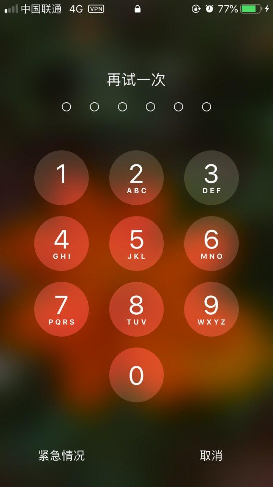
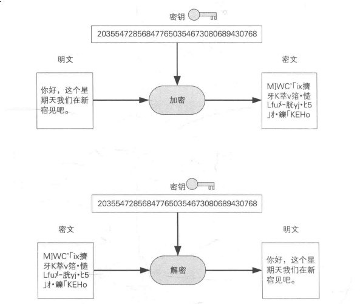
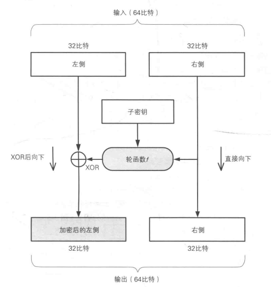
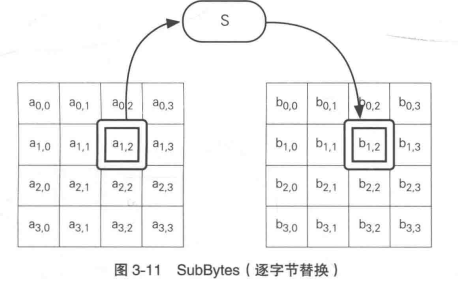
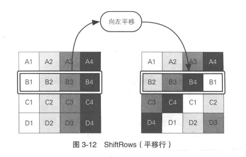
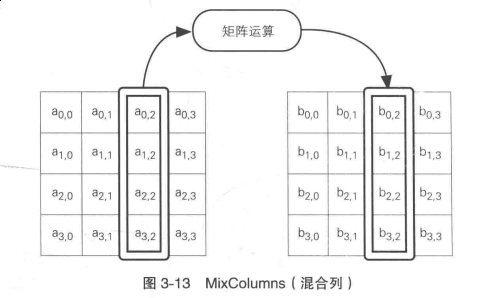
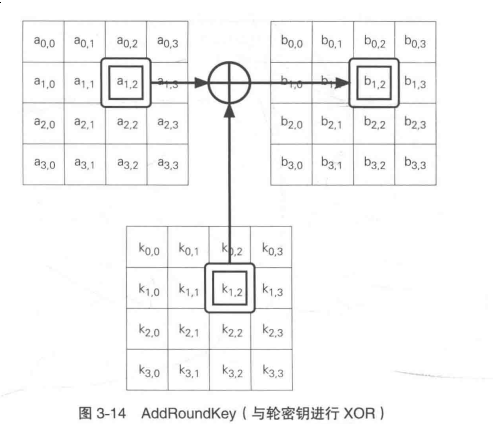

# 密码技术简明教程(一)：对称加密和非对称加密

密码技术好像不常用，偶尔我们才需要对接需要验签的接口。
实际上密码技术很常用，只要你访问了https的网站，就用到了密码技术，甚至是解锁手机，也用到了密码技术。

密码技术就是这样，无处不在，但是一般人却极少察觉到。然而密码技术与网络安全息息相关，每个程序员都有必要了解。

为此，整理了这篇教程，就是为了让大家能够方便快速的理解密码技术。我们先对图示进行约定。首先我们所有的图示中，
`Alice` 和 `Bob` 是发送者和接受者(通常都是 `Alice` 是发送者，`Bob` 是接受者，但偶尔会反过来，视箭头方向而定)，而
`Cracker` 是尝试窃取 `Alice` 和 `Bob` 通信内容的第三者。举个例子，最理想的情况下，没有人进行窃听，那么 `Alice` 和
`Bob` 是这样进行对话的：

```
Alice ---(消息A)----> Bob
```

就好像我们和朋友面对面说话，但是旁人都没有听。但实际生活中，我们的谈话多多少少会被旁人听到，因此，实际上应该是这样的：

```
Alice ----(消息A)---> Bob
                \------> Cracker
```

除了窃听之外，`Cracker` 可以做出更多破坏性的事情，例如篡改信息，就像下面这样：

```
Alice ---(消息A)---> Cracker ---(消息B)---> Bob
```

如果 `Alice` 给 `Bob` 发送的消息是 "我爱你"，但是不怀好意的 `Cracker` 篡改成了 "我们分手吧！混蛋"，那么对于 `Alice` 和
`Bob` 来说，这无疑都是最坏的消息。 这就是传说中的中间人攻击。还有其他的攻击类型，例如破解密码等等。而密码技术的重要用途
就是保证我们想要的数据完好无损或者不被第三人知晓。

然而在了解真正的密码技术之前，首先我们要了解一些常见的概念。让我们开始吧！

## 密码、加密、解密、破译



说起密码，我想大家都不陌生，我们每天都要输入各种各样的密码，密码简单来说，就是一堆只有你知道而别人不一定知道的序列，但是通常来说，
密码是明文的，例如最常见的弱密码：1234567。

而加密则是把明文转换成别人看不懂、无法破解的密文的过程，解密则是相反的过程。加密之前的消息叫做明文，加密之后生成的消息叫做密文。
而对于解密来说，解密之前的消息叫做密文，解密成功之后得到的消息便是明文。而第三方通过某种方式，也将密文还原成了明文，这就叫破译。

```
+----------+               +-----------+
|          |  ---加密--->  |           |
|   明文   |               |   密文    |
|          |  <--解密----  |           |
+----------+               +-----------+
            <-            /
               \--破译---/
```

而对于加密来说，由于加密和解密所使用的密钥是否相同，则分为了对称加密和非对称加密两种。密钥就是加密和解密时使用的密码。

## 对称加密，非对称加密和混合加密



对称加密是指在加密和解密时使用同一密钥的加密方式。
非对称加密则是指在加密和解密时使用不同密钥的方式。

而对于使用的密钥，对称加密所使用的密钥叫做对称密码(symmetric cryptography)，非对称加密所使用的密钥叫做
非对称密码(asymmetric cryptography)，也叫公钥密码(public-key cryptography)。

而混合加密就是把对称加密和非对称加密揉在一起，利用这两种技术各自的优点，而避开缺点的一种技术，比如 HTTPS 就是构建在混合加密之上的。

### 对称加密

我们知道，计算机里所有的东西都是0和1来表示，而二进制有一个运算特别 “神奇”，那就是异或运算(XOR)。异或运算有这样一个特性，
对于同一个数字A，使用另一个数字B进行两次异或运算，最后的结果还是A。如果我们用 `^` 来表示 异或运算，那么就是： `A ^ B ^ B = A`。

异或运算的规则(二进制)：

- 0 ^ 0 = 0
- 1 ^ 0 = 1
- 0 ^ 1 = 1
- 1 ^ 1 = 0

> 简单的来说就是相同的为0，不同的为1。

用Python来算一下就知道了：

```python
$ python
>>> 1 ^ 2 ^ 2
1
```

### 分组密码

#### DES

下面我们介绍一种年代比较久远的对称加密：DES。DES(Data Encryption Standard)是1977年美国联邦信息处理标准中采用的一种对称密码。
它的工作方式是把明文分成64bit为一组，使用一个64bit长(实际有效长度为56bit)的加密密钥分别进行加密。

> 一般来说，以分组为单位进行处理的密码算法称为分组密码。

DES中，加密的各个步骤称为轮(round)，DES的整个加密过程中就是进行若干次轮的循环。DES是一种16轮循环的加密算法。



如图，每一轮中，将输入的64bit切割成两个32bit，分别叫做左侧和右侧，然后把右侧的数据和子密钥使用轮函数进行加密，然后和左侧
的32bit进行异或运算。由于这样只加密了左侧，没有加密右侧，因此进行下一轮的时候，将左右两侧对调，重复进行上次的操作。

> 注意，其中的子密钥之所以叫做子密钥，是因为每一轮中的子密钥都是不同的，它只针对那一轮生效。

而解密的流程就是根据上述流程反着来。

#### AES

AES(Advanced Encryption Standard)是取代DES的新的加密标准，它的底层算法是Rijndael算法。AES也使用了轮，在每一轮中，AES进行了
如下四个步骤：

- SubBytes。AES的输入分组为128bit，也就是16字节。首先AES逐字节的对16字节进行SubBytes替换。也就是以每个字节的值为索引，
从一张拥有256个值的表里查找出对应的字符进行替换。



- ShiftRows。这一步是以4字节为单位，算作一行，按照一定的规则向左平移，每一行评议的字节数是不一样的。



- MixColumns。这一步是以4字节为单位，对每一列进行比特运算，得到一个不同的4字节的值。



- AddRoundKey。最后这一步就是将前面得到的结果与密钥进行异或运算。



而解密的时候也是根据上述流程反着来。

> 扩展阅读：[分组加密的分组模式](https://en.wikipedia.org/wiki/Block_cipher_mode_of_operation)

### 非对称加密

对称加密固然好，但是有一个很大的问题，那就是，怎么解决密码共享的问题呢？ `Cracker` 可以不知道密文是什么，但是只要在密钥共享的过程中
获取了密钥，那么密文自然就可以破译出来。因此我们需要一种不需要共享密钥就能进行加密的技术，它就是非对称加密。

非对称加密的原理是余数，以时钟为例，1点再转12个小时，又会回到1点，即 `1 + 12 = 13, 13 mod 12 = 1`，而时钟反过来转，往前减12个小时，也
还是1，即 `1 - 12 = -11, -11 mod 12 = 1`。正是利用了余数的这一特性，才能有公钥加密。

下面我们来讲讲最常用的公钥加密算法：RSA。

在RSA中，密文、明文、密钥都是数字。RSA的加密和解密流程是这样的：

- `密文 = 明文 ** E mod N`，即密文 = 明文的E次方 mod N
- `明文 = 密文 ** D mod N`，即明文 = 密文的D次方 mod N

而我们常说的公钥和私钥，在上面的等式中就是，公钥是E和N的组合，私钥是D和N的组合。

不过至于RSA的数学证明，以我目前的水平尚且无法给大家一个简单易懂的解释，有兴趣的同学可以自行参考: https://en.wikipedia.org/wiki/RSA_(cryptosystem)

### 混合密码技术

既然RSA这么好用，为什么不直接在所有的场合都使用RSA呢？原因是RSA的加密和解密都要对一个非常大的质数进行计算，与对称加密相比，性能实在是差太多。
因此就有人把这两种技术混合起来，使用非对称加密来传送密码，之后使用所传送的密码进行对称加密，HTTPs就是构建在这个基础之上的。

## 小结

这篇文章里，我们简单的看了一下对称加密和非对称加密，了解了加密过程中涉及到的一些对象和名词概念。
在 [下一篇](https://jiajunhuang.com/articles/2019_05_14-crypto_part2.md.html) 中，我们将会看到密码技术在其他领域的应用，例如校验文件的唯一性，等等。

---

- [《图解密码技术》](https://book.douban.com/subject/26822106/)
- [中间人攻击](https://zh.wikipedia.org/wiki/%E4%B8%AD%E9%97%B4%E4%BA%BA%E6%94%BB%E5%87%BB)
- [AES](https://zh.wikipedia.org/zh/%E9%AB%98%E7%BA%A7%E5%8A%A0%E5%AF%86%E6%A0%87%E5%87%86)
