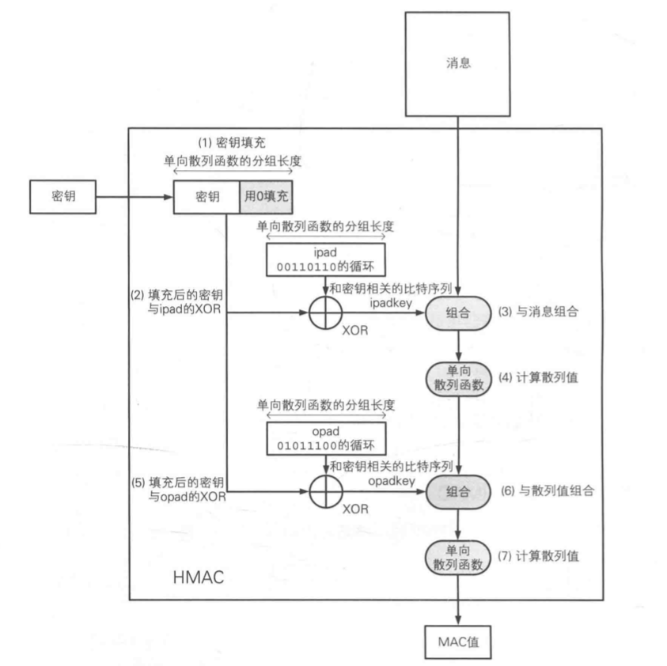
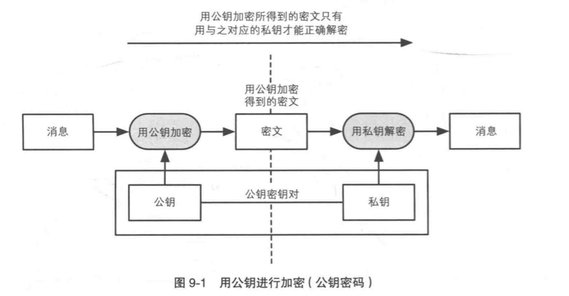
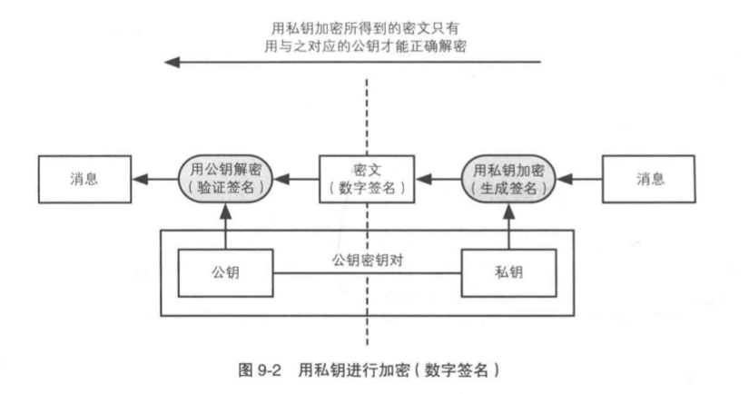

# 密码技术简明教程(二)：散列、消息认证码和数字签名

[上一篇](https://jiajunhuang.com/articles/2019_05_12-crypto.md.html) 我们讲到了对称加密和非对称加密，利用这两个技术我们
确保了信息传输的安全性。但是如果有这么一种情况，`Alice` 下班之后忘记把电脑锁屏，第二天来的时候 `Alice` 如何确定自己的文件
是否被篡改过呢？

这种时候我们就要使用到一种叫做散列的技术，有时候也把通过散列函数生成出来的字符串叫做那个文件的指纹。

## 散列

散列函数的作用就是输入一样的消息，那么就会输出一个同样的散列值，也就是我们所说的指纹。但是只要消息有一丁点儿变化，就会输出
一个不一样的散列值。

> 当然，散列函数并不是完美的，也有极小的概率，输入两个不一样的消息，却输出了一个同样的散列值，这种情况我们叫做"碰撞"。
> 这种情况的发生主要取决于散列函数的质量。

散列值的长度与输入的长度无关，无论输入是多长，输出的值的长度都是固定的。

我们常见的散列函数有：

- MD4: https://en.wikipedia.org/wiki/MD4
- MD5: https://en.wikipedia.org/wiki/MD5
- SHA-1: https://en.wikipedia.org/wiki/SHA-1
- SHA-256, SHA-384, SHA-512: https://en.wikipedia.org/wiki/SHA-2
- SHA-3: https://en.wikipedia.org/wiki/SHA-3

但是要注意，到2019年，MD4和MD5已经是不安全的了，它们的碰撞性已经被攻破了。同时，SHA-1也已经不安全。因此，目前常用的散列
是SHA-256，SHA-384和SHA-512。

高质量的散列函数能够识别出哪怕一丁点儿的篡改，但是它也有一个缺点，虽然它能识别篡改，但是无法识别伪装。即，如果 `Cracker`
伪装成 `Alice` 给 `Bob` 发送文件，即使 `Bob` 确认了文件没有被篡改也无济于事，因为这个文件根本不是真正的 `Alice` 发出的，
而是出自 `Cracker` 之手。因此，我们需要消息认证码和数字签名技术。

## 消息认证码

消息认证码(MAC, Mesasge Authentication Code)的作用就是确保消息发送于真正的来源。而消息认证码需要有这么一种特性，即使消息
认证码被 `Cracker` 获取了，它也无法篡改消息认证码从而让自己伪装成 `Alice`。

消息认证码有几种实现方式：

- 通过散列函数实现，这种一般叫做 `HMAC`，`H` 就是Hash。
- 使用分组密码例如AES来实现

这上面的密钥就是 `Alice` 和 `Bob` 事先商量好的一个密钥，只要这个密钥没有泄漏，那么就可以说明，发消息的要么是 `Alice`，
要么就是 `Bob`；而根据消息的流向很容易就能确定是 `Alice` 发给 `Bob` 的还是 `Bob` 发给 `Alice` 的。那么怎么确保密钥不会
被 `Cracker` 知道呢？这就要用到上一节我们介绍的 非对称加密 了。

但是即便如此，消息认证码也是有安全风险的，那就是一种叫做 "重放攻击" 的策略，也就是说，虽然我没法知道你到底传输的内容是什么，
但是我可以拦截你的消息认证码，我再给你请求一遍。这个时候很可能就会发生这样一种情况，例如 `Alice` 给 `Bob` 转账1000元，
重放攻击之后，`Alice` 就一共给 `Bob` 转账了2000元。一般我们解决这种问题的方案有这么三种：

- 把时间戳加进去，但是这只能在一定范围内解决重放攻击，却不能根治，只要 `Cracker` 足够快，你就追不上重放攻击的步伐。
- 使用一个单调递增的序号，这种方式可以虽然可以根治，但是每次双方都要记录好这个序列号。
- nonce，这种方式就是每次请求都带一个随机数，这个随机数就是nonce，因为每次都是随机的，所以可以确定唯一性，当然，缺点就是，消息变的更大了一些。

消息认证码这么好用，也有一个解决不了的问题，那就是，如果 `Alice` 和 `Bob` 转账之后，需要向他们老板证明，然后老板给他们报销。
这是做不到的，为什们？因为消息认证码需要一个只有 `Alice` 和 `Bob` 才知道的密钥，如果想要向老板证明，那就要把密钥也给老板，
但是既然密钥给了老板，那么如何证明消息不是老板发的而是 `Alice` 发的呢？所以我们需要数字签名技术。

## 数字签名

`Alice` 和 `Bob` 之所以无法向老板证明，是因为知道密钥的人，就能造出消息。如果想要证明是 `Alice` 发的消息，那么只能使用
一个只有 `Alice` 才有，别人都没有的东西来进行签名才行。这让我们想起了使用 `ssh` 的时候，我们总是把本机的公钥发给目的机器，
然后我们登录的时候就可以确保我们一定是从这台电脑上登录的。

不过由于数字签名，所生成的签名是要给别人看的，所以数字签名是使用私钥来生成签名，而公钥用来验证签名的。

总结一下：

- 非对称加密中，公钥加密，私钥解密
- 数字签名中，私钥签名，公钥验证签名

正是因为 `Alice` 的私钥只有 `Alice` 才有，`Bob` 的私钥只有 `Bob` 才有，因此他们才可以证明消息是自己发的。

---

小结：

这一篇文章中我们学习了散列、消息认证码和数字签名，[接下来一篇文章中我们将会看一下证书和TLS](https://jiajunhuang.com/articles/2019_05_15-crypto_part3.md.html)。

---

- 重放攻击：https://zh.wikipedia.org/wiki/%E9%87%8D%E6%94%BE%E6%94%BB%E5%87%BB
- MD4: https://en.wikipedia.org/wiki/MD4
- MD5: https://en.wikipedia.org/wiki/MD5
- SHA-1: https://en.wikipedia.org/wiki/SHA-1
- SHA-256, SHA-384, SHA-512: https://en.wikipedia.org/wiki/SHA-2
- SHA-3: https://en.wikipedia.org/wiki/SHA-3
