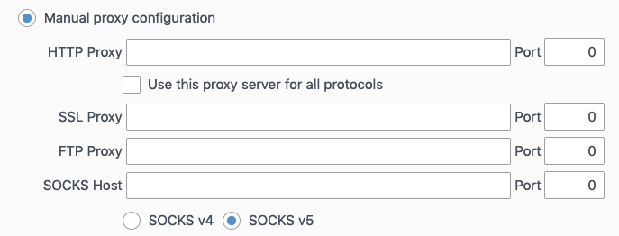
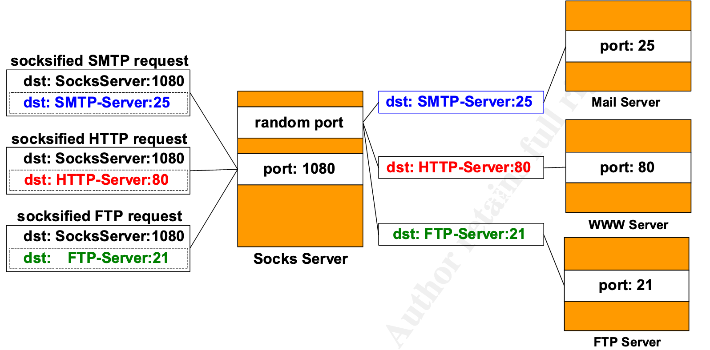

# socks5 协议详解

`socks5` 是一个简单的代理协议，这里是 [RFC](https://tools.ietf.org/html/rfc1928)。



整个协议其实就是在建立TCP连接之后，真正的内容传输之前，加一点内容。以下是简述：

首先定义一下名词：

```
      /-> | Firewall(防火墙) | ->\
Client -> Server(代理服务器) -> Dst(目标地址)
```

然后定义一下表示形式：

```
+----+----------+----------+
|VER | NMETHODS | METHODS  |
+----+----------+----------+
| 1  |    1     | 1 to 255 |
+----+----------+----------+
```

例如上述，1就是指长度是一个byte，因此 `1 to 255` 也就是 1~255个byte。如果是 `X'05'` 那么就是八进制的 `05` 也就是 `0x05`
的意思。

## 第一步，Client建立与Server之间的连接

建立TCP连接之后，Client发送如下数据：

```
+----+----------+----------+
|VER | NMETHODS | METHODS  |
+----+----------+----------+
| 1  |    1     | 1 to 255 |
+----+----------+----------+
```

- `VER` 是指协议版本，因为是 `socks5`，所以值是 `0x05`
- `NMETHODS` 是指有多少个可以使用的方法，也就是客户端支持的认证方法，有以下值：
    -  `0x00` NO AUTHENTICATION REQUIRED  不需要认证
    -  `0x01` GSSAPI 参考：https://en.wikipedia.org/wiki/Generic_Security_Services_Application_Program_Interface
    -  `0x02` USERNAME/PASSWORD 用户名密码认证
    -  `0x03` to `0x7f` IANA ASSIGNED 一般不用。INNA保留。
    -  `0x80` to `0xfe` RESERVED FOR PRIVATE METHODS 保留作私有用处。
    -  `0xFF` NO ACCEPTABLE METHODS 不接受任何方法/没有合适的方法
- `METHODS` 就是方法值，有多少个方法就有多少个byte

## 第二步，Server返回可以使用的方法

收到Client的请求之后，Server选择一个自己也支持的认证方案，然后返回：

```
+----+--------+
|VER | METHOD |
+----+--------+
| 1  |   1    |
+----+--------+
```

`VER` 和 `METHOD` 的取值与上一节相同

## 第三步，客户端告知目标地址

```
+----+-----+-------+------+----------+----------+
|VER | CMD |  RSV  | ATYP | DST.ADDR | DST.PORT |
+----+-----+-------+------+----------+----------+
| 1  |  1  | X'00' |  1   | Variable |    2     |
+----+-----+-------+------+----------+----------+
```

- `VER` 还是版本，取值是 `0x05`
- `CMD` 是指要做啥，取值如下：
    - CONNECT `0x01` 连接
    - BIND `0x02` 端口监听(也就是在Server上监听一个端口)
    - UDP ASSOCIATE `0x03` 使用UDP
- `RSV` 是保留位，值是 `0x00`
- `ATYP` 是目标地址类型，有如下取值：
    - `0x01` IPv4
    - `0x03` 域名
    - `0x04` IPv6
- `DST.ADDR` 就是目标地址的值了，如果是IPv4，那么就是4 bytes，如果是IPv6那么就是16 bytes，如果是域名，那么第一个字节代表
接下来有多少个字节是表示目标地址
- `DST.PORT` 两个字节代表端口号

## 第四步，服务端回复

```
+----+-----+-------+------+----------+----------+
|VER | REP |  RSV  | ATYP | BND.ADDR | BND.PORT |
+----+-----+-------+------+----------+----------+
| 1  |  1  | X'00' |  1   | Variable |    2     |
+----+-----+-------+------+----------+----------+
```

- `VER` 还是版本，值是 `0x05`
- `REP` 是状态码，取值如下：
    -  `0x00` succeeded
    -  `0x01` general SOCKS server failure
    -  `0x02` connection not allowed by ruleset
    -  `0x03` Network unreachable
    -  `0x04` Host unreachable
    -  `0x05` Connection refused
    -  `0x06` TTL expired
    -  `0x07` Command not supported
    -  `0x08` Address type not supported
    -  `0x09` to `0xff` unassigned
- `RSV` 保留位，取值为 `0x00`
- `ATYP` 是目标地址类型，有如下取值：
    - `0x01` IPv4
    - `0x03` 域名
    - `0x04` IPv6
- `DST.ADDR` 就是目标地址的值了，如果是IPv4，那么就是4 bytes，如果是IPv6那么就是16 bytes，如果是域名，那么第一个字节代表
接下来有多少个字节是表示目标地址
- `DST.PORT` 两个字节代表端口号



## 第五步，开始传输流量

到这一步，就成功了，接下来就该咋传输流量咋传输流量了。

## 总结

socks5是一个非常通用的代理协议，因此，无论我们自己要实现什么加密传输，都需要在client端设置一个socks5服务器，用于将
客户端例如浏览器等的请求理解之后，转换成私有协议。这篇文章中我们初步的看了一下socks5的结构，了解了一下socks5协议的
传输流程。

---

参考资料：

- https://tools.ietf.org/html/rfc1928
- https://www.giac.org/paper/gsec/2326/understanding-implementing-socks-server-guide-set-socks-environment/104018
