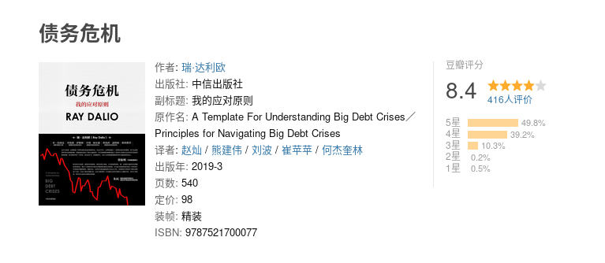

# 读《债务危机》

最近读了《原则》一书作者的另一本书，《债务危机》，花了点时间，昨天才读完。这本书主要是以20世纪到2018年世界范围内发生的
各种债务危机为案例，总结了泡沫的常见特征。并且重点分析了三个案例：

- 德国1918-1924债务危机与恶性通胀
- 美国1928-1937债务危机
- 美国2007-2011债务危机

其中，德国1918-1924，美国2007-2011年是典型的通胀型萧条，而美国1928-1937则是通缩型萧条。从这三个案例中，可以发现，面对债务危机，
通常有两种方式来解决：

- 缩减开支，即缩减消费，把省出来的钱用于还债。这样做会非常痛苦，很容易导致恶性循环，即 省钱 - 工厂赚不到钱 - 工资变少 - 更省钱
- 印钞，通过印钞来刺激经济，让经济正向循环，这个方式的套路是，印钱 - 撒钱给大众 - 刺激消费 - 工厂“更赚钱” - 可供消费的钱更多

但是印钞有一个致命弱点，就是钞票本身是一个信用，只是一张纸。我们所说的100元，背后需要有100元的实物与之对应。我们以钞票
来进行交易，实际上是指，这张钞票的背后能有100元的价值。如果大量印钞，那么就会发生通胀，即明天的100元，没有现在的100元
值钱。

但是为何政府仍然选择印钞呢？因为美国1928-1937年的案例表明，在两种选择中，印钞没有那么痛。而在上个世纪，很多资本主义国家
都实行金本位制，也就是说货币与黄金是互换的。这样的好处显而易见，与黄金绑定，信用极高，有利于货币推广，坏处也很明显，没有
办法加印钞票。因此很多国家现在都取消了金本位制。

接下来解释几个名词：

- 债务：简单来说，就是借钱。与个人一样，企业或者集团同样需要借钱，如果所借每1元，到期需要还利息5分，那么，只要在到期时，
这一元钱最终赚到的钱多余1.05元，就是划算的（当然，还要减扣开支等）
- 去杠杆：上面所说的借钱投资，就是杠杆，即本人只有一块钱，但是如果可以借到一块钱，那么就有两块钱可以进行投资。去杠杆就是
少借点钱。
- 杠杆率：杠杆率一般是指权益资本与资产负债表中总资产的比率。也就是，借来的钱占总共的钱的比率。杠杆率越高，风险就越大，因为
投资是有风险的，如果赚了，那么自然是皆大欢喜，如果赔了，那么本金都要贴进去了。

---

接下来是读本书的一些笔记：

- 化繁为简的讲，在任何时候，你一旦借钱，就会创造出一个周期。买一件你目前买不起的东西，你的消费必然会超出你的收入。借款时，
你不仅是在向贷款人借钱，你实际上是在向未来的自己借钱。在未来的某个时候，你必须要降低消费水平，以偿还债务。这种先借款消费，
后紧缩开支的模式与周期非常相似。对个人来说是这样，对一国经济而言也是如此。一旦借款，就启动了一系列机械性的、可预测的事件。
- 如果市场已经好道不能再好，但每个人都认为它还会更好时，市场的顶部就行成了。
- 我在此重申我提出的泡沫的基本特征。
    - 以传统尺度来衡量，物价较高
    - 物价低估了未来物价在这些高位基础上的快速上涨
    - 存在普遍的看涨情绪
    - 人们通过高杠杆融资购买
    - 买家进行了超长期的远期购买（如积累库存、签署远期购买合同等），以进行投机或保护自己免受未来物价上涨影响
    - 新买家（即之前没有进入市场的买家）已进入市场
    - 刺激性货币政策有助于泡沫扩大，而紧缩政策有助于泡沫破裂。
- 如前所述，胡佛试图通过财政紧缩平衡预算，这是新手应对经济萧条的典型做法
- 房价上涨越多，信贷标准就越低（即使反过来才合乎逻辑），但贷款人和借款人发现，发放贷款和借款购房都很有利可图
- 将高速增长的债务用于消费而非投资，这种现象是一个危险信号，因为消费不能产生收入，而投资可能增加收入
- 泡沫时期的一个典型现象是，外国资金大量涌入，参与泡沫，表现为资本流入和经常账户赤字膨胀（占GDP的6%）。这些资金大部分
都来自中国等新兴经济体，这些经济体当时拥有巨额经常账户盈余，它们选择了储蓄和投资美国资产。强劲的资本流入使美国公民能够
得到借款，进而维持超出自身收入的消费水平。
- 随着利率的上升，债务偿还金额也会增加（无论是新增信贷还是原有浮动利率贷款）。这不利于新增借款（因为信贷成本上升了），
也减少了可支配收入（因为偿债金额增加）。借款和可支配收入减少导致支出增速放缓。由于一个人的支出是另一个人的收入，收入也
随之下降，如此循环。当人们削减消费时，物价走低，经济活动减少。
- 同时，随着短期利率的上升，收益率曲线趋于平缓甚至倒挂，导致流动性下降，短期资产（如现金）的回报也随其收益率走高而提升，
相比周期较长的金融资产（如债券、股票和房地产）和信用评级较低的资产（这些资产与现金的利差逐渐收窄），持有短期资产变得
更具有吸引力，因此资金流出金融资产，导致资产价值下跌。资产价格下降反过来产生负面财富效应，导致支出和收入不断下降，进而
影响尸体经济。
- 在风险价值法中使用近期的波动率数据，并大体预期未来波动率将保持不变。这是人们的普遍心理，也是一种愚蠢的思维方式，因为使用
前期波动性和前期相关性并不能准确预测未来的风险。
- 将濒临破产、大而不倒的金融机构国有化是去杠杆的典型举措

---

参考资料：

- https://book.douban.com/subject/30486499/
- https://zh.wikipedia.org/zh/%E9%87%91%E6%9C%AC%E4%BD%8D
