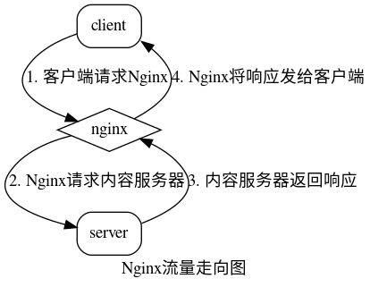
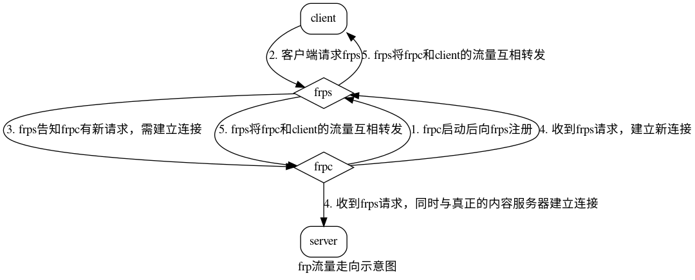

# frp 源码阅读与分析(一)：流程和概念

frp 是一个比较流行的用于内网穿透的反向代理服务器，与Nginx不同，一般我们使用Nginx做负载均衡，而frp我们一般用来做内网穿透。

先来看看Nginx和frp流量走向的区别。这是Nginx的流量走向示意图：



这是frp的流量走向示意图：



## 了解frp里的一些名词

说实话，frp里名词太多了，再加上 [Golang 奇葩的命名规则(要求短)](https://jiajunhuang.com/articles/2018_11_01-golang_practice.md.html) ，
实在是不好阅读。我们要先来了解一下在阅读frp源码之前，有哪些名词是我们需要了解的：

- `frps`: frp由两部分组成，`frps` 是服务端的名称，负责处理请求，转发流量
- `frpc`: frp由两部分组成，`frpc` 是客户端的名称，负责把本地的流量连到服务器，让服务器读取&写入
- `proxy`: `proxy` 就是代理，例如下面的配置文件里，`[tcp]` 和 `[http]` 就是要代理的东西
- `visitor`: `visitor` 是指使用 `stcp` 和 `xtcp` 的时候，请求公网服务器的那台电脑也要装一个客户端，那个就是所谓的 `visitor`
- `workConn`: `workConn` 就是指 `frpc` 和 `frps` 所建立的连接
- `service`: `service` 是服务端和客户端里，管辖一切的一个全家桶。可以直接把它当 `frpc` 和 `frps` 看待。
- `control`: `control` 是用来管理连接用的，比如连接、断开等等
- `xxx wrapper`: 这个就顾名思义了，就是一个包装，一般是包了一个 `logger`
- `xxx manager`: 同样顾名思义，就是用来管理的

```ini
# frpc.ini
[common]
server_addr = x.x.x.x
server_port = 7000

[ssh]
type = tcp
local_ip = 127.0.0.1
local_port = 22
remote_port = 6000

[http]
type = tcp
local_ip = 127.0.0.1
local_port = 80
remote_port = 6001
```

## 一个请求的大概处理流程

接下来我们看一下frp的工作流程：

- 首先，`frpc` 启动之后，连接 `frps`，并且发送一个请求 `login()`，之后保持住这个长连接，如果断开了，就重试
- `frps` 收到请求之后，会建立一个 `listener` 监听来自公网的请求
- 当 `frps` 接受到请求之后，会在本地看是否有可用的连接( `frp` 可以设置连接池)，如果没有，就下发一个 `msg.StartWorkConn` 并且
等待来自 `frpc` 的请求
- `frpc` 收到之后，对 `frps` 发起请求，请求的最开始会指名这个连接是去向哪个 `proxy` 的
- `frps` 收到来自 `frpc` 的连接之后，就把新建立的连接与来自公网的连接进行流量互转
- 如果请求断开了，那么就把另一端的请求也断开

## 难点

难点在于 `frp` 的程序代码为了糅合 `frpc` 和 `frps` 之间的请求，自己在TCP之上进行协议封装，因此大量使用了 `channel`，
所以代码被割散到各处，很不容易连贯起来。所以大家做好心理准备。

## 总结

这一篇文章中，我们了解了frp的一些概念和流程。下一篇我们会深入到代码看一下一个TCP代理是怎么工作的。

---

参考资料：

- https://github.com/fatedier/frp
- https://zh.wikipedia.org/zh-hans/%E4%BB%A3%E7%90%86%E6%9C%8D%E5%8A%A1%E5%99%A8
- https://zh.wikipedia.org/wiki/%E5%8F%8D%E5%90%91%E4%BB%A3%E7%90%86
