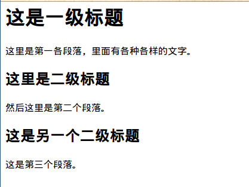
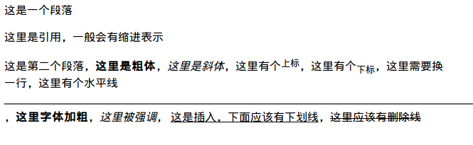
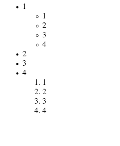
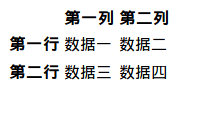

# 后端工程师学前端（一）：HTML

为了让自己的技能不再那么单一，我决定先后学习前端和iOS开发。此前我的前端技能是零散的、不成体系的，我会系统的将学习历程
记录成系列博客：后端工程师学前端。

> 这一篇是阅读《HTML&CSS设计与构建网站》之后的笔记，借助这一篇文章，可以系统的学习HTML知识。

## HTML的基本结构

正如Word文档，编辑的时候会有标题、一级标题、二级标题等等，HTML也有类似的概念用以表示不同的结构。下面是一个基本的HTML代码：

```html
<html>
    <body>
    <h1>这是一级标题</h1>
    <p>这里是第一各段落，里面有各种各样的文字。</p>
    <h2>这里是二级标题</h2>
    <p>然后这里是第二个段落。</p>
    <h2>这是另一个二级标题</h2>
    <p>这是第三个段落。</p>
    </body>
</html>
```

其展示效果如下：



上述代码中，例如 `<html>`, `<body>` 这样的，用尖括号括起来的叫做元素，每个元素有一个起始标签和结束标签，其中 `<html>`
是起始标签，`</html>` 是结束标签。

一个HTML的基本结构是：

```html
<!DOCTYPE html>
<html>
    <head>
        <title>Title of the document</title>
    </head>

    <body>
        The content of the document......
    </body>
</html>
```

其中第一行的 `<!DOCTYPE html>` 是声明我们使用的是 `HTML 5`，这是最新的HTML标准。然后是由 `<html>` 和 `</html>` 组成的元素，
里面一般有 `<head>`,`<body>` 两部分组成。一般我们用 `<body>` 来存储我们肉眼看到的的页面的内容，例如第一个截图中的各种内容，
而用 `<head>` 来存储各种关于页面的信息，例如 `<title>` 是这个页面在浏览器上显示的标题，`<meta>` 标签可以告诉浏览器一些关于
当前页面的信息等等。

## 标签

一般来说，标签都是成对出现的，例如 `<html>` 和 `</html>`，前者告诉浏览器，元素开始，后者告诉浏览器，元素结束。每个元素
都有一些专属属性，用于展示特效，属性是在标签后面，用 `xxx="yyy"` 的形式，例如：

```html
<p lang="en">hello world</p>
```

其中的 `lang="en"` 就是属性。正如K-V，`lang` 就是 K, `lang` 就是V，一般V都会用引号包含起来。只有少量属性是所有元素都共有的，
例如 `lang`，绝大多数属性都是元素特有的，用于描述该元素的一些属性。

## 标题和段落

一共有6个级别的标题，从 `h1` 到 `h6`，他们在外观上的区别是大小不一，例如如下代码：

```html
<h1>这是h1</h1>
<h2>这是h2</h2>
<h3>这是h3</h3>
<h4>这是h4</h4>
<h5>这是h5</h5>
<h6>这是h6</h6>
```

其展示效果是：

<h1>这是h1</h1>
<h2>这是h2</h2>
<h3>这是h3</h3>
<h4>这是h4</h4>
<h5>这是h5</h5>
<h6>这是h6</h6>

而段落则使用 `<p>` 标签，`p` 是 `paragraph` 的缩写，即段落。默认情况下，浏览器会为每个 `<p>` 标签另起一行并且与后续段落保持
一定的距离，因为 `<p>` 是块级元素，块级元素就会另起一行，与之相对的叫做内联元素，我们会在后面讲到。

其余的修饰文本的标签有：

- `<b>` 字体为粗体
- `<i>` 字体为斜体
- `<sup>` 上标
- `<sub>` 下标
- `<br />` 换行
- `<hr />` 水平线
- `<strong>` 加粗
- `<em>` 强调
- `<blackquote>` 和 `<q>` 都是引用，不过后者不常用
- `<ins>` 插入，一般显示为带下划线
- `<del>` 删除，一般显示为删除线

下面的代码结合了上述标签：

```html
<html>
<p>
这是一个段落
</p>
<blackquote>这里是引用，一般会有缩进表示</blackquote>
<p>
这是第二个段落，<b>这里是粗体</b>，<i>这里是斜体</i>，这里有个<sup>上标</sup>，这里有个<sub>下标</sub>，这里需要换<br />一行，
这里有个水平线<hr />，<strong>这里字体加粗</strong>，<em>这里被强调</em>，
<ins>这是插入，下面应该有下划线</ins>，<del>这里应该有删除线</del>
</p>
</html>
```

我们看看效果：



## 列表

列表分三种，一种是有序列表，一种是无序列表，一种是自定义列表。有序列表的标签是 `<ol>`，即 `ordered list`，无序列表的标签是
`<ul>` 即 `unordered list`，它们的子元素都是 `<li>`。有序列表中，每个子元素的前面会有数字表示序号，而无序列表的前面一般是
一个黑点。列表可以嵌套。例如如下代码：

```html
<html>
    <ul>
        <li>1</li>
        <ul>
            <li>1</li>
            <li>2</li>
            <li>3</li>
            <li>4</li>
        </ul>
        <li>2</li>
        <li>3</li>
        <li>4</li>
        <ol>
            <li>1</li>
            <li>2</li>
            <li>3</li>
            <li>4</li>
        </ol>
    </ul>
</html>
```

效果是：



自定义列表不常用，忽略之。

## 超链接

链接的标签是 `<a>`，目标地址是一个叫做 `href` 的属性，例如：

```html
<a href="https://jiajunhuang.com">我的博客</a>
```

其中，`我的博客` 会由浏览器渲染出来，一般默认的特效是蓝色字体，而 `href="https://jiajunhuang.com"` 则是属性，即目标地址是 `https://jiajunhuang.com`。`href` 的值可以
有两种形式，一种是类似 `https://jiajunhuang.com` 这样的，叫做绝对URL，一般我们表示
其它网站的资源的时候就用这种，另外一种是 `/aboutme` 这样的，这是相对URL，也就是说，
我们要访问的目标地址是当前所访问网站的 `/aboutme` 这个资源。

如果 `href` 里的值是 `mailto:xxx@example.com`，那么点击这个超链接之后，就会唤起邮件客户端，
如果想要在新的窗口中打开链接，那么应该写上一个属性，KV为 `target="_blank"`。
还有一种形式，例如 `href="#top"`，点击之后，浏览器会把我们定位到元素id为 `top` 的地方，
也就是说，如果某个元素有这么一对KV：`id="top"`，那么就是它了。

> 注意，id必须在整个页面中都是唯一的

## 图像

我们使用 `` 标签来表示图像，它有这么几个常见的属性：

- `src`：值是图像的地址，同样可以是绝对URL或相对URL
- `alt`：值是对图像的文字说明，一般图像无法加载时就会显示它
- `title`：当鼠标放在图像上面时，就会展示出来
- `height` 和 `width`：表示图片的高度和宽度

## 表格

表格的标签是 `<table>`，一般我们称用于表示表格信息的第一列或者第一行为表头，我们使用
`<th>` 来表示表头，`<tr>` 是行，`<td>` 是表格中的数据。例如：

> `<th>` 有个属性，`scope="col|row"`表示它作用于行还是列

```html
<html>
    <table>
        <tr>
            <th></th>
            <th scope="col">第一列</th>
            <th scope="col">第二列</th>
        </tr>
        <tr>
            <th scope="row">第一行</th>
            <td>数据一</td>
            <td>数据二</td>
        <tr>
        </tr>
            <th scope="row">第二行</th>
            <td>数据三</td>
            <td>数据四</td>
        </tr>
    </table>
</html>
```

其效果是：



`<td>` 标签可以使用 `colspan` 或者 `rowspan` 来表示跨行或者跨列，即把多个单元格合并成一个。

## 表单

表单就是 `form`，后端工程师一定不陌生，表单的标签是 `<form>`，`<form>` 有几个属性，`action` 表示提交表单时所请求的URL，`method` 表示提交表单时所使用的方法，可以是
`GET` 或者 `POST`。
表单里最重要的标签是 `<input>`，`<input>` 的属性 `name` 表示表单中KV值的K，`value` 则是V。
`<input>` 还有一个属性，`type`，它的不同的值代表着不同的类型：

- `type="text"`：普通文本
- `type="password"`：密码
- `type="radio"`：单选框
- `type="checkbox"`：复选框
- `type="file"`：上传文件
- `type="submit"`：提交按钮
- `type="image"`：使用图像来作为提交按钮
- `type="hidden"`：隐藏控件，即不会展示出来
- `type="date"`：日期控件
- `type="email"`：邮件
- `type="url"`：URL
- `type="search"`：搜索框

表单中还有 `<textarea>` 是多行文本框。`<label>` 是标签，用于描述输入框，`<fieldset>`
用于组合表单元素。`<select>` 下拉框，如果加了 `multiple` 属性，则为多选框。`<button>`
是按钮。

## 其它标签

- HTML 5的文档类型声明是 `<!DOCTYPE html>`
- HTML中的注释是 `<!-- blabla -->`
- `id` 是用来表示全局唯一身份的属性
- `class` 是表示多个元素所有的共同属性
- 块级元素在显示时总是会另起一行，包括：`<h1>` - `<h6>`, `<p>`, `<ul>`, `<ol>`等
- 内联元素在显示时总是与相邻元素在同一行内，包括：`<a>`, `<b>`, `<em>`, ``等
- `<div>` 用于将多个块级元素组合在一起
- `<span>` 用于将多个内联元素组合在一起

## 总结

这一篇中我们系统的学习了一下HTML 5的标签。接下来我们要熟悉CSS 3。
