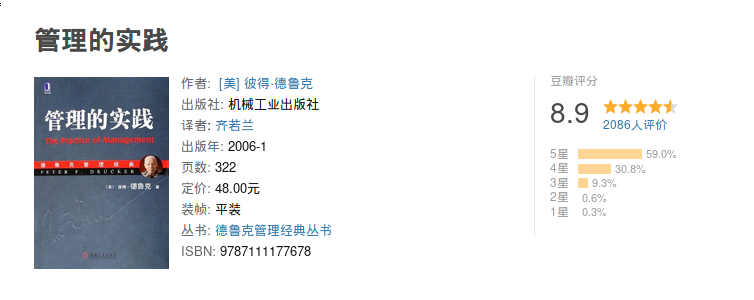

# 读《管理的实践》

最近把《管理的实践》读了一遍，我认为这本书可以多读几遍，因为这可以提升我们的思维层次，以技术人员一章中的说法为例，为何
通常技术人员不是一个好的管理层呢？因为技术人员通常忽略并且鄙视行政，他们认为技术好则一切都好。我在
[技术人，光有技术是不行的](https://jiajunhuang.com/articles/2019_04_17-tech_only_is_bad.md.html) 一文中已经说明：

> 技术是一门手艺。但这门手艺的门槛并不高，尤其是今天，只要你有兴趣，能坚持下去，好的教材非常多，学技术并不是一件很
> 难的事情，而竞争力就来源于壁垒。既然无法构建壁垒，那么竞争力其实并不高。

我们不能让自己陷入技术的怪圈，即 “罢黜百家，独尊技术”，而应该让自己的能力多元化，我们可以先从小地方做起，
例如，让自己站在更高的视角，技术总监，产品总监来看，可以让自己脱离单纯的技术层面，从打造一个产品的源头，
到最后产品推广，这一整条线上的技能，依次学习了解；然后站在更高的位置，例如CEO，如果你是CEO，你会如何布局当前的产品，
如何取舍，形成自己公司的战略，这当中就涉及到一个非常重要的东西 --- 管理。

一个人的时候，我们需要自我管理，自制力是自我管理的关键之处，对于自我管理，通常是高效的，因为沟通成本、自我执行成本
都很低；当事情多了之后，一个人无法完成所有任务，一个人也不应该完成所有任务，这个时候就涉及到对他人的管理。

- 如何调动员工的情绪？是让他积极的认同这份工作，还是让他消极的认为自己只是纯粹的打工？
- 工作中势必有一些无聊，却不得不做的事情，让谁来承担这些事情？
- 公司应该如何定位？面向哪种用户？针对哪个市场？
- 公司的竞争力是什么？公司的战略是什么？
- 如何管理不同工作类型的员工？
- ...

当然，这本书讲了很多方面，同时也就意味着讲的比较泛，不会出现具体的方案。此外书中举例子的方式实在是让人有点容易想起童话故事。

---

接下来是读本书的一些笔记：

- 管理层的第一个定义是：管理层是经济器官，是工业社会所独有的经济器官。管理层的每一个行动、每一项决策和每一个考虑，都必须以经济作为首要尺度。

- 第二个否定性的结论是，管理绝不能成为一门精确的科学。

- 管理的最后一项职能是管理员工与工作。工作必须有效执行，而工作必须由员工来完成──从纯粹的非技术性员工到艺术家、从推车的
工人到执行副总裁都是企业员工。这意味着要对工作进行组织，使之成为最适合人类的工作；对员工进行组织，使得员工最有效地进行工作。
这也意味着应该将人视为资源──也就是说，人具备独特的生理特质、能力和限制，因此应该像处理其他资源（例如铜）一样，给予同等
的关注。但同时也应该将人当成不同于其他资源的资源，每位员工都有自己的个性和公民权，能够掌控自己是否要工作，以及做多做少
和绩效好坏，因此需要激励、参与、满足、刺激、奖励、领导、地位和功能。只有通过管理，才能满足这些要求。因为员工只有通过
工作和职务，并身属企业才能得到满足，而管理层则是给企业注入生命的重要器官。

- 管理的第四个职能（而是额外的尺度），那就是时间。管理者必须将目前的现况和长远的未来都一并纳入考虑。

- 企业是由人创造和管理的，而不是由“经济力量”创造和管理的。

- 市场不是由上帝、大自然或经济力量创造的，而是由企业家创造的。企业家必须设法满足顾客的需求，而在他们满足顾客的需求之前，
顾客也许感觉到那种需求。就像饥荒时渴求食物一样，不能满足的需求可能主宰了顾客的生活，在他清醒的每一刻，这种需求都盘旋在
他的脑海中。但是，在企业家采取行动满足这些需求之后，顾客才真的存在，市场也才真的诞生，否则之前的需求都只是理论上的需求。

- 由于企业的目的是创造顾客，任何企业都有两个基本功能，而且也只有这两个基本功能：营销和创新。

- 想要弄清楚我们的事业是什么，第一步是问：“我们的顾客是谁？”谁是我们真正的顾客？谁又是我们潜在的顾客？这些顾客在哪里？他们如何购买？如何才能接触到这些顾客？
下一个问题是，“顾客购买的是什么？”,最后是最难回答的问题：“在顾客心目中，价值是什么？顾客采购时究竟在寻找什么？”

- 企业应该设定绩效和成果目标的领域共有 8个：包括市场地位、创新、生产力、实物和财力资源、获利能力、管理者绩效和培养管理者、员工绩效和工作态度、社会责任。

- 大多数的企业都需要不止一个营销目标，而需要 7个营销目标：
    - 1.现有产品在目前市场上的理想地位，以销售额和市场占有率来表示，同时和直接与间接竞争对手相比较。
    - 2.现有产品在新市场上的理想地位，以销售额和市场占有率来表示，同时和直接与间接竞争对手相比较。
    - 3.应该淘汰哪些旧产品──无论是为了技术原因、市场趋势、改善产品组合，或只是管理层考虑应该从事的事业后所做的决定。
    - 4.目前市场需要的新产品──产品的数量、性质以及应该达到的销售额与市场占有率。
    - 5.应该开发的新市场和新产品──以销售额和市场占有率来表示。
    - 6.达到营销目标和适当的定价政策所需要的销售组织。
    - 7.服务目标，衡量公司如何以产品、销售和服务组织，提供顾客认为有价值的东西。

- 企业经营者千万不要忘记创新是一个缓慢的过程。许多公司今天之所以能居于领导地位，要归功于 25年前的辛苦耕耘。许多目前还
默默无闻的公司，可能因为今天的创新，将成为明天的产业龙头。成功公司面临的危机是，总是志得意满地挥霍前人累积的创新成果。
因此需要建立衡量标准，来评估创新活动是否成功。

- 突然削减经费可能在一夕之间摧毁了长期耕耘的成果。

- 几乎上述的每一项支出都必须依赖能干的员工，才能发挥效用。然而如果工作时经常觉得受制于突发、不可预测的高低起伏的公司政策，
那么一流人才就不愿继续留在公司里，或即使留下来，也不再尽最大的努力──因为“到头来上面还是说砍就砍，努力工作又有什么用呢？”

- 找到过去已经发生过的非经济性、却会影响经济环境的事件，然后据以制定未来的决策。

- 我们不能说任何事情在未来一定会发生。即使必然会发生的事情确实发生了，我们仍然无法预估发生的时间。因此，我们绝不能单独
运用基本要素分析法，必须由第三个降低预测风险的工具加以检验：趋势分析

- 只有当企业能充分了解生产是怎么回事，并将之组织为统一零件的生产，再将零件组装成多样的产品，才能发挥自动化的效益。

- 企业应该把报告和程序保持在最低限度，只有当报告和程序能节省时间和人力时，才运用这项工具，并且应该尽可能简化。

- 企业需要的管理原则是：能让个人充分发挥特长，凝聚共同的愿景和一致的努力方向，建立团队合作，调和个人目标和共同福祉的原则。

- 管理者的工作应该以能够达成公司目标的任务为基础，是实质工作，能对企业的成功产生明显而且可以清楚衡量的贡献。管理者的
工作范围和职权应该尽可能宽泛，凡是不能明确排除在外的事务都应该视为管理者的职责。最后，管理者应该受绩效目标的指引和控制，而不是由上司指导和控制。

- 对组织最严重的控诉，莫过于说他们把杰出人才当成威胁，认为卓越的绩效会造成别人的困扰和挫折感。对组织精神杀伤力最大的
莫过于一味强调员工的缺点，而忽视他们的长处，不正视员工的能力，只怪罪他们的无能。企业必须把焦点放在员工的长处上。

- 企业必须通过五方面的实践，才能确保正确的精神贯彻于整个管理组织中：
    - 1.必须建立很高的绩效标准，不能宽容差的或平庸的表现，而且必须根据绩效，给予奖励。
    - 2.每个管理职位本身必须有其价值，而不只是升迁的踏板。
    - 3.必须建立合理而公平的升迁制度。
    - 4.管理章程中必须清楚说明谁有权制定事关管理者命运的重要决定，管理者必须有向高层申诉的途径。
    - 5.在任命管理者的时候，必须很清楚诚实正直的品格是对管理者的绝对要求，是管理者原本就需具备的特质，不能期待他升上管理职位后才开始培养这种特质。

- 企业不应该完全从内部升迁。内部升迁确实应该是企业的常态，但很重要的是，不要让管理层完全依赖近亲繁殖，结果变得自鸣得意、自我封闭。
公司规模越大，就越需要局外人的参与。公司内部应该建立起清楚的共识──即使是高层管理职位，都需要定期引进外部人才，而外部人才
一旦加入公司，享受到的待遇将和循正常轨道升上来的“老干部”没什么两样。

- 管理层不应该任命一个将才智看得比品德更重要的人，因为这是不成熟的表现。管理层也不应该提拔害怕其手下强过自己的人，
因为这是一种软弱的表现。管理层绝不应该将对自己的工作没有高标准的人放到管理岗位上，因为这样做会造成人们轻视工作，轻视管理者的能力。

- 组织结构必须尽可能包含最少的管理层级，设计最便捷的指挥链。每增加一个管理层级，组织成员就更难建立共同的方向感和增进彼此
了解。每个新增的层级都可能扭曲目标，误导注意力。指挥链中的每个连接点都会带来压力，成为引发怠惰、冲突和松懈的另一个源头。

- 如果没有适当的组织原则，管理层级只会不断增加。

- 无论实施联邦或职能分权制，都必须在企业上上下下建立共同的公民意识，在多元中保存一致性。即使最自主管理的产品事业部都
不算真正独立的单位，反之，自治只是整个企业提高绩效的手段而已。因此，由于拥有更大的自主权，各单位管理者更应该把自己当成整个企业和广大团体的一分子。

- 在企业外部，经济是最重要的考虑。在企业内部，所有的考虑都是基于权力平衡和权力之间的关系。

- 要让专业人员在企业中发挥效能和生产力，必须满足五个特殊需求：他必须是专业人员，但也必须对企业有所贡献，而且知道自己有
何贡献；他必须享有专业人员和个别贡献者的升迁机会；当他改善绩效和提高个人贡献时，企业必须提供金钱上的奖励；他的职务必须
属于专业工作；他需要在企业内部和更广大的社区中获得专业上的肯定。
