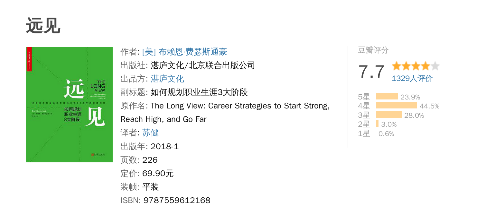

# 读《远见-如何规划职业生涯3大阶段》

毕业之前，学校一般都会组织上职业生涯规划这样一门课程，但是一般由于涉世未深，学校这么课程一般也挺水，因此可以说，大部分人
都没有认真的思考过自己的职业生涯规划。而这本书就是为此而生，它告诉我们，职业生涯可以大概分为三个阶段：

- 加添燃料，强势开局：这个阶段我们主要要做的事情是磨练自己的能力
- 聚焦长板，达到高点：这个阶段我们已经知道自己擅长什么，不擅长什么，发挥自己的长处，规避自己的短处
- 优化长尾，持续发挥影响力：这个阶段已经是接近职业生涯的尾声，我们的创造力已经接近枯竭，但是可以通过维护先前的积累，继续发挥影响力

职业生涯就像是自己的一个品牌，它是一个长跑，我们选择工作时一定要想清楚自己到底想要什么，对当前有何利弊，对长远来说又有何利弊。作者所划分的三个阶段，每个阶段约15年，实际上我们应该根据自己的实际情况来进行适配。作者的计算方式是这样的，以62岁减去
当前的年龄（62岁是绝大多数人的退休年龄），基本上就是职业生涯的全部。这样大概是40-45年。

第一个阶段的唯一目标就是为接下来的两个阶段打好基础，第一阶段不仅要有耐心，而且要不断行动，为之后收获果实播下种子，这个时候
我们要以成长为第一目标，要找到自己的长板和热情所在，要树立良好的工作习惯，要去探索和弥补自身的短板，要储存职场燃料，所谓的职场燃料，主要是这么三个：可迁移的技能、有意义的经验、持久的关系。
第二个阶段是利用自己的长板，自己的爱好和这个世界的需求，找到他们的交集，以追求更高的目标，实现自我。
第三个阶段就是完美的退出。从执行或领导的角色变成顾问或辅助的角色。

## 三个职场燃料

- 可迁移的技能是指你在职业生涯中获取并且拥有的各种基本能力，它们并不局限于一家特定的公司，例如技术能力、产品能力、运营能力等等。它们是当你从一个工作换到另一个工作，从一家公司换到另一家公司，甚至是从一个行业换到另外一个行业都能依靠的能力和基础。例如：
    - 解决问题的能力
    - 说服式沟通技巧
    - 完成任务的能力，要能长期的高质量的交付任务
    - 人才引力：让别人愿意为你工作
    - 帮助和求助的能力：你的有意义的付出会在某一天回报你
    - 情商
    - 搜索和收集信息的能力
    - 缓解压力的能力

- 有意义的经验结合起来可以让你在职业生涯中既成为复合型人才，又很稳健。新的经验会让你离开舒适圈，建立新的职业技能。要点不同的技能，而不是把自己局限于单一技能。例如，代码就是代码，而不是只是前端、后端。你还可以做产品、运营等等。

- 持久的关系，你的职业生涯会认识很多人，他们会是你最持久的燃料。和那些惺惺相惜的合作者保持联系例如你的上司，你的客户，你的商业伙伴，身边的人才，你的同类等等。

## 从五个数字看职场

想想，几十年的职场生涯似乎很长。但是我们一旦将它拆解，就变得很短：

- 用62减去当前的年龄，就是职业生涯的长度
- 精通一项技能，大约需要1万小时的密集训练和演习，一个人才能在某一方面达到精通。以一天8小时练习计算，就是 3.42 年。仅有天赋是不够的，还需要长时间高强度的训练。这样就是为啥一般高级工程师至少都是三年以上的缘故。
- 40岁之后能赚到的个人财富百分比占人生的85%-90%
- 你有多少个社交网络好友？
- 你有多少个职场支持者（能给你的职业生涯带来真正的变化的人）？

## 实际操作

接下来对自己进行实际操作，列出自己的各类燃料，例如1号燃料，列出你的：

- 学位、专业证书
- 语言、包括音乐和计算机语言
- 上司在评价中经常提及的优点
- 你收到的关于情商的评价和评分
- 你在职业生涯中获得了提拔了吗？
- ...

等等。

每一年我们都要为下一年设定目标，并且回顾过去的这一年。每次都要思考：

- 我是否在学习和成长？
- 我是否正在对某些人、现在的公司乃至整个社会拥有影响力？
- 我体验到了乐趣了吗？
- 我是否的到了适当的奖励，并且创造了经济价值？

不同的职业生涯阶段，他们所占的比例可能不一样，我们需要自行权衡。此外，时间管理是非常重要的一个技能，我们每周清醒的时间
大概是100小时，平均每天大约14小时，我们可以回想一下自己都是如何支配这些时间的。此外，这其中的时间还有很大一部分被碎片化，
如何利用他们也是一个重要的技能。

例如，我每天的通勤时间大概是两小时，我以前一般会看电子书，但是由于对脖子和视力都不好，我改成了在车上发呆和思考问题。

## 职业生涯的选择

在职业生涯中我们会面临很多选择，例如是否应该跳槽，是否应该进修等等。考虑这些问题的时候一定要站在职业生涯的角度来考虑，
不能武断和短时，要知道自己真正想要什么，同时要结合自己当前的进度：

- 想清楚自己的职业理想是什么
- 想清楚自己目前拥有什么职业燃料，缺少什么职业燃料
- 想清楚下一步应该去获得什么职业燃料

例如，我的目标是成为____，当前拥有以下技能：1. _____ , 2 ______。为了实现目的，还需要以下技能：1. _____, 2. _____。

最后，我们需要牢记，要终生学习才能不断成长，这样才能立于不败之地。

## 总结

这本书系统的总结了职业生涯中常见的问题并且提供了一些常见的技巧。当然，我仔细阅读了前半部分，后半部分是跳读，因为比较罗嗦。

每个人都应该认真的规划自己的职业生涯道路，把他们看成一个整体，然后拆分成不同的部分，各个击破。一步一个脚印去实现自己的人生目标。

最后，所有的职场人都应该记住一句话：人呐，最重要的是开心 :)。
