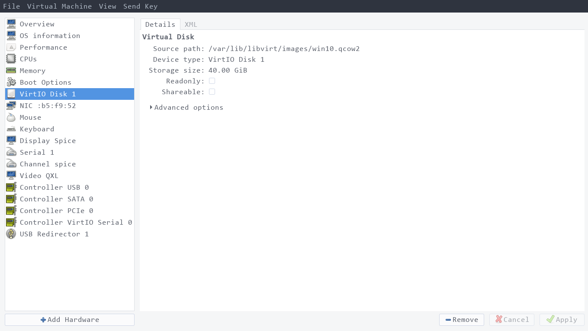
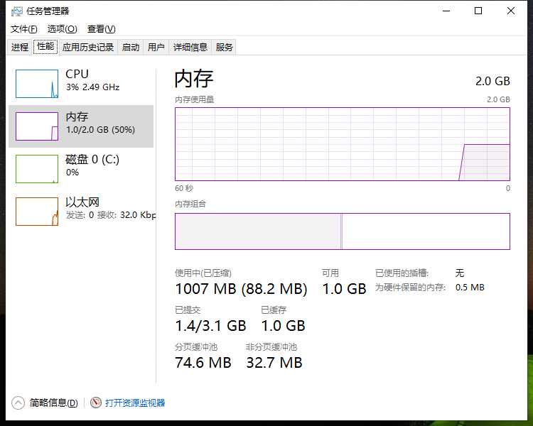

# Linux托管Windows虚拟机最佳实践

Linux和Windows各有所长，macOS非我所爱。对我来说，习惯使用XMonad这类平铺式窗口管理器，而Windows并没有好的替代品，再加上
Windows相比来说更加吃内存，国产软件又比较流氓等多个原因，我的方案是使用Linux作为桌面系统，而Windows装在虚拟机里，这样有
多个好处：

- 对于家用机，我并不经常需要使用Windows，使用Linux作为桌面系统能耗更低，续航更久，对于工作机，虽然需要常开Windows用以
交流，但是编程等还是在Linux下完成，这种组合既可以使用顺手的Linux，又可以不脱离组织
- Linux稳定得多，更新与否都控制在我的手上，而Windows则隔三差五的要求重启
- Windows闭源，不知道Windows到底做了什么，再加上国产软件一贯的流氓作为，把Windows作为主要操作系统实在是不放心
- 使用Linux作为宿主机，可以方便的搭各种服务

所以对我来说，方案基本确定，即Linux作为宿主机(host)，而Windows作为客户机(guest)。Linux下当然是使用kvm，VirtualBox也能用，
但是效率还是有点低。

## 安装

首先确定CPU支持虚拟化，这年头的机器基本上都支持，要是不支持，就不用折腾了。

```bash
$ grep -E --color=auto 'vmx|svm|0xc0f' /proc/cpuinfo
...vmx
```

如果有输出，那么就是支持了。接下来我们就安装 `libvirtd` 和 `virt-manager`，一个是daemon，用于跑虚拟机服务，一个是client，
用于管理：

```bash
$ sudo pacman -S libvirtd virt-manager qemu dnsmasq
$ sudo systemctl enable libvirtd
$ sudo gpasswd -a `whoami` libvirt
```

退出登录一下，然后启动libvirtd：`sudo systemctl start libvirtd`，或者也可以直接重启 `sudo reboot`。

下一步就是启动virt-manager进行安装了，一般我不会给虚拟机太大内存，省得影响宿主机发挥，而Windows有个特点，那就是吃性能，
不过，要知道微软还有一批客户，就是工厂里的那些老旧机器，他们可没有什么强悍的性能，因此微软一直都有一些给垃圾机器运行的
Windows系统，例如 `Windows Thin PC`，`Windows 10 LTSC 2019`。这两个都还不错，只不过Windows Thin PC要跟着Windows 7一起在
2020年1月份结束支持了，所以我们以 Windows 10 LTSC 2019 为例。



打开virt-manager之后，新建连接，连接的内容是 `qemu:///system`，点新建，下一步下一步下一步，给好2G内存，然后勾选开始安装之前
进行定制 的那个勾，我们需要做的事情是把磁盘驱动设置为virtio，把网卡驱动设置为virtio，增加一个cdrom挂载 `virtio-win.iso`，
然后开始安装，安装的时候Windows会提醒你找不到硬盘，这个时候点加载驱动，选择 virtio-win.iso 中的 `viosector` 下，`w10 -> x86`，
此外还要把 `NetKVM` 和 `Ballon` 用同样的办法装上驱动。

安装完成之后，还需要安装 `spice-guest-tools-latest.exe`，这个是KVM图形虚拟化的一个协议，当然它还打包了一堆的其它驱动在里边，
安装完，在virt-manager菜单上的 `View` 里勾选 `Scale - Always` 并且勾选上 `Resize With Window`，大功告成！



## 文件共享

既然是Windows作为虚拟机，自然是有一些交互的，照着上面的步骤之后，剪贴板已经是可以共享的了，但是有时候还是需要共享文件的，
由于外边是Linux，因此我们有一批的文件共享方法：

- winscp 使用scp登录Linux的host
- filezilla使用ftp登录Linux的ftp服务器
- 文件管理器中使用samba/ftp共享文件

如果使用samba，就用这个配置：

```
[global]
        dns proxy = No
        log file = /usr/local/samba/var/log.%m
        map to guest = Bad User
        max log size = 50
        server role = standalone server
        server string = Jiajun's Samba Server
        idmap config * : backend = tdb
        create mask = 0644
        force create mode = 0644
        force directory mode = 0755
        hosts allow = 192.168. 127.
        smb encrypt = desired


[download]
        comment = Jiajun's Download Disk Space
        guest ok = No
        path = /data/download
        read only = No


[public]
        comment = Jiajun's Public Disk Space
        guest ok = Yes
        guest only = Yes
        path = /data/public
        read only = No
```

然后在Windows中挂载网络卷，网络卷的位置就是Linux宿主机的桥接IP，例如 `\\192.168.122.1\public`。

不过我使用的是FTP，主要是因为samba占用内存较大，配置也较复杂。

首先安装vsftpd，然后把文件夹设置成 `ftp:ftp`的用户权限，这是配置：

```
anonymous_enable=YES
write_enable=YES
anon_upload_enable=YES
anon_mkdir_write_enable=YES
anon_other_write_enable=YES
no_anon_password=YES
anon_root=/data/ftp
dirmessage_enable=YES
xferlog_enable=YES
connect_from_port_20=YES
listen=YES
pam_service_name=vsftpd
```

注意，新版vsftpd的根目录不能有写的权限，所以我把子目录设置为可写，在Windows中挂载 `ftp://192.168.122.1/public` 即可。

```bash
$ ll -hd /data/ftp
dr-xr-xr-x 1 ftp ftp 12 Oct  8 14:38 /data/ftp/
$ ll -hd /data/ftp/public
drwxr-xr-x 1 ftp ftp 974 Oct  8 20:07 /data/ftp/public/
```

## 防火墙

由于我都是使用的匿名共享，所以最好要加一个防火墙，我使用ufw([ufw简明教程看这里](https://jiajunhuang.com/articles/2019_09_14-ufw.md.html))：

```bash
$ sudo ufw allow from 192.168.122.0/24 to any app CIFS  # 如果是samba 4，执行这个
$ sudo ufw allow from 192.168.122.0/24 to any port 21  # 如果是ftp，执行这个
```

## 性能优化

Windows 虚拟机可能会占用比较多的CPU和内存的，可以进行如下几点优化：

- 删除不需要的设备，例如触控板，USB Controller等等，这样可以减少host机器上的线程数量
- 切记要安装NetKVM和virtio等驱动
- 使用spice以获得更好的图形性能
- Windows中关闭搜索索引

---

2020.05.18 更新：

启用Qemu的Hyper-V enlightenments特性，可以让虚拟机跑的更快一点，参考 [此处](https://blog.wikichoon.com/2014/07/enabling-hyper-v-enlightenments-with-kvm.html)：

```bash
$ export VMNAME=你的虚拟机的名字
$ sudo virt-xml $VMNAME --edit --features hyperv_relaxed=on,hyperv_vapic=on,hyperv_spinlocks=on,hyperv_spinlocks_retries=8191
$ sudo virt-xml $VMNAME --edit --clock hypervclock_present=yes
```

---

参考资料：

- [virtio 驱动介绍](https://docs.fedoraproject.org/en-US/quick-docs/creating-windows-virtual-machines-using-virtio-drivers/)
- [virtio-win.iso下载](https://fedorapeople.org/groups/virt/virtio-win/direct-downloads/latest-virtio/virtio-win.iso)
- [spice-guest-tools.exe下载](https://www.spice-space.org/download/binaries/spice-guest-tools/)
- https://blog.wikichoon.com/2014/07/enabling-hyper-v-enlightenments-with-kvm.html
