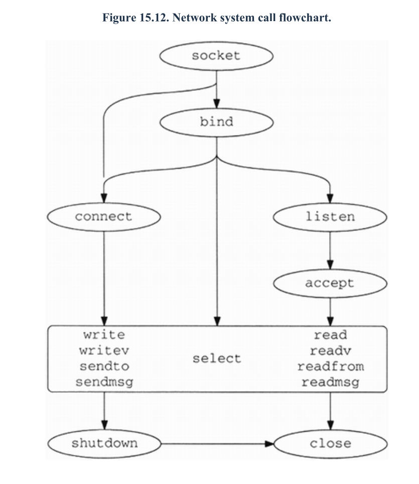
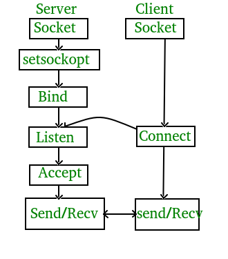
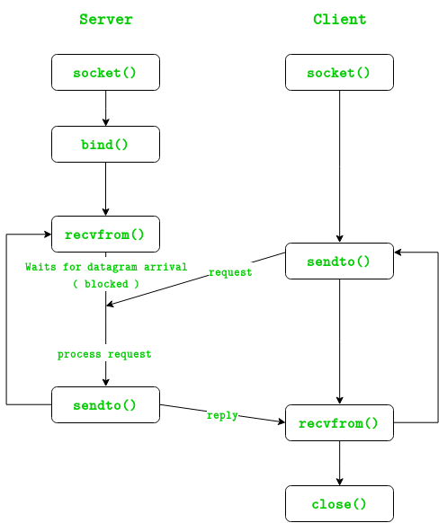

# 网络编程所需要熟悉的那些函数

> 注：图片来自《TCP/IP协议详解卷二：实现》

我们常用的网络协议栈是TCP/IP协议栈。

从发起连接的角度来看，我们有服务端和客户端，一般来说，我们把主动发起连接的那一方叫做客户端，等待
别人来连接的叫做服务端。

从协议上来讲，分为UDP和TCP。

因此，把上面两种分类组合一下，就有四种，我们来看看它们所需要用到的函数：

- TCP客户端: `socket -> connect -> send|recv -> shutdown|close`
- TCP服务端: `socket -> bind -> listen -> accept -> send|recv -> shutdown|close`

- UDP客户端: `socket -> connect -> recvfrom|sendto -> close`
- UDP服务端: `socket -> bind -> recvfrom|sendto -> close`

此外就是一些高级的函数，主要是I/O多路复用相关的：

- select
- pselect
- poll
- epoll
- kqueue

不过，如果你不是用C的话，一般来说语言都已经封装好了，都会在对应的操作系统使用最优的I/O多路复用函数，例如
Linux上使用epoll，FreeBSD上使用kqueue等等。

基本上熟悉以上函数，就可以说得上一句"熟悉网络编程"了，至于精通嘛，估计要把TCP/IP协议详解卷二吃透了能称得上？

---

- TCP/IP协议详解卷二：实现
- [UDP编程示例](https://www.geeksforgeeks.org/udp-server-client-implementation-c/)
- [TCP编程示例](https://www.geeksforgeeks.org/tcp-server-client-implementation-in-c/)
