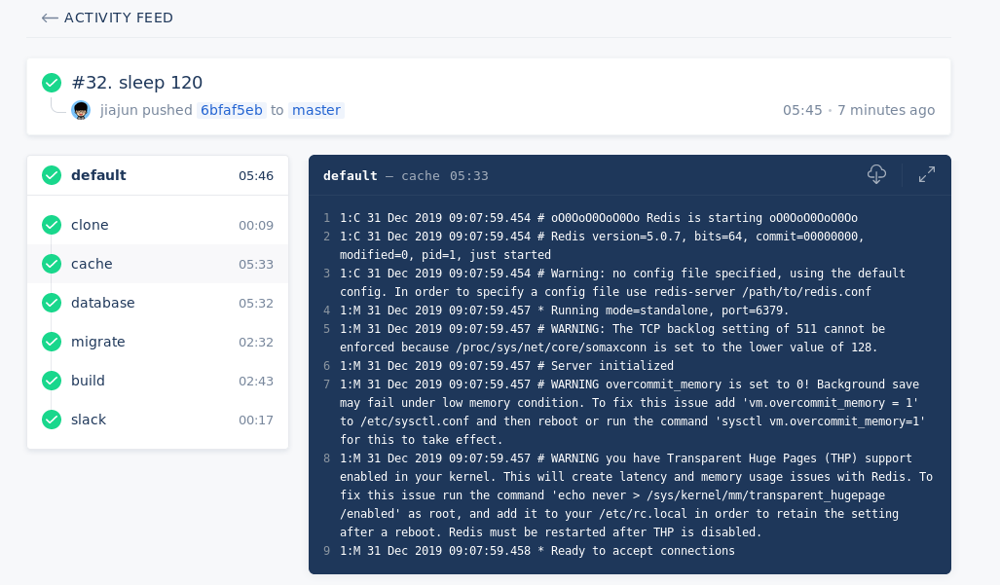

# 使用Gitea+Drone打造自己的CI/CD系统

有些代码我放本地了，因此搭建了一个Gitea，再加上家里有个老机器，闲着也是闲着，就搭建一个Drone CI来跑测试。

首先可以直接安装：

```bash
$ sudo pacman -S gitea
```

配置好数据库等即可，此外还可以使用Docker托管。首先要在Gitea上创建一个Application，[详情看这里](https://docs.drone.io/installation/providers/gitea/)

然后搭建Drone：

```bash
#!/bin/bash

export DRONE_GITEA_CLIENT_ID="gitea上生成的Client ID"
export DRONE_GITEA_CLIENT_SECRET="gitea上生成的Client Secret"
export DRONE_GITEA_SERVER="http://192.168.1.2(总之是gitea的地址，自行替换)"
export DRONE_RPC_SECRET="<RPC Secret，用来和下面runner通信的>"
export DRONE_SERVER_HOST="<Drone自己的地址，可以是内网地址，也可以是域名>"
export DRONE_SERVER_PROTO="http或者https"

docker run \
  --volume=/var/lib/drone:/data/docker/drone \
  --env=DRONE_AGENTS_ENABLED=true \
  --env=DRONE_GITEA_SERVER=${DRONE_GITEA_SERVER} \
  --env=DRONE_GITEA_CLIENT_ID=${DRONE_GITEA_CLIENT_ID} \
  --env=DRONE_GITEA_CLIENT_SECRET=${DRONE_GITEA_CLIENT_SECRET} \
  --env=DRONE_RPC_SECRET=${DRONE_RPC_SECRET} \
  --env=DRONE_SERVER_HOST=${DRONE_SERVER_HOST} \
  --env=DRONE_SERVER_PROTO=${DRONE_SERVER_PROTO} \
  --publish=8089:80 \
  --restart=always \
  --detach=true \
  --name=drone \
  drone/drone:1
```

```bash
#!/bin/bash

docker run -d \
  -v /var/run/docker.sock:/var/run/docker.sock \
  -e DRONE_RPC_PROTO=<上面填的DRONE_SERVER_PROTO> \
  -e DRONE_RPC_HOST=<上面填的DRONE_SERVER_HOST> \
  -e DRONE_RPC_SECRET=<上面填的Drone RPC Secret> \
  -e DRONE_RUNNER_CAPACITY=2 \
  -e DRONE_RUNNER_NAME=${HOSTNAME} \
  --restart always \
  --name runner \
  drone/drone-runner-docker:1
```

由于我使用的是Go，因此我还搭建了一个 goproxy 来加速下载：

```
#!/bin/bash

docker run -d --name goproxy -p 8899:8081 -v /data/docker/goproxy:/go goproxy/goproxy -proxy https://goproxy.io -exclude "<gitea的域名或地址>"
```

接下来定义一个 `.drone.yml` 就好：

```yml
---
kind: pipeline
type: docker                   
name: default
                                                                                                                                                                             
steps:              
- name: migrate
  image: migrate/migrate:20200101
  commands:                    
    - sleep 120                                                   
    - /migrate -path=migrations -database="mysql://root:@(database:3306)/test" up
                                                                    
- name: build     
  image: newapi-ci:20200101
  environment:                  
    GOPROXY: http://192.168.1.2:8899
    DEBUG: true
    REDISURL: "redis://:@cache:6379/1"
    DATABASEURL: "root:@(database:3306)/test?parseTime=true&loc=Local"
  commands:         
    - protoc -I proto/ api/api.proto --go_out=plugins=grpc:proto/
    - go vet ./...
    - go test ./...
    - go build -tags=jsoniter          
                                   
- name: slack                
  image: plugins/slack:20200101
  settings:
    webhook: <Slack webhook地址>
    link_names: true
    channel: ci
    template: >
      {{#success build.status}}
        build {{build.number}} {{build.link}} succeeded. Good job.
      {{else}}
        build {{build.number}} {{build.link}} failed. Fix me please.
      {{/success}}
  when:
    status: [ success, failure ]

services:
  - name: cache
    image: redis:5
  - name: database
    image: mysql:5.7
    ports:
    - 3306
    environment:
      MYSQL_ALLOW_EMPTY_PASSWORD: "yes"
      MYSQL_DATABASE: "test"
``

注意几点：

- image尽量自己加个tag，来加速访问，否则docker默认拉取 `latest` 这个tag的镜像，太难等了
- 自己搭建一个goproxy加速访问，或者使用 `https://goproxy.io` 也行，但肯定是磁盘快啦
- 使用 service 来起跑测试用的数据库时，不要用 mariadb，因为这货默认监听 127.0.0.1
- 使用 service 来起跑测试用的服务时，注意要sleep等待一下，参考上面的 `sleep 120`，因为我的是机械硬盘，所以要等比较久
- slack 提醒最好成功和失败都加上

最后来看一张效果图：


