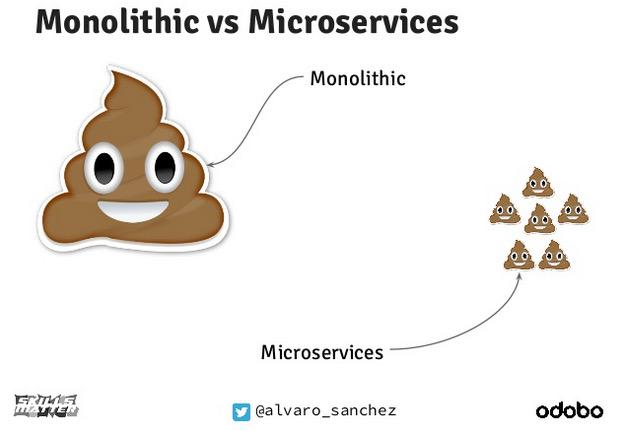

# 微服务的缺点

微服务，火了好几年的东西。曾经我们看中的是微服务拆分之后，每个项目变得更小，对团队的每个人来说维护成本降低，因为需要了解
的东西局限于一个更小的服务。第二是加强了技术选型的灵活性。但是由于没有实践，并不知道微服务会带来什么大的问题。

当我们大规模应用微服务之后，问题才开始慢慢显现出来。

- 网络调用过多

微服务之间互相调用，有时候是非常频繁的，例如鉴权类接口，几乎每一个接口都要请求一次，因此是整个系统中并发要求最高的，
网络调用与函数调用相比性能相差许多，尤其是当服务间使用 RESTful 而当其基于 HTTP/1.x 协议时，因此为了提升性能，会在
服务间引入gRPC或Thrift等，从而又引入了新技术栈的维护成本和更多的问题。

- 技术栈太过灵活

当每个人都可以自己主导一个服务的开发时，技术栈选型往往就变得多样化，以我所在团队为例，语言有Python、Go，HTTP框架有
Flask、Gin，这还是在大家统一服务端语言和框架的情况下。而HTTP client则是显现出技术多样化的最好例子，Python有requests，
Go则有 `net/http`, `req`, `resty` 等，他们的功能和能解决的问题都差不多，但是却因为不同成员的不同偏好而引入，而当A成员
去维护B成员的项目时，A成员就不得不再学一个重复的对他无提升的东西。

- 难于应对连表查询的需求

当微服务拆分开来之后，数据库、缓存等也会一并拆开。这时候，服务之间的数据提取就从原本查数据库变成了走API。不同服务的需求
不一样，这就会导致API向两个方向演变：越来越多的API，或者是越来越大的API，更糟糕的是两者的集合。而另一种需求则更为致命，
连表查询。原本在数据库表中连表查询即可的需求，现在可能要在多个服务间调用，在语言里实现去重、连表的部分逻辑。多次网络
请求，大量运算带来的是API性能的急剧下降。

- 核心应用崩溃会导致大面积瘫痪

还是以上面的例子为例，高可用这个词，用在核心服务上再合适不过，例如鉴权类的核心服务，每挂一秒钟，影响的都是数量极大的服务
和用户，而即便是 `99.9999%` 高可用的服务，一年也会挂 31.53 秒。

- 运维成本增加

毫无疑问，项目的增加会提高运维成本，而运维并不仅仅包括当服务挂了之后，去重启应用这么简单，更多的包括，一不小心日志导致
磁盘爆了、突然而来的超高流量、某个应用成为瓶颈等。这对监控、及时响应来说都是极大的挑战。

- 接口风格不一致

如上所说，不同成员有不同的风格，如果团队中每个成员的接口风格不一致，没有编码规范，就会导致对接API的人非常的痛苦，每个
项目有不同的返回结构，对接者使用静态语言解析JSON时，会非常难做。

上面就是个人总结的一些微服务所带来的问题。
