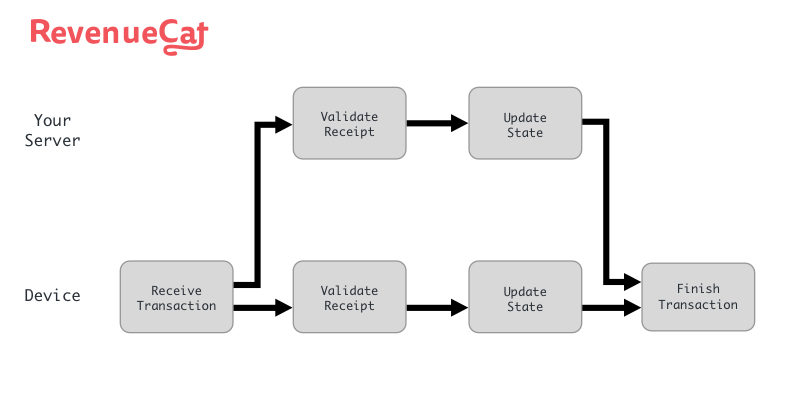

# 应用内购的坑

> iOS应用内购，那真不是一般的坑。

最近了解了一下iOS和Android的应用内购，也就是在App里进行购买。

一般来说，购买分为两种，一种是一次性的，比如购买金币，这种处理很简单，就不多说了；另外一种就是订阅，也就是每个月或者
每一定周期，就会付费一次，比如VIP会员，这是我们今天的主角。

来看一下常见的流程：

- 首先在App内显示可以购买的产品(product)，可能是一个，也可能是多个（比如会员、超级会员等）
- 然后App调用SDK进行购买，此时App会与Apple的App Store或者Google 的Play Store进行通信，进行购买，成功之后，App会获得一个
receipt，这是此次购买的凭证
- 与此同时，服务端会收到一个通知，表示初次购买成功
- App获得receipt之后，将receipt发给服务端
- 服务端对receipt进行校验（可以选择本地校验，也可以选择联网校验），确认receipt的真实性之后，将商品或者服务发放给用户



对于订阅来说，很重要的一个环节是处理通知，比如当用户取消、续订、升降级等事件发生时，我们的服务端都会收到一个通知。

## Google Play的过期处理

对于Google的通知，处理起来很简单，直接获取 `expiryTimeMillis` 即可知道什么时候过期。

When checking the developer API, you should always do the following:

    - If expiryTimeMillis is in the future, always grant entitlement.
    - If autoRenewing = false, try to get the user to resignup because the subscription will end at expiry time.
    - If paymentState = 0,send the user to the subscriptions center using the subscriptions center deep-link to
    fix their payment issue. 

> 其中还包括宽限期，也会体现到 `expiryTimeMillis` 里

Google 的通知坑比较少，我踩到的一个就是，如果没有正确处理通知（返回200），那么Google就会开启无限循环通知，短短几个
小时内，就会收到数万次请求。

## Apple App Store的过期处理

Apple的可就坑爹了：

- 首先 `receipt` 校验返回的结构特别奇葩：

```json
{
    "latest_receipt": "MIIbngYJKoZIhvcNAQcCoIIbj...",
    "status": 0,
    "receipt": {
        "download_id": 0,
        "receipt_creation_date_ms": "1486371475000",
        "application_version": "2",
        "app_item_id": 0,
        "receipt_creation_date": "2017-02-06 08:57:55 Etc/GMT",
        "original_purchase_date": "2013-08-01 07:00:00 Etc/GMT",
        "request_date_pst": "2017-02-06 04:41:09 America/Los_Angeles",
        "original_application_version": "1.0",
        "original_purchase_date_pst": "2013-08-01 00:00:00 America/Los_Angeles",
        "request_date_ms": "1486384869996",
        "bundle_id": "com.yourcompany.yourapp",
        "request_date": "2017-02-06 12:41:09 Etc/GMT",
        "original_purchase_date_ms": "1375340400000",
        "in_app": [{
            "purchase_date_ms": "1486371474000",
            "web_order_line_item_id": "1000000034281189",
            "original_purchase_date_ms": "1486371475000",
            "original_purchase_date": "2017-02-06 08:57:55 Etc/GMT",
            "expires_date_pst": "2017-02-06 01:00:54 America/Los_Angeles",
            "original_purchase_date_pst": "2017-02-06 00:57:55 America/Los_Angeles",
            "purchase_date_pst": "2017-02-06 00:57:54 America/Los_Angeles",
            "expires_date_ms": "1486371654000",
            "expires_date": "2017-02-06 09:00:54 Etc/GMT",
            "original_transaction_id": "1000000271014363",
            "purchase_date": "2017-02-06 08:57:54 Etc/GMT",
            "quantity": "1",
            "is_trial_period": "false",
            "product_id": "com.yourcompany.yourapp",
            "transaction_id": "1000000271014363"
        }],
        "version_external_identifier": 0,
        "receipt_creation_date_pst": "2017-02-06 00:57:55 America/Los_Angeles",
        "adam_id": 0,
        "receipt_type": "ProductionSandbox"
    },
    "latest_receipt_info": [{
            "purchase_date_ms": "1486371474000",
            "web_order_line_item_id": "1000000034281189",
            "original_purchase_date_ms": "1486371475000",
            "original_purchase_date": "2017-02-06 08:57:55 Etc/GMT",
            "expires_date_pst": "2017-02-06 01:00:54 America/Los_Angeles",
            "original_purchase_date_pst": "2017-02-06 00:57:55 America/Los_Angeles",
            "purchase_date_pst": "2017-02-06 00:57:54 America/Los_Angeles",
            "expires_date_ms": "1486371654000",
            "expires_date": "2017-02-06 09:00:54 Etc/GMT",
            "original_transaction_id": "1000000271014363",
            "purchase_date": "2017-02-06 08:57:54 Etc/GMT",
            "quantity": "1",
            "is_trial_period": "true",
            "product_id": "com.yourcompany.yourapp",
            "transaction_id": "1000000271014363"
        }, {
            "purchase_date_ms": "1486371719000",
            "web_order_line_item_id": "1000000034281190",
            "original_purchase_date_ms": "1486371720000",
            "original_purchase_date": "2017-02-06 09:02:00 Etc/GMT",
            "expires_date_pst": "2017-02-06 01:06:59 America/Los_Angeles",
            "original_purchase_date_pst": "2017-02-06 01:02:00 America/Los_Angeles",
            "purchase_date_pst": "2017-02-06 01:01:59 America/Los_Angeles",
            "expires_date_ms": "1486372019000",
            "expires_date": "2017-02-06 09:06:59 Etc/GMT",
            "original_transaction_id": "1000000271014363",
            "purchase_date": "2017-02-06 09:01:59 Etc/GMT",
            "quantity": "1",
            "is_trial_period": "false",
            "product_id": "com.yourcompany.yourapp",
            "transaction_id": "1000000271016119"
        }],
    "environment": "Sandbox"
}
```

- 其次字段结构特别坑爹
    - validate结果中，`latest_receipt_info` 是一个列表，但是服务端通知中，是一个结构体
    - 没有过期发生时，通知体现在 `latest_receipt_info` 里，而当过期发生时，通知体现在 `latest_expired_receipt_info` 里
    - 对于宽限期的receipt来说，validate_result 体现在 `pending_renewal_info` 的 `grace_period_expires_date_ms` 里
    - 最坑的是，这些毫秒时间戳，都是字符串

- Apple还有一个坑爹之处是，Sandbox环境特别不稳定

这就是本文想记录的IAP坑爹之处。

---

参考资料：

- https://medium.com/revenuecat-blog/ios-subscriptions-are-hard-d9b29c74e96f
- https://developer.apple.com/documentation/appstoreservernotifications/responsebody
- https://developer.android.com/google/play/billing/billing_subscriptions.html
- https://developer.apple.com/documentation/storekit/in-app_purchase/validating_receipts_with_the_app_store
- https://developers.google.com/android-publisher/api-ref/purchases/subscriptions
