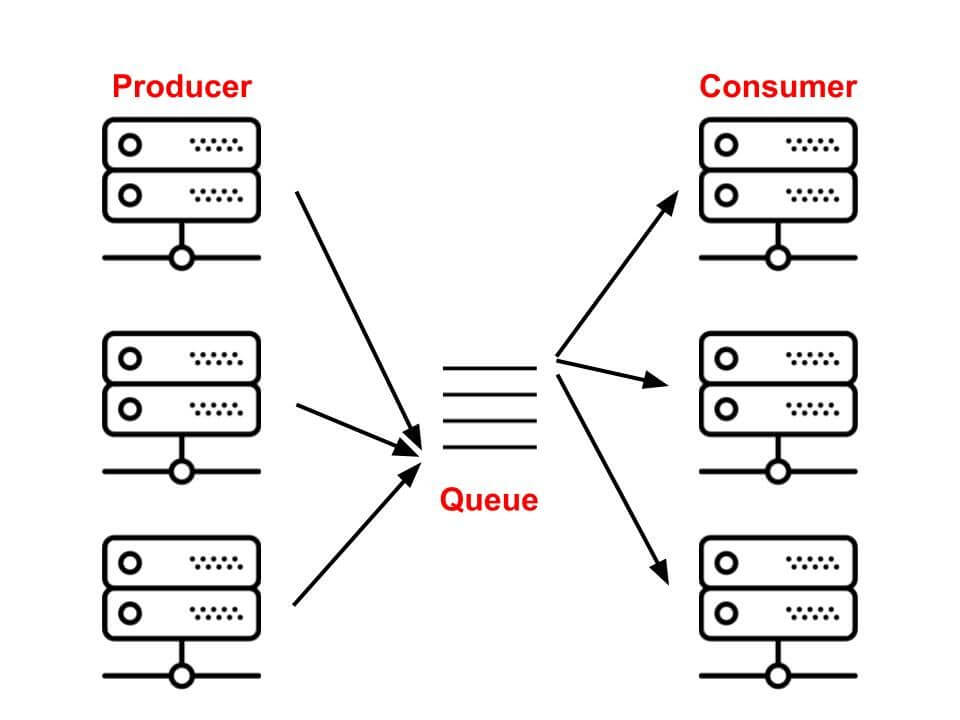

# 使用Go语言实现一个异步任务框架

如何使用Go语言实现一个简单的异步任务框架呢？且听我一一道来。首先我们看一下常见的任务队列的架构：



所以作为一个任务队列，主要有这么几个部分组成：

- Producer，负责把调用者的函数、参数等传入到broker里
- Consumer，负责从broker里取出消息，并且消费，如果有持久化运行结果的需求，还需要进行持久化
- 选择一个Producer和Consumer之间序列化和反序列化的协议

首先我们要定义一下Broker的接口：

```go
type Broker interface {
        Acquire(string) *Task                                       
        Ack(*Task) bool                     
        Update(*Task)
        Enqueue(*Task) string
}
```

作为一个broker，获取任务，ACK，更新任务状态，入队是基本操作。然后我们要定义一个任务，既然是异步任务队列
嘛，这是自然的：

```go
type Task struct {
        ID                  string    `json:"task_id"`
        CreatedAt           time.Time `json:"created_at"`
        UpdatedAt           time.Time `json:"updated_at"`
        QueueName           string    `json:"queue_name"`
        JobName             string    `json:"job_name"`
        ArgsMap             ArgsMap   `json:"args_map"`
        CurrentHandlerIndex int       `json:"current_handler_index"`
        OriginalArgsMap     ArgsMap   `json:"original_args_map"`
        ResultLog           string    `json:"result_log"`
}
```

接下来我们要选择一个序列化和反序列化的协议，为了通用，我们选择JSON。那么接下来要做的事情就比较简单了，我们实现broker的
四个接口即可，我们使用Redis的LPUSH和RBPOP就可以：

```go
func (r *RedisBroker) Acquire(queueName string) *Task {
        task := Task{}
        vs, err := rc.BRPop(time.Duration(0), genQueueName(queueName)).Result()
        if err != nil {
                log.Panicf("failed to get task from redis: %s", err)
                return nil // never executed
        }
        v := []byte(vs[1])

        if err := json.Unmarshal(v, &task); err != nil {
                log.Panicf("failed to get task from redis: %s", err)
                return nil // never executed
        }

        return &task
}

func (r *RedisBroker) Ack(task *Task) bool {
        // redis doesn't support ACK
        return true
}

func (r *RedisBroker) Update(task *Task) {
        task.UpdatedAt = time.Now()
        taskBytes, err := json.Marshal(task)
        if err != nil {
                log.Panicf("failed to enquue task %+v: %s", task, err)
                return // never executed here
        }
        rc.Set(genTaskName(task.ID), taskBytes, time.Duration(r.TaskTTL)*time.Second)
}

func (r *RedisBroker) Enqueue(task *Task) string {
        taskBytes, err := json.Marshal(task)
        if err != nil {
                log.Panicf("failed to enquue task %+v: %s", task, err)
                return "" // never executed here
        }

        rc.Set(genTaskName(task.ID), taskBytes, time.Duration(r.TaskTTL)*time.Second)
        rc.LPush(genQueueName(task.QueueName), taskBytes)
        return task.ID
}
```

生产者该咋做呢？生产者要做的事情就是把Task序列化，然后推送到对应的列表里：

```go
func (r *RedisBroker) Enqueue(task *Task) string {
	taskBytes, err := json.Marshal(task)
	if err != nil {
		log.Panicf("failed to enquue task %+v: %s", task, err)
		return "" // never executed here
	}

	rc.Set(genTaskName(task.ID), taskBytes, time.Duration(r.TaskTTL)*time.Second)
	rc.LPush(genQueueName(task.QueueName), taskBytes)
	return task.ID
}
```

到目前为止，我们已经确保了生产者能生产数据，然后放到redis里，消费者能从redis里消费数据。那么怎么实现异步任务呢？
还差一个步骤，那就是当从broker里取到数据的时候，我们要能够找到对应的函数去执行：

```go
func Register(jobName string, handlers ...JobHandler) {
	if _, ok := jobMap[jobName]; ok {
		log.Panicf("job name %s already exist, check your code", jobName)
		return // never executed here
	}

	jobMap[jobName] = handlers
}
```

所以我们需要这个函数，我们把执行的函数和一个唯一键对应起来，然后再在消费端，取到任务之后，把函数找到然后去执行：

```go
handlers, ok := jobMap[task.JobName]
if !ok {
    log.Panicf("can't find job handlers of %s", task.JobName)
    return
}
```

大功告成！详细的代码看 [这里](https://github.com/jiajunhuang/gotasks/blob/9765fd0bf235bc7d2fadb5c17a7398d64775b879/gotasks.go#L107)

这样我们就实现了一个异步任务框架，如果去看看的话，你会发现 4k star 的 [machinery](https://github.com/RichardKnop/machinery)
也是差不多的思路和代码。

---

参考资料：

- https://github.com/jiajunhuang/gotasks (建议切换到9765fd0这个提交)
- https://github.com/rq/rq
