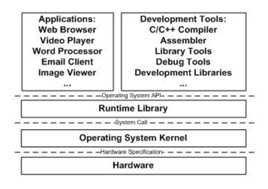

# 《程序员的自我修养-装载、链接与库》笔记

很就之前读过这本书，今日重读，作笔记。

## 操作系统

操作系统提供的一个重要功能是管理底层的硬件并且将其抽象为API向上层提供服务。

原始的程序是直接跑在物理内存上的，比如一共有100M内存，A程序需要10M，B程序需要50M，C程序也需要50M，那么如果现在A和B在跑，
C就没法跑，因为内存不够用，此外还有很多问题：

- 地址空间不隔离：这对于程序的安全有很大的问题，A程序可能有意或者无意，导致改写了B程序的内容，这会导致B程序出现不可预料的问题
- 内存使用效率低：由于整个程序都要加载到内存里，如果我们想要运行C，这个时候必须将B搬出来才可以，但是这又会导致B无法运行
- 程序运行的地址不确定：由于每次程序进入内存，都要分配一块连续的足够大的空闲的内存，久而久之，此次分配的内存地址与上一次所在
的内存地址未必相同，所以程序每次运行的内存地址是不确定的

因此引入了分段的管理方法，也就是不再让程序直接使用物理内存，转而使用虚拟内存地址，我们按程序所需要的大小，为其分配虚拟内存地址，
这就叫分段，这样解决了上面的1和3的问题，借助虚拟内存，可以使得程序每次都假使自己使用的内存地址从0开始，而硬件直接将他们映射到
物理内存的某一段。

为了解决2，引入了分页的技术。也就是把整个程序切成固定大小的长度，比如4KB。每一个4KB，就是一页。虚拟内存空间的页叫做
虚拟页(Virtual Page, VP)，物理内存的页叫做物理页(Physical Page, PP)，磁盘中的页叫做磁盘页(Disk Page, DP)。通过MMU来进行
内存位置的映射。

## 线程和进程

一个标准的线程有以下几个部分组成：

- 线程ID
- 当前指令指针(PC)
- 寄存器集合
- 堆和栈

线程是程序执行流的最小单元，也是CPU调度的最小单元。一般来说，一个进程由一个到多个线程组成，各个线程之间共享程序的内存空间
比如代码段，数据段，堆等，以及一些进程级别的资源比如所打开的文件和信号等。

我们一般把频繁等待的线程称之为I/O密集型线程，很少等待的线程则叫做CPU密集型线程。

三种线程模型：

- 内核线程:用户态线程 = 1:1：缺点是内核线程数量有限，所以用户态线程真正并发的数量也有限；内核线程上下文切换开销大
- 内核线程:用户态线程 = 1:1：这个几乎不存在，因为内核线程一般都不止一个
- 内核线程:用户态线程 = 1:1：这个结合了上述两种的好处，可以有无数的用户态线程和较低的切换开销

## 静态链接和动态链接

一个简单的Hello World的C程序，其实有这么几个步骤：

- 预处理：把源码里的头文件、宏定义等展开，插入，生成为一个 .i 的文件
- 编译：把上一步得出来的文件进行一系列词法分析，语法分析，语义分析，优化之后生成对应的汇编代码
- 汇编：把汇编码变成机器码
- 链接：由于上述步骤生成出来的变量、地址等都还不是确定的，因此在这一步，进行这种工作。把各个模块之间的互相引用的部分都处理好，
使得各个模块之间能够正确的衔接。主要包括：地址和空间分配，符号决议和重定位等。

静态链接完成之后，整个程序运行所需要的库等，都会打包在可执行文件里，因此空间上有点浪费（可以参考Go编译出来的程序，都很大），
此外还有一个问题就是，没有办法动态的更新程序中的一部分，只要代码或者其依赖的库有变化，就必须重新打包，发布。因此有了动态
链接，动态链接就是把程序的模块分割开来，形成独立的文件，不对那些组成程序的目标文件进行链接，而是把这个工作退后到了运行时。
需要的时候，再进行链接的工作。
