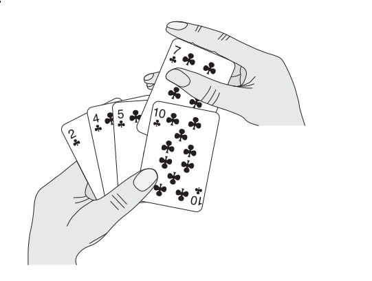

# Golang sort源码阅读

## 复习算法

- 插入排序(insertion sort)
    [插入排序](https://en.wikipedia.org/wiki/Insertion_sort) 可以想象为打牌的时候，我们抓到一张牌之后，从右往左
    （或者从左往右）找到合适的位置，然后插入。它的时间复杂度是O(n^2)。

    

- 希尔排序(shell sort)
    [希尔排序](https://en.wikipedia.org/wiki/Shellsort) 是插入排序的一种改进版本，它每次以一定步长进行排序，一直重复
    到步长为1为止。

- 堆排(heapsort)
    [堆排序](https://en.wikipedia.org/wiki/Heapsort) 借助了堆这个数据结构的特性，将数据放到堆以后再取出，便有了顺序。

- 快排(quicksort)
    [快排](https://en.wikipedia.org/wiki/Quicksort) 每次选取一个哨兵，然后将比它更小的放左边，比它更大的放右边，
    然后递归对左右两侧的子数组进行快排的操作，最终数组便会是一个有序的数组。

## 看看Go的sort实现

我们来看看Go的sort是咋实现的，首先得让要排序的对象实现这个接口：

```go
// A type, typically a collection, that satisfies sort.Interface can be
// sorted by the routines in this package. The methods require that the
// elements of the collection be enumerated by an integer index.
type Interface interface {
	// Len is the number of elements in the collection.
	Len() int
	// Less reports whether the element with
	// index i should sort before the element with index j.
	Less(i, j int) bool
	// Swap swaps the elements with indexes i and j.
	Swap(i, j int)
}
```

在这个接口之上，我们才能继续阅读源码，以 `sort.Ints` 为例：

```go
func Ints(a []int) { Sort(IntSlice(a)) }

func Sort(data Interface) {
	n := data.Len()
	quickSort(data, 0, n, maxDepth(n))
}
```

看函数名，它是用的快排，但是点进去，你会发现其实它是一个混合排序算法：

```go
func quickSort(data Interface, a, b, maxDepth int) {
	for b-a > 12 { // Use ShellSort for slices <= 12 elements
		if maxDepth == 0 {
			heapSort(data, a, b)
			return
		}
		maxDepth--
		mlo, mhi := doPivot(data, a, b)
		// Avoiding recursion on the larger subproblem guarantees
		// a stack depth of at most lg(b-a).
		if mlo-a < b-mhi {
			quickSort(data, a, mlo, maxDepth)
			a = mhi // i.e., quickSort(data, mhi, b)
		} else {
			quickSort(data, mhi, b, maxDepth)
			b = mlo // i.e., quickSort(data, a, mlo)
		}
	}
	if b-a > 1 {
		// Do ShellSort pass with gap 6
		// It could be written in this simplified form cause b-a <= 12
		for i := a + 6; i < b; i++ {
			if data.Less(i, i-6) {
				data.Swap(i, i-6)
			}
		}
		insertionSort(data, a, b)
	}
}
```

可以看得出来，在不同的条件下，它会使用不同的算法：

- 当元素数量小于12时，使用shell sort(插入排序的一种更高效的改进版本)
- 元素数量大于12且maxDepth不为0时，使用原地快排
- maxDepth = 0时，转而使用 heap sort

所以可以看出来，Go的sort方法是比较复杂的，它结合了多种排序方法进行排序。

其实其它语言也是一样的，比如Python和Java的排序，就使用了 [TimSort](https://zh.wikipedia.org/wiki/Timsort)，也是一种
混合排序算法。

---

- https://zh.wikipedia.org/wiki/%E5%B8%8C%E5%B0%94%E6%8E%92%E5%BA%8F
- https://zh.wikipedia.org/wiki/Timsort
