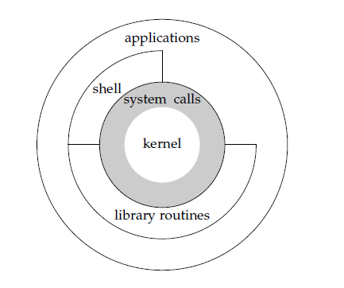

# 操作系统也是CRUD

起初学习UNIX环境下的编程觉得非常难，毕竟这是一个陌生的东西，但是工作后，照面打得多了，自然就熟悉了些，在此总结一些经验。

其实要是写了几年代码的人，回头总结一下用代码一般都做什么事，会得到四个字母：CRUD，也就是增删查改。

- 后端程序员：对数据库的增删查改
- 系统程序员：对OS数据结构的增删查改
- 嵌入式程序员：对硬件数据的增删查改
- 前端程序员：对JSON和用户输入的增删查改

那既然大家归根结底，都是增删查改，学习UNIX是否可以从另外一个角度来看待呢？

## 开始之前

远古时期，所有程序员都是直接操纵硬件的，但是这有很大的问题，你也想用100M内存，我也想用100M，但是一共只有100M，怎么办？
你也想播放音乐，我也想，又怎么办？你也想写磁盘，我也想写磁盘，怎么办？

除了上述冲突，更麻烦的是，所有人都要知道所有硬件怎么操作，才能写出一个程序，这太难了。于是有了操作系统，它帮我们屏蔽了所有的硬件设备的
区别，提供了统一的接口，并且抽象了一些东西，比如文件系统，通过文件系统，我们不再需要操心这个文件是写到磁盘具体的哪个位置，
而只需要告诉操作系统：我要写文件，写什么，写多长即可。

这一切都是通过操作系统提供的系统调用(system call)来完成的。

我们还是要了解一下UNIX操作系统的结构：



可以看到，最内部的，就是内核，它帮我们处理各种各样的硬件设备，然后抽象成一个简单的概念。
比如我们不用担心是HDD还是SSD，我们只管用文件系统，我们只需要调用操作文件的系统调用，操作系统会帮我们找到对应的磁盘位置并且把数据写进去，
即使失败了，也会返回一个错误告诉我们为什么。

稍往外层，就是系统调用，系统调用的外层有shell和library routines，另外applications也可以和它直接接触，这是什么意思呢？

shell可以简单理解为命令行，但是用熟了之后，应当知道，bash，zsh这类才是shell，他封装了很多系统调用，然后以命令或者图形界面的方式提供
给用户，比如Windows上，很多按钮点一下，背后其实就调用了一些系统调用。
而library routines，比如glibc，帮我们封装了系统调用，加了一些代码，让我们调用更加轻松，因为我们的代码不可能是通过执行各种命令行
来完成，那样抗不住并发，所以我们得通过调用函数的方式，
我们可以直接调用系统调用，这就是图中applications直接和system call接触的那部分，也可以调用library routines，然后后者帮我们调用system call。

## 模块分类

相信很多人毕业设计做的就是XXX管理系统，内核其实也是一个XXX管理系统，只不过它是多个管理系统的集合：

- 文件管理系统
- 用户管理系统
- 权限管理系统
- 进程管理系统
- 内存管理系统
- 硬件设备管理系统

其实内核自己就可以做这些事情，但是因为每个人每个公司的需求都不一样，所以内核暴露了系统调用来让程序员可以借助它的能力，
做定制化操作。

内核为了安全，会通过CPU的能力，将进程分为两个类别：

- 在内核里跑的
- 在用户空间跑的

显然前者拥有更大的权利，干啥都可以，后者的权力自然是受限的。

## 文件管理系统

我们知道，XXX管理系统的主要内容就是CRUD。我们来看看，我们自然是要：

- 创建文件（增）
- 删除文件（删）
- 查找文件内容（查）
- 更新文件内容（写入）

由于除了文件，还有文件夹，所以它也有CRUD。由于UNIX中把一切都抽象成文件，因此，对他们也有CRUD，不过，幸好由于UNIX把一切都抽象成文件，因此
对一切文件，也就这么几个系统调用（其实是C库封装过后的库函数，但是其底层是系统调用，后同）：

- `creat` 创建文件
- `remove` 删除文件
- `close` 关闭文件
- `read` 读取文件
- `write` 写文件
- `lseek` 设置写入的位置

当然，UNIX发展这么久了，其历史分支多的不得了，自然就会有分裂和不统一的情况，因此除了上述系统调用，你还会看到一些标新立异、特殊使用的，比如针对网络的 `recv` 和 `send`，没有关系，理解一下，毕竟几十年
的系统了。

说起文件，特别重要的一个概念就是文件描述符(file descriptor，简称fd)。这是啥呢？你看我们平时操作数据库的每一行，是不是还有个Primary ID？对的，这玩意儿就跟它类似，用于定位一个文件，这样大家都知道我们说的是哪个文件。

为了高性能，我们的文件管理系统自然就要引入缓存，引入缓存，那就要引入把缓存写到磁盘的操作，因此就有了：

- `sync`
- `fsync`
- `fdatasync`

另外文件还有一些属性什么的，因此就有了：

- `stat`
- `fstat`
- `lstat`
- ...

## 权限管理系统和用户管理系统

UNIX是一个多用户的系统，既然是多用户，那就要做好权限控制，我不能随意看别人的东西，别人也不能随意看我的，要不然大家岂不是都在
裸奔了吗？

首先要做的就是在文件系统里引入权限控制，也就同时引入了用户管理系统。

UNIX中，每个用户都有自己的id，每个用户都可以加入多个组，每个组也可以有多个用户，因此UNIX把权限分为三类：

- 对本人的控制
- 对本组的控制
- 对其他人(也就是其他组)的控制

然后控制，又细分为三个：

- 可读
- 可写
- 可执行（对于文件来说是可执行，对于文件夹来说，就是是否可以列出其下文件）

由于UNIX设计的时候，内存都是很宝贵的（今天没那么贵了但是也还挺宝贵的），所以用位来保存权限，可读、可写、可执行分别是二进制的 00000100，00000010和00000001，因此对应10进制分别是4，2，1。

注意，4+2+1 = 7。

所以如果你给一个文件，权限为777，那么就是对本人可读可写可执行，对组内成员可读可写可执行，对其他所有人可读可写可执行。

如果是467，那就是对本人可读，对组内成员可读可写，对其他人可读可写可执行。

以此类推。

当然，我们得有系统调用来对权限进行CRUD：

- `access` 查
- `chmod` 改、增、删

刚才说了，有用户和组这两个概念。UNIX下，用户信息存储在 `/etc/passwd` 上，组的信息存储在 `/etc/group` 上。

用户有密码，以前密码也是存在 `/etc/passwd` 上，不过不太安全，后来就把密码以更严格的文件权限存储在 `/etc/shadow` 里。

```bash
$ ll -h /etc/passwd /etc/shadow /etc/group
-rw-r--r-- 1 root root    910 Jun 12 15:29 /etc/group
-rw-r--r-- 1 root root   2.2K Jun 12 15:29 /etc/passwd
-rw-r----- 1 root shadow 1.3K Jun 12 15:29 /etc/shadow
```

## 进程管理系统和内存管理系统

我们的代码，最终编译为程序，它就是一堆0和1，躺在磁盘里。但是当它被操作系统加载，运行之后，在内存里，就叫进程。当然，进程也得有一个唯一ID，我们管他叫 `pid(process id)`。

进程和内存分不开，进程要申请内存、销毁内存等，因此就有了这些CRUD：

- `malloc` 申请内存
- `free` 释放内存

至于改和查嘛，这是在代码逻辑里就做好了的，无需操心。

而对进程本身的一些增删查改，则是对它的运行环境什么的操作，比如：

- `getenv` 获取环境变量
- `getpid` 获取当前进程id
- `getppid` 获取父进程id
- `getrlimit` 和 `setrlimit` 获取和设置进程的一些资源限制
- `fork` 创建新的进程
- `exec` 替换当前进程所要执行的代码
- `wait` 等待子进程

进程管理本身就还包含很多东西，比如进程所属的用户和组，进程的资源限制，进程之间的通信，进程的优先级等等，每一个子系统都有它的CRUD。

后来又引入了线程这个概念，线程是CPU调度的最小单位，同一个进程内的多个线程，
共享所在进程里的一些资源，对于这些东西，又有很多CRUD函数。同时还引入了并发和并行这两个概念，因此也就有一些锁、竞争等概念，所以又有一批
对应的CRUD函数。

## 硬件管理系统

程序要做的很重要的一件事情，其实是和其他进程通信，和其他硬件设备打交道。

同步I/O无法应对并发，因此就有了I/O多路复用，也就有了：

- `select`
- `epoll`
- `kqueue`

还有POSIX规定的aio系列函数，这又是一堆CRUD。

## 总结

一个操作系统，要做的事情很多，直到今天，Linux内核也还在非常活跃的开发维护中，操作系统要做的事情远远不止上面所列的这么
几个管理系统，但是我们可以把操作系统要做的事情，分门别类来看，就会发现，原来它也是CRUD。当然，这个CRUD的技术含量，可就
比较高了。
