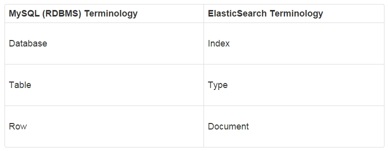

# ElasticSearch学习笔记

## 搭建单节点ES

用Docker来搭建是比较简单的方式：

```bash
$ docker pull elasticsearch
$ docker run -d --name elasticsearch -p 9200:9200 -p 9300:9300 -e "discovery.type=single-node" elasticsearch
```

## 基本概念

ES引入了几个新的概念，我们和数据库对比一下：



可以看到ES对应数据库的概念，然后看下ES在URL里如何对应这些概念：

```bash
http://host:port/[index]/[type]/[_action/id]
```

还有一个概念就是document，其实就是每一个JSON就是一个document。比如插入一个document：

```bash
$ http POST :9200/customer/doc2/1 name="John Doe"
```

这里，`customer` 就是index，`doc2`就是type，`1` 就是id，如果不想指定id，想要实现数据库里自增id的方式，就这样：

```bash
$ http POST :9200/customer/doc/ name="John Doye"
HTTP/1.1 201 Created
Location: /customer/doc/AXMTYwk4PDh6wP1Uklpb
content-encoding: gzip
content-length: 156
content-type: application/json; charset=UTF-8

{
    "_id": "AXMTYwk4PDh6wP1Uklpb",
    "_index": "customer",
    "_shards": {
        "failed": 0,
        "successful": 1,
        "total": 2
    },
    "_type": "doc",
    "_version": 1,
    "created": true,
    "result": "created"
}
```

看，返回结果中， 就会把自动生成的id一起返回。 获取文档就要用到这个id：

```bash
$ http :9200/customer/doc/AXMTYwk4PDh6wP1Uklpb
HTTP/1.1 200 OK
content-encoding: gzip
content-length: 137
content-type: application/json; charset=UTF-8

{
    "_id": "AXMTYwk4PDh6wP1Uklpb",
    "_index": "customer",
    "_source": {
        "name": "John Doye"
    },
    "_type": "doc",
    "_version": 1,
    "found": true
}
```

## 搜索

ES本身就是为了搜索的，我们来看下如何搜索，搜索就是往 `_search` 这个endpoint请求：

```bash
$ http :9200/customer/_search
HTTP/1.1 200 OK
content-encoding: gzip
content-length: 258
content-type: application/json; charset=UTF-8

{
    "_shards": {
        "failed": 0,
        "skipped": 0,
        "successful": 5,
        "total": 5
    },
    "hits": {
        "hits": [
            {
                "_id": "AXMTWg-BPDh6wP1UklpX",
                "_index": "customer",
                "_score": 1.0,
                "_source": {
                    "name": "John Doge"
                },
                "_type": "doc"
            },
            {
                "_id": "2",
                "_index": "customer",
                "_score": 1.0,
                "_source": {
                    "name": "John Dog"
                },
                "_type": "doc"
            },
            {
                "_id": "AXMTYwk4PDh6wP1Uklpb",
                "_index": "customer",
                "_score": 1.0,
                "_source": {
                    "name": "John Doye"
                },
                "_type": "doc"
            },
            {
                "_id": "1",
                "_index": "customer",
                "_score": 1.0,
                "_source": {
                    "name": "John Doe"
                },
                "_type": "doc"
            },
            {
                "_id": "1",
                "_index": "customer",
                "_score": 1.0,
                "_source": {
                    "name": "John Doe"
                },
                "_type": "doc2"
            },
            {
                "_id": "_create",
                "_index": "customer",
                "_score": 1.0,
                "_source": {
                    "name": "John Doge"
                },
                "_type": "doc"
            }
        ],
        "max_score": 1.0,
        "total": 6
    },
    "timed_out": false,
    "took": 62
}
```

瞧，这样，不带条件，就把所有的文档搜出来了。如果只想搜索一个 `type` 里的，那就：`http :9200/customer/doc2/_search`。
如果想搜索整个ES里的，那就：`http :9200/_search`。


更复杂的搜索，就要用到Elastic的Query DSL来进行操作了。

## Query DSL

Query DSL比较灵活，代价就是相对复杂，其实是用JSON的形式，来表达查询规则。分为两种：

- query。query会模糊查找文档，然后根据匹配程度有一个打分，根据打分来排序。
- filter。filter就是看是否匹配，结果要么匹配，要么不匹配。相对简单。

最简单的DSL如下：

```js
{
  "query":{
    "match_all": {}
  }
}
```

作用就是查询所有的文档。

### 分页

可以根据 `size` 和 `from` 来指定从何处开始取结果，取多少：

```bash
$ cat query.json 
{
  "query":{
    "match_all": {}
  },
  "from": 2,
  "size": 1
}

$ http GET :9200/_search < query.json 
HTTP/1.1 200 OK
content-encoding: gzip
content-length: 203
content-type: application/json; charset=UTF-8

{
    "_shards": {
        "failed": 0,
        "skipped": 0,
        "successful": 5,
        "total": 5
    },
    "hits": {
        "hits": [
            {
                "_id": "AXMTYwk4PDh6wP1Uklpb",
                "_index": "customer",
                "_score": 1.0,
                "_source": {
                    "name": "John Doye"
                },
                "_type": "doc"
            }
        ],
        "max_score": 1.0,
        "total": 6
    },
    "timed_out": false,
    "took": 2
}
```

## 查询条件

除了上面的 `match_all`，ES还有好几个查询语句，他们都是放在 `query` 里面，我们来看看：

- `match_all`: 查询全部
- `match`: 简单匹配
- `multi_match`: 在多个字段上执行相同的match查询
- `query_string`: 可以在查询里边使用AND或者OR来完成复杂的查询
- `term`: term可以用来精确匹配，精确匹配的值可以是数字、时间、布尔值
- `range`: range用来查询落在指定区间内的数字或者时间
- `bool`: bool可以通过 `must`, `must_not`, `filter`, `should` 把多个查询条件组合起来

## 聚合

聚合查询就更强大了，这个还是直接看文档吧：https://www.elastic.co/guide/en/elasticsearch/reference/current/search-aggregations.html

---

ref:

- https://www.elastic.co/guide/cn/elasticsearch/guide/current/_most_important_queries.html
- https://www.elastic.co/guide/en/elasticsearch/reference/current/query-filter-context.html
