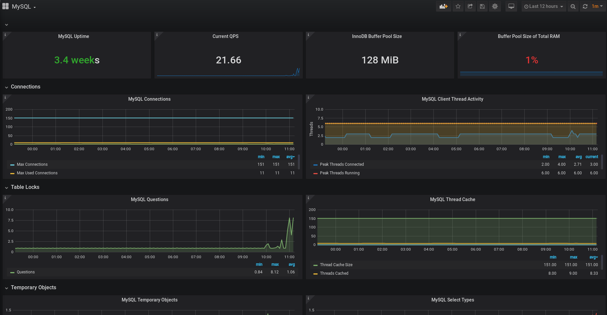

# 程序员的MySQL手册(二): 监控与benchmark

这一节我们主要讲解如何监控MySQL的性能数据，以及如何对MySQL进行压测。

## 使用Prometheus进行监控

MySQL的监控方案有很多，我们使用Prometheus来进行监测，首先要安装prometheus mysql exporter：

```bash
$ sudo apt install prometheus-mysqld-exporter
```

在MySQL中创建如下用户：

```sql
CREATE USER 'exporter'@'localhost' IDENTIFIED BY 'XXXXXXXX' WITH MAX_USER_CONNECTIONS 3;
GRANT PROCESS, REPLICATION CLIENT, SELECT ON *.* TO 'exporter'@'localhost';
```

修改 `/etc/default/prometheus-mysqld-exporter` 中的 `DATA_SOURCE_NAME` 连接串。

之后要在Prometheus中加上对该节点的配置，至于Prometheus本身的安装配置，可以参考其它教程，我们这一节只专注于Prometheus的
安装与配置。

```
  - job_name: 'mysql'
    static_configs:
    - targets: ['192.168.122.220:9104']
      labels:
        instance: 'debian.mysql'
```

再往Grafana上添加一个面板，之后就可以看到MySQL的性能数据了，如图：



## sysbench对MySQL进行压测

> 这一节基本上可以算是一个简单的sysbench教程

sysbench 的基本用法是 `sysbench <测试名称> <各类选项> 命令`，其中命令包括 prepare run cleanup help version 这几个。而
测试名称，则包括 fileio, cpu, memory, threads, mutex，以及对数据库的一些测试脚本，他们在 `/usr/share/sysbench/` 下，
例如如果要测试 `oltp_insert.lua` 就写为 oltp_insert 。

测试MySQL时，需要先准备一些数据，因此三个命令依次是 prepare, run, cleanup，依次是准备数据，执行测试，清除测试数据。
我们来看看实例。

```bash
$ sysbench oltp_insert --db-driver=mysql --mysql-host=127.0.0.1 --mysql-db=sbtest --mysql-user=root --mysql-password=new_password prepare
sysbench 1.0.18 (using system LuaJIT 2.1.0-beta3)

Creating table 'sbtest1'...
Inserting 10000 records into 'sbtest1'
Creating a secondary index on 'sbtest1'...
$ sysbench oltp_insert --db-driver=mysql --mysql-host=127.0.0.1 --mysql-db=sbtest --mysql-user=root --mysql-password=new_password run
sysbench 1.0.18 (using system LuaJIT 2.1.0-beta3)

Running the test with following options:
Number of threads: 1
Initializing random number generator from current time


Initializing worker threads...

Threads started!

SQL statistics:
    queries performed:
        read:                            0
        write:                           1909
        other:                           0
        total:                           1909
    transactions:                        1909   (190.76 per sec.)
    queries:                             1909   (190.76 per sec.)
    ignored errors:                      0      (0.00 per sec.)
    reconnects:                          0      (0.00 per sec.)

General statistics:
    total time:                          10.0039s
    total number of events:              1909

Latency (ms):
         min:                                    0.99
         avg:                                    5.23
         max:                                   21.17
         95th percentile:                        9.06
         sum:                                 9989.73

Threads fairness:
    events (avg/stddev):           1909.0000/0.00
    execution time (avg/stddev):   9.9897/0.00

$ sysbench oltp_insert --db-driver=mysql --mysql-host=127.0.0.1 --mysql-db=sbtest --mysql-user=root --mysql-password=new_password cleanup
sysbench 1.0.18 (using system LuaJIT 2.1.0-beta3)

Dropping table 'sbtest1'...
```

通过对对应部分的压测，我们可以得到一个大致的数据，即当前配置情况下，数据库实例大概能跑到一个什么样的情况。从而为之后的
变更（如数据库升级，数据库是否到了瓶颈）等提供一个参考数据。

## 总结

这篇文章中我们主要是搭建了Prometheus MySQL的监控，和学习使用了sysbench这个工具，从而可以得到一些数据库的基准数据，这个
数据可以为之后对数据库实例的使用作为参考。
