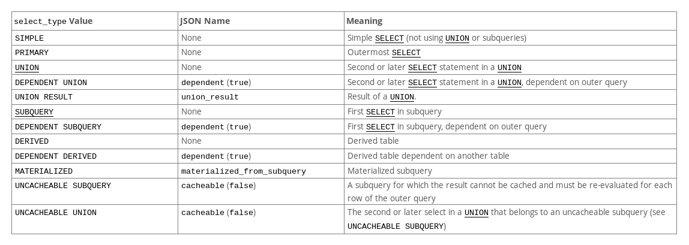

# 程序员的MySQL手册(五)：索引优化

随着产品的迭代，数据库中的数据一直在变更，索引也要跟着变更才能顺应时代，哦不，顺应数据的要求。

当索引不够好用时---通常是一波请求高峰击溃了系统，或者是提前发现查询性能不够高，我们就需要对查询进行诊断，判断当前是否
使用了索引，是否所使用的索引是否足够高效。

而我们所需要借助的工具只有两个，第一，slowlog，通过它我们可以发现慢查询；第二，explain，通过它我们可以一窥MySQL的执行
计划，从而判定索引是否合理，从而决定是否需要优化。

slowlog我们在第一篇中有讲述，这一篇，我们主要来学习一下如何使用explain。

首先我们来看一个EXPLAIN的例子：

```bash
MariaDB [foo]> EXPLAIN SELECT COUNT(*) FROM user WHERE name > 'A' AND name < 'Z';
+------+-------------+-------+-------+---------------+-----------+---------+------+------+--------------------------+
| id   | select_type | table | type  | possible_keys | key       | key_len | ref  | rows | Extra                    |
+------+-------------+-------+-------+---------------+-----------+---------+------+------+--------------------------+
|    1 | SIMPLE      | user  | range | user_name     | user_name | 1022    | NULL |  686 | Using where; Using index |
+------+-------------+-------+-------+---------------+-----------+---------+------+------+--------------------------+
1 row in set (0.000 sec)

```

对于每一列的解释如下：

- id: 语句的id
- select_type: 查询语句的类型，可选值见下图。
- table: 所查询的表
- partitions: 所涉及到的分区，如果不是NDB集群，没有这个字段
- type: 查询数据的类型，类型见 [这里](https://dev.mysql.com/doc/refman/8.0/en/explain-output.html#explain-join-types) 或 [我的这篇博客](https://jiajunhuang.com/articles/2018_01_08-db_optimizations.md.html)
- possible_keys: 可能会使用的索引
- key: 实际使用的索引
- key_len: 使用到索引的长度
- ref: 和索引做比较的列
- rows: MySQL预估有多少行需要处理
- filtered: 大概被过滤的行数的百分比
- Extra: 其它信息



## 索引提示

了解了查询如何被MySQL执行，以及为什么慢之后，就会有对策出来，一般要么是加新的索引，要么是MySQL选错了索引。如果是选错了
索引，那么我们就需要使用索引提示。语句如下：

```sql
SELECT * FROM table1 USE INDEX (col1_index,col2_index)
  WHERE col1=1 AND col2=2 AND col3=3;

SELECT * FROM table1 IGNORE INDEX (col3_index)
  WHERE col1=1 AND col2=2 AND col3=3;
```

详见 https://dev.mysql.com/doc/refman/8.0/en/index-hints.html 。

## 总结

通过这个系列的五篇文章，我们熟悉和了解了日常开发工作中，涉及到的MySQL的知识，我们系统的整理了这些知识，从安装，监控，
到熟悉MySQL的类型，索引设计，索引优化。深入了解这些知识，是成为中高级、资深开发的必备知识。希望这个系列能够作为引子，
抛砖引玉，为大家带来一定帮助，并且引导大家更加深入的了解MySQL。

系列目录：

- [程序员的MySQL手册(一): 安装，基本配置](https://jiajunhuang.com/articles/2020_07_05-mysql_part1.md.html)
- [程序员的MySQL手册(二): 监控与benchmark](https://jiajunhuang.com/articles/2020_07_23-mysql_part2.md.html)
- [程序员的MySQL手册(三)：数据库设计](https://jiajunhuang.com/articles/2020_07_26-mysql_part3.md.html)
- [程序员的MySQL手册(四)：索引设计](https://jiajunhuang.com/articles/2020_07_27-mysql_part4.md.html)
- [程序员的MySQL手册(五)：索引优化](https://jiajunhuang.com/articles/2020_07_28-mysql_part5.md)

---

参考资料：

- https://dev.mysql.com/doc/refman/8.0/en/using-explain.html
- https://dev.mysql.com/doc/refman/8.0/en/explain-output.html#explain-join-types
- https://jiajunhuang.com/articles/2018_01_08-db_optimizations.md.html
- https://dev.mysql.com/doc/refman/8.0/en/index-hints.html
