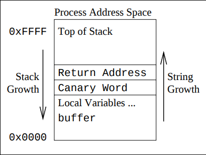

# StackGuard的作用

最近在重新翻Go runtime的源码，发现一个新知识点，叫做StackGuard。此为学习记录。

## 什么是StackGuard

首先我们来看一下USENIX上论文中，对StackGuard的描述与介绍：

> StackGuard is a compiler extension that enhances the executable code produced
> by the compiler so that it detects and thwarts buffer-overflow
> attacks against the stack. The effect is transparent to the normal function
> of programs. The only way to notice that a program is
> StackGuard-enhanced is to cause it to execute C statements with undefined behavior: StackGuard-enhanced
> programs define the behavior of writing to the return address of a function while it is still active.

由此我们知道，StackGuard是一个用来防御缓冲区溢出攻击的方式，一般在
编译器里实现，它的存在对函数调用是没有直接影响的。

不过，为了进一步了解它是如何工作的，我们得先来了解一下缓冲区溢出攻击。

## 缓冲区溢出攻击

缓冲区溢出（buffer overflow），是针对程序设计缺陷，向程序输入缓冲区写入使之溢出的内容（通常是超过缓冲区能保存的最大数据量的数据），从而破坏程序运行、趁著中断之际并获取程序乃至系统的控制权。

下图是正常的函数调用时，函数调用栈的示意图：

缓冲区异常攻击，需要程序没有检查数组或者指针的边界，因此攻击者可以把
特定的二进制代码写到数组里，覆盖
函数的返回地址，从而执行攻击者的代码。攻击者可以注入类似于 `exec("sh")` 的代码，这样就为后续的操作奠定了基础。

## StackGuard 如何发挥作用

由上图可以看到，缓冲区溢出攻击的核心点在于，由于程序没有检测边界，而攻击者利用这一点，覆盖函数的返回地址。如果我们有办法能检测到
程序是否被修改，就可以作出一定的防御，比如检测到被修改，就退出。

StackGuard的方法很简单，就是往返回地址后面插入一段特殊值(称之为canary)，在函数返回之前，首先检查这个
特殊值是否被修改，
如果被修改了，说明发生了缓冲区溢出攻击。更安全的方式是，插入这段特殊值，是随机值。

但是，即便如此，攻击者仍然有办法绕过，那就是不修改这段值，而是直接
修改返回地址，但是这很难做到，因为攻击者无法知道这段随机值到底是多长。另外由于随机化，攻击者也无法轻易复制这一段随机值。另外由于随机化，攻击者也无法轻易复制这一段随机值。

## 总结

这篇文章中，学习了一下什么是StackGuard以及什么是缓冲区溢出攻击，以及StackGuard是如何预防缓冲区溢出攻击的。

---

Ref:

- https://www.usenix.org/legacy/publications/library/proceedings/sec98/full_papers/cowan/cowan.pdf
- http://www.jsjkx.com/CN/article/openArticlePDF.jsp?id=10963
- https://zh.wikipedia.org/wiki/%E7%BC%93%E5%86%B2%E5%8C%BA%E6%BA%A2%E5%87%BA
