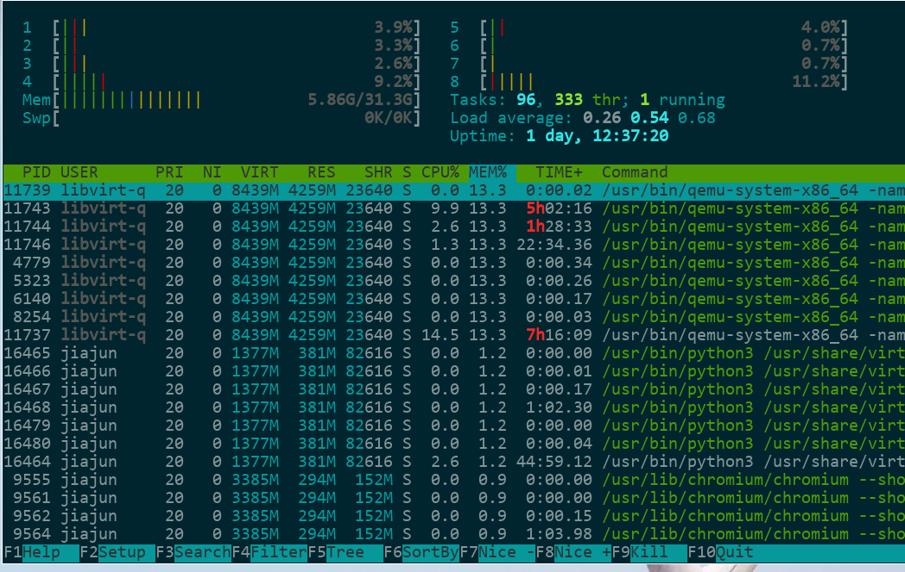

# Linux常用命令(二)：htop

htop是非常非常常用的一个命令行工具。htop在top上有很多改进，更加易用，并且操作更加简单、直观。我们来看看htop的截图：

可以看到，最上面的是CPU和内存，以及负载等基础信息，中间是进程及其信息，最下面是快捷键。

## 顶栏

首先我们来看顶栏，上图可以看到，这是一个8核心的电脑，有31.3G(32G)内存，使用了5.86G，有0K的交换分区，
使用0K，也就是没有交换分区的意思。右边，Tasks这一栏，说明有96个待执行的Task(Linux中的进程，定义为一个Task)，333各线程，其中1各正在执行。

Load average分别是最近1分钟，5分钟，15分钟的负载，Linux的负载包含CPU负载和I/O负载。

接着就是Uptime，这是开机时间。

至于CPU和内存颜色所代表的含义，由于不同终端颜色不一样，我建议直接按 `h` 快捷键查看说明，里面有每一
个颜色的示例和含义说明。

## 各列的含义

看中间的栏里，分别解释每一个列的意思：

- `PID` 是进程ID
- `USER` 是执行用户
- `PRI` 和 `NI` 是优先级和nice值。一般 `PRI` 是 `NI` 加上20。
- `VIRT` 是虚拟内存大小
- `RES` 是实际使用的物理内存大小
- `SHR` 是使用的共享页的大小
- `S` 是进程状态。
    - S for sleeping (idle)
    - R for running
    - D for disk sleep (uninterruptible)
    - Z for zombie (waiting for parent to read its exit status)
    - T for traced or suspended (e.g by SIGTSTP)
    - W for paging
- `CPU%` 是CPU占比
- `MEM%` 是内存占比
- `TIME+` 是进程执行时间
- `Command` 是进程启动的命令，包含所有的参数

## 常用快捷键

最下面一栏就是命令行参数，依次对应F1到F10，这无需多言。其实每个功能，都还有一个按键的快捷键，
基本上与Vim和一部分Emacs快捷键相同：

- 上下左右分别是把当前的界面进行对应方向的移动
- `^` 和 `$` 分别是移到行首和行尾，同时也可以使用 `Ctrl-A` 和 `Ctrl-E` 来进行操作
- 空格把当前所在行的进程进行标记，`U` 则是取消标记
- `s` 是对当前所在行的进程进行strace命令，attach上去看系统调用
- `l` 查看当前所在行的进程所打开的文件
- `h` 显示帮助
- `/` 进行搜索
- `\` 进行过滤
- `t` 使用树状来表示进程之间的关系，这样可以清晰明了的看到进程间的关系
- `k` 对当前所在行的进程发送kill信号
- `q` 退出htop
- `u` 会在左侧弹出一个用户选择列表，选择对应的选项，htop便会只显示对应用户的进程

## 命令行参数

htop常用的命令行参数如下：

- `-h` 显示帮助，不过 `man htop` 更有帮助
- `-t` 以树状形式显示
- `-u` 仅显示指定用户的进程
- `-p` 仅显示某个进程ID的信息
- `-v` 显示版本信息

## 总结

这一篇文章里我们总结了一下htop的使用方法，从界面看起，分为三块，最后看了一下命令行参数，总体学习
了一下htop的用法。
