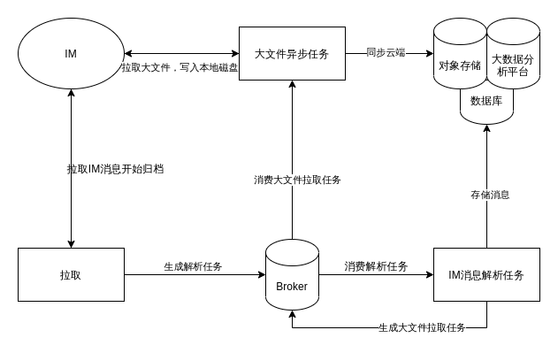

# 设计一个IM归档系统

最近整了一个IM归档系统，需求就是把IM聊天记录、文件、图片等全部归档，供数据团队分析。挑战在于量非常的大，以及可靠性保证。

架构如下：

要注意这么一些点：

- 充分使用Broker来解耦
- 把IM消息解析和文件拉取拆分成两个不同的任务，原因是他们的性能损耗的方向不一样，IM消息解析更消耗CPU，文件拉取则是网络I/O
- 如果使用Redis做Broker，那么要注意在Producer处做内存检测，如果内存超过某个阈值，那么就暂缓拉取，毕竟拉取可以慢一点没关系，当然这主要取决于对聊天消息的实时性要求，不过最主要的还是要保证Redis不满，也就是说，worker要能充分消费任务
- 如果使用RabbitMQ做Broker，那么会是更好地一个选择，因为可以使用late ack来保证任务不丢失，或者失败后进行重试
- 为Broker和程序都加上监控，这样子消费情况一目了然
- 由于量非常大，如何存储这些消息就变得很重要，主要出于成本考量，消息可以写入MongoDB集群或者写入HDFS，文件则可以考虑使用对象存储（因为文件不常用）
- 生产者和消费者之间的生产速度、消费速度（并发消费数量）要控制好，并且要留有余地应对高峰，同时生产者应该在保证实时性的前提下，进行主动流量控制(其实很简单，检测到内存快满了，暂停一会儿)。

最后，我想说，celery很坑。动不动卡死。最后切换到了python-rq，代价就是没有了late ack，只能在代码里
设置rq自动发现异常就重试，但是当重启的时候，正在执行的任务，如果是使用 `kill -9` 的方式，那么就会丢失，这个时候，只能靠代码来进行补偿，不过问题不大，对于这个系统来说，是可以容忍的。
