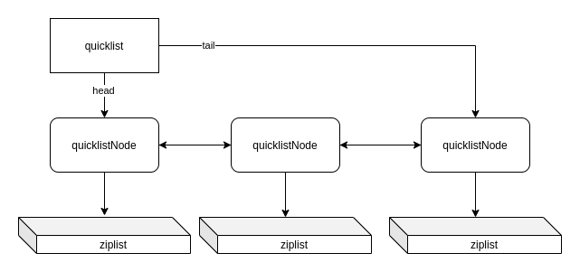

# Redis源码阅读：list实现(ziplist, quicklist)

如果我们用Redis做过broker，就知道，绝大部分的队列实现，都是基于 `LPUSH` 和 `BRPOP` 这两个命令的。那么，Redis到底是怎么
实现list的呢？底层是如何实现的，是否省内存，Redis为了省内存又做了什么优化？阻塞版的pop又是怎么实现的？这篇文章里，我们
就会探讨这些问题。

接下来我们来看看Redis到底是怎么实现list的，我们从 `LPUSH` 入手：

```c
    {"lpush",lpushCommand,-3,
     "write use-memory fast @list",
     0,NULL,1,1,1,0,0,0},


/* LPUSH <key> <element> [<element> ...] */
void lpushCommand(client *c) {
    pushGenericCommand(c,LIST_HEAD,0);
}

/* Implements LPUSH/RPUSH/LPUSHX/RPUSHX. 
 * 'xx': push if key exists. */
void pushGenericCommand(client *c, int where, int xx) {
    int j;

    // ...
    for (j = 2; j < c->argc; j++) {
        // 将参数逐一加到list中
        listTypePush(lobj,c->argv[j],where);
        server.dirty++;
    }
    // ...
}

void listTypePush(robj *subject, robj *value, int where) {
    if (subject->encoding == OBJ_ENCODING_QUICKLIST) {
        int pos = (where == LIST_HEAD) ? QUICKLIST_HEAD : QUICKLIST_TAIL;
        if (value->encoding == OBJ_ENCODING_INT) {
            char buf[32];
            ll2string(buf, 32, (long)value->ptr);
            // 这里是真正写入的地方
            quicklistPush(subject->ptr, buf, strlen(buf), pos);
        } else {
            quicklistPush(subject->ptr, value->ptr, sdslen(value->ptr), pos);
        }
    } else {
        serverPanic("Unknown list encoding");
    }
}

/* Wrapper to allow argument-based switching between HEAD/TAIL pop */
void quicklistPush(quicklist *quicklist, void *value, const size_t sz,
                   int where) {
    if (where == QUICKLIST_HEAD) {
        quicklistPushHead(quicklist, value, sz);
    } else if (where == QUICKLIST_TAIL) {
        quicklistPushTail(quicklist, value, sz);
    }
}

/* Add new entry to head node of quicklist.
 *
 * Returns 0 if used existing head.
 * Returns 1 if new head created. */
int quicklistPushHead(quicklist *quicklist, void *value, size_t sz) {
    quicklistNode *orig_head = quicklist->head;
    if (likely(
            _quicklistNodeAllowInsert(quicklist->head, quicklist->fill, sz))) {
            // 判断 quicklist->head 能不能插入数据，如果可以，就插入
        quicklist->head->zl =
            ziplistPush(quicklist->head->zl, value, sz, ZIPLIST_HEAD); // 插入并且返回新的ziplist
        quicklistNodeUpdateSz(quicklist->head);
    } else {
        // 如果不可以，就新建一个
        quicklistNode *node = quicklistCreateNode();
        node->zl = ziplistPush(ziplistNew(), value, sz, ZIPLIST_HEAD);

        quicklistNodeUpdateSz(node);
        _quicklistInsertNodeBefore(quicklist, quicklist->head, node);
    }
    quicklist->count++;
    quicklist->head->count++;
    return (orig_head != quicklist->head);
}
```

到这里，我们看到，原来 `quicklist` 底层实现就是用的 `ziplist`，我们来看看 `quicklist` 的实现：

```c
/* quicklist is a 40 byte struct (on 64-bit systems) describing a quicklist.
 * 'count' is the number of total entries.
 * 'len' is the number of quicklist nodes.
 * 'compress' is: 0 if compression disabled, otherwise it's the number
 *                of quicklistNodes to leave uncompressed at ends of quicklist.
 * 'fill' is the user-requested (or default) fill factor.
 * 'bookmakrs are an optional feature that is used by realloc this struct,
 *      so that they don't consume memory when not used. */
typedef struct quicklist {
    quicklistNode *head;
    quicklistNode *tail;
    unsigned long count;        /* total count of all entries in all ziplists */
    unsigned long len;          /* number of quicklistNodes */
    // 请注意，下面的几个值，加起来一共占36bit
    int fill : QL_FILL_BITS;              /* fill factor for individual nodes */
    unsigned int compress : QL_COMP_BITS; /* depth of end nodes not to compress;0=off */
    unsigned int bookmark_count: QL_BM_BITS;
    quicklistBookmark bookmarks[];
} quicklist;

/* quicklistNode is a 32 byte struct describing a ziplist for a quicklist.
 * We use bit fields keep the quicklistNode at 32 bytes.
 * count: 16 bits, max 65536 (max zl bytes is 65k, so max count actually < 32k).
 * encoding: 2 bits, RAW=1, LZF=2.
 * container: 2 bits, NONE=1, ZIPLIST=2.
 * recompress: 1 bit, bool, true if node is temporary decompressed for usage.
 * attempted_compress: 1 bit, boolean, used for verifying during testing.
 * extra: 10 bits, free for future use; pads out the remainder of 32 bits */
typedef struct quicklistNode {
    struct quicklistNode *prev;
    struct quicklistNode *next;
    unsigned char *zl; // 真正存放数据的地方，其实就是一个 ziplist 的指针
    unsigned int sz;             /* ziplist size in bytes */
    unsigned int count : 16;     /* count of items in ziplist */
    unsigned int encoding : 2;   /* RAW==1 or LZF==2 */
    unsigned int container : 2;  /* NONE==1 or ZIPLIST==2 */
    unsigned int recompress : 1; /* was this node previous compressed? */
    unsigned int attempted_compress : 1; /* node can't compress; too small */
    unsigned int extra : 10; /* more bits to steal for future usage */
} quicklistNode;
```

所以，`quicklist` 大概是这么一个样子：



`quicklistNode` 中存储的数据，还可以进行压缩，以进一步节省内存。不过我们就不细究了。接下来，我们看一眼ziplist。

## ziplist

`ziplist` 的实现在 `ziplist.c` 里，最上面的注释说明了一切：

```c
/* The ziplist is a specially encoded dually linked list that is designed
 * to be very memory efficient. It stores both strings and integer values,
 * where integers are encoded as actual integers instead of a series of
 * characters. It allows push and pop operations on either side of the list
 * in O(1) time. However, because every operation requires a reallocation of
 * the memory used by the ziplist, the actual complexity is related to the
 * amount of memory used by the ziplist.
```

说明了几点：

- ziplist的设计是为了最大化内存使用率，所以才叫 memory efficient
- ziplist的数据，每一次插入或者修改，都要重新分配内存，所以如果是高频读写，其实很不友好

再往下面一点的注释，说明了ziplist是如何存放数据的：

```c
 * ZIPLIST OVERALL LAYOUT
 * ======================
 *
 * The general layout of the ziplist is as follows:
 *
 * <zlbytes> <zltail> <zllen> <entry> <entry> ... <entry> <zlend>
 *
 * NOTE: all fields are stored in little endian, if not specified otherwise.
 * <uint32_t zlbytes> is an unsigned integer to hold the number of bytes that
 * the ziplist occupies, including the four bytes of the zlbytes field itself.
 * This value needs to be stored to be able to resize the entire structure
 * without the need to traverse it first.
 *
 * <uint32_t zltail> is the offset to the last entry in the list. This allows
 * a pop operation on the far side of the list without the need for full
 * traversal.
 *
 * <uint16_t zllen> is the number of entries. When there are more than
 * 2^16-2 entries, this value is set to 2^16-1 and we need to traverse the
 * entire list to know how many items it holds.
 *
 * <uint8_t zlend> is a special entry representing the end of the ziplist.
 * Is encoded as a single byte equal to 255. No other normal entry starts
 * with a byte set to the value of 255.


 * ZIPLIST ENTRIES
 * ===============
 *
 * Every entry in the ziplist is prefixed by metadata that contains two pieces
 * of information. First, the length of the previous entry is stored to be
 * able to traverse the list from back to front. Second, the entry encoding is
 * provided. It represents the entry type, integer or string, and in the case
 * of strings it also represents the length of the string payload.
 * So a complete entry is stored like this:
 *
 * <prevlen> <encoding> <entry-data>
 *
 * Sometimes the encoding represents the entry itself, like for small integers
 * as we'll see later. In such a case the <entry-data> part is missing, and we
 * could have just:
 *
 * <prevlen> <encoding>
 *
 * The length of the previous entry, <prevlen>, is encoded in the following way:
 * If this length is smaller than 254 bytes, it will only consume a single
 * byte representing the length as an unsinged 8 bit integer. When the length
 * is greater than or equal to 254, it will consume 5 bytes. The first byte is
 * set to 254 (FE) to indicate a larger value is following. The remaining 4
 * bytes take the length of the previous entry as value.
 *
 * So practically an entry is encoded in the following way:
 *
 * <prevlen from 0 to 253> <encoding> <entry>
 *
 * Or alternatively if the previous entry length is greater than 253 bytes
 * the following encoding is used:
 *
 * 0xFE <4 bytes unsigned little endian prevlen> <encoding> <entry>
 *
 * The encoding field of the entry depends on the content of the
 * entry. When the entry is a string, the first 2 bits of the encoding first
 * byte will hold the type of encoding used to store the length of the string,
 * followed by the actual length of the string. When the entry is an integer
 * the first 2 bits are both set to 1. The following 2 bits are used to specify
 * what kind of integer will be stored after this header. An overview of the
 * different types and encodings is as follows. The first byte is always enough
 * to determine the kind of entry.
 *
 * |00pppppp| - 1 byte
 *      String value with length less than or equal to 63 bytes (6 bits).
 *      "pppppp" represents the unsigned 6 bit length.
 * |01pppppp|qqqqqqqq| - 2 bytes
 *      String value with length less than or equal to 16383 bytes (14 bits).
 *      IMPORTANT: The 14 bit number is stored in big endian.
 * |10000000|qqqqqqqq|rrrrrrrr|ssssssss|tttttttt| - 5 bytes
 *      String value with length greater than or equal to 16384 bytes.
 *      Only the 4 bytes following the first byte represents the length
 *      up to 2^32-1. The 6 lower bits of the first byte are not used and
 *      are set to zero.
 *      IMPORTANT: The 32 bit number is stored in big endian.
 * |11000000| - 3 bytes
 *      Integer encoded as int16_t (2 bytes).
 * |11010000| - 5 bytes
 *      Integer encoded as int32_t (4 bytes).
 * |11100000| - 9 bytes
 *      Integer encoded as int64_t (8 bytes).
 * |11110000| - 4 bytes
 *      Integer encoded as 24 bit signed (3 bytes).
 * |11111110| - 2 bytes
 *      Integer encoded as 8 bit signed (1 byte).
 * |1111xxxx| - (with xxxx between 0001 and 1101) immediate 4 bit integer.
 *      Unsigned integer from 0 to 12. The encoded value is actually from
 *      1 to 13 because 0000 and 1111 can not be used, so 1 should be
 *      subtracted from the encoded 4 bit value to obtain the right value.
 * |11111111| - End of ziplist special entry.
 *
 * Like for the ziplist header, all the integers are represented in little
 * endian byte order, even when this code is compiled in big endian systems.
```

ziplist 使用小端来存放数据，我们看看这几个字段的含义：

- `zlbytes` 整个ziplist的长度
- `zltail` 最后一项的偏移量
- `zllen` 数据项的长度，当值为 `2 ** 16 - 1` 时，代表长度未知，想要知道就去遍历
- `entry` 具体的数据
- `zlend` 标记结束

然后是 entry 的结构，差不多是这样：`<prevlen> <encoding> <entry-data>`，`prevlen` 是上一个数据的长度，`encoding` 是
数据的类型，比如整数，或者字符串。如果是字符串，还会有长度，当内容为字符串时，encoding的一部分代表类型，另外一部分
代表长度。详细就得看上面的注释了。我认为知道ziplist是一种高度为了生内存而搞出来的“编码”，其实就差不多了。

## BRPOP是怎么实现的

最后我们来看一下，`BRPOP` 是怎么实现的，照样，我们从 `BRPOP` 入手：

```c
    {"brpop",brpopCommand,-3,
     "write no-script @list @blocking",
     0,NULL,1,-2,1,0,0,0},


/* BLPOP <key> [<key> ...] <timeout> */
void brpopCommand(client *c) {
    blockingPopGenericCommand(c,LIST_TAIL);
}

/* Blocking RPOP/LPOP */
void blockingPopGenericCommand(client *c, int where) {
    // ...
        /* If the keys do not exist we must block */
    struct listPos pos = {where};
    blockForKeys(c,BLOCKED_LIST,c->argv + 1,c->argc - 2,timeout,NULL,&pos,NULL);
}

void blockForKeys(client *c, int btype, robj **keys, int numkeys, mstime_t timeout, robj *target, struct listPos *listpos, streamID *ids) {
    // ...
        /* And in the other "side", to map keys -> clients */
        de = dictFind(c->db->blocking_keys,keys[j]);
        if (de == NULL) {
            int retval;

            /* For every key we take a list of clients blocked for it */
            l = listCreate();
            retval = dictAdd(c->db->blocking_keys,keys[j],l);

    // ...

    blockClient(c,btype);
}

/* Block a client for the specific operation type. Once the CLIENT_BLOCKED
 * flag is set client query buffer is not longer processed, but accumulated,
 * and will be processed when the client is unblocked. */
void blockClient(client *c, int btype) {
    c->flags |= CLIENT_BLOCKED;
    c->btype = btype;
    server.blocked_clients++;
    server.blocked_clients_by_type[btype]++;
    addClientToTimeoutTable(c);
    if (btype == BLOCKED_PAUSE) {
        listAddNodeTail(server.paused_clients, c);
        c->paused_list_node = listLast(server.paused_clients);
        /* Mark this client to execute its command */
        c->flags |= CLIENT_PENDING_COMMAND;
    }
}
```

说明其实是把key和client加到 `c->db->blocking_keys` 里，然后不回复客户端。那么，在啥地方通知客户端？搜索了
`c->db->blocking_keys`，发现有这么一个函数：

```c
/* Helper function for handleClientsBlockedOnKeys(). This function is called
 * when there may be clients blocked on a list key, and there may be new
 * data to fetch (the key is ready). */
void serveClientsBlockedOnListKey(robj *o, readyList *rl) {
    /* We serve clients in the same order they blocked for
     * this key, from the first blocked to the last. */
    dictEntry *de = dictFind(rl->db->blocking_keys,rl->key);
    // ...
    if (serveClientBlockedOnList(receiver,
        rl->key,dstkey,rl->db,value,
        wherefrom, whereto) == C_ERR)
}

int serveClientBlockedOnList(client *receiver, robj *key, robj *dstkey, redisDb *db, robj *value, int wherefrom, int whereto) {
    // ...
    /* BRPOP/BLPOP */
    addReplyArrayLen(receiver,2);
    addReplyBulk(receiver,key);
    addReplyBulk(receiver,value);
    // ...
}
```

这是说明，调用这个函数之后，就去 `rl->db->blocking_keys` 里，找到客户端，然后回复。那么，`serveClientsBlockedOnListKey`
函数是在哪里被调用的呢？

```c
void handleClientsBlockedOnKeys(void) {
    // ...
    if (o != NULL) {
        if (o->type == OBJ_LIST)
            serveClientsBlockedOnListKey(o,rl);
        else if (o->type == OBJ_ZSET)
            serveClientsBlockedOnSortedSetKey(o,rl);
        else if (o->type == OBJ_STREAM)
            serveClientsBlockedOnStreamKey(o,rl);
        /* We want to serve clients blocked on module keys
            * regardless of the object type: we don't know what the
            * module is trying to accomplish right now. */
        serveClientsBlockedOnKeyByModule(rl);
    }


// 在 processCommand 和 beforeSleep 里都有调用
int processCommand(client *c) {
    // ...
    
    /* Exec the command */
    if (c->flags & CLIENT_MULTI &&
        c->cmd->proc != execCommand && c->cmd->proc != discardCommand &&
        c->cmd->proc != multiCommand && c->cmd->proc != watchCommand &&
        c->cmd->proc != resetCommand)
    {
        queueMultiCommand(c);
        addReply(c,shared.queued);
    } else {
        call(c,CMD_CALL_FULL);
        c->woff = server.master_repl_offset;
        if (listLength(server.ready_keys))
            handleClientsBlockedOnKeys();
    }

    // ...
}

void beforeSleep(struct aeEventLoop *eventLoop) {
    // ...
    /* Try to process blocked clients every once in while. Example: A module
     * calls RM_SignalKeyAsReady from within a timer callback (So we don't
     * visit processCommand() at all). */
    handleClientsBlockedOnKeys();

    // ...
}
```

所以现在我们知道了，当调用 `BRPOP` 时，如果列表里有内容，那么就会返回；如果没有，就把当前client加到 `blocking_keys`
这个dict里。当处理完命令之后，或者进入事件循环之前，就会去处理看是否有客户端可以不被阻塞了。这里面还有一个细节，就是
当处理一个key时，Redis会把它加到 `server.ready_keys`，当然会进行判断，比如这个key所对应数据类型是否能阻塞，是否有
阻塞的。然后在循环的时候，会对已经好的key，进行处理。

## 总结

这篇文章里我们看了一下Redis中是如何实现list这个数据结构的，以及ziplist是怎么最大化利用内存，最后我们看了一下 `BRPOP`
在Redis中是如何实现的。
