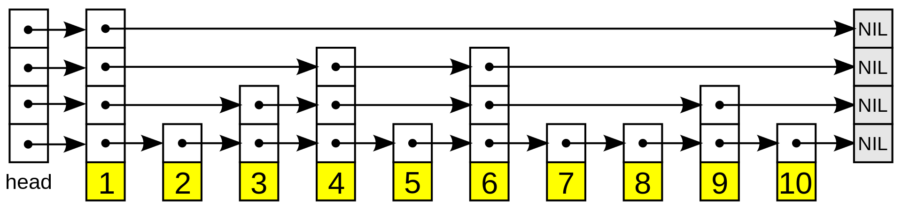

# Redis源码阅读：zset实现

关于zset这个数据结构的，网上有很多的资料，这一篇文章我主要还是通过探索几个命令，来看到zset是怎么实现的。

首先我得借用维基百科上一张关于skiplist的图，来让大家对skiplist进行一个认知。



简单理解，skiplist就是最底层一个链表，然后上面有n层链表，每一层都比下面一层元素更少，上面的链表其实就是
底层链表的一个索引，用来辅助快速跳过一些元素，从而加快查询速度。

## 阅读命令实现

我们从 `ZADD` 开始看起：

```c
    {"zadd",zaddCommand,-4,
     "write use-memory fast @sortedset",
     0,NULL,1,1,1,0,0,0},


void zaddCommand(client *c) {
    zaddGenericCommand(c,ZADD_IN_NONE);
}


/* This generic command implements both ZADD and ZINCRBY. */
void zaddGenericCommand(client *c, int flags) {
    // ...
        for (j = 0; j < elements; j++) {
        double newscore;
        score = scores[j];
        int retflags = 0;

        ele = c->argv[scoreidx+1+j*2]->ptr;
        // 添加元素
        int retval = zsetAdd(zobj, score, ele, flags, &retflags, &newscore);
    // ...


int zsetAdd(robj *zobj, double score, sds ele, int in_flags, int *out_flags, double *newscore) {
    // ...
    /* Update the sorted set according to its encoding. */
    if (zobj->encoding == OBJ_ENCODING_ZIPLIST) {
        // ...
    } else if (zobj->encoding == OBJ_ENCODING_SKIPLIST) {
        zset *zs = zobj->ptr;
        zskiplistNode *znode;
        dictEntry *de;

        de = dictFind(zs->dict,ele);
        if (de != NULL) {
            // 已经存在
            // ...
        } else if (!xx) {
            // 不存在，插入
            ele = sdsdup(ele);
            znode = zslInsert(zs->zsl,score,ele);
            serverAssert(dictAdd(zs->dict,ele,&znode->score) == DICT_OK);
            *out_flags |= ZADD_OUT_ADDED;
            if (newscore) *newscore = score;
            return 1;
        } else {
            *out_flags |= ZADD_OUT_NOP;
            return 1;
        }

    }
```

到这里为止，我们可以看到 zset 的底层实现，其实也是有两种，一种是ziplist，一种是skiplist，如我们前面所说，当元素比较少
的时候，就用ziplist，否则用skiplist。后面我们就直接跳过ziplist的逻辑。从上面我们可以看到 skiplist的定义是 `zskiplistNode`，
我们跟进去看看：

```c
/* ZSETs use a specialized version of Skiplists */
typedef struct zskiplistNode {
    // 应该是存储的对象
    sds ele;
    // 分数
    double score;
    // 回退指针
    struct zskiplistNode *backward;
    // 层级
    struct zskiplistLevel {
        // 前进指针，注意指向的是节点本身
        struct zskiplistNode *forward;
        // 这个指针跳过的节点数
        unsigned long span;
    } level[];
} zskiplistNode;

typedef struct zskiplist {
    // ziplist的头节点，尾节点
    struct zskiplistNode *header, *tail;
    // 节点数量
    unsigned long length;
    // 层级
    int level;
} zskiplist;

typedef struct zset {
    dict *dict;
    zskiplist *zsl;
} zset;
```

看到这里，再和最上面的图对应一下，就可以大概理解 skiplist 是怎么实现的了，首先 zset 对应的数据结构是 `struct zset`，里面
包含了一个 `dict` 和一个 `zskiplist`，而 `zskiplist` 就是skiplist的实现。`zskiplist` 包含头节点、尾节点指针，节点数量和
层级。最后就是skiplist中节点的定义，里面包含了元素，分数，回退指针和每一层以及该层对应的前进指针。

接下来我们继续看 `zslInsert`：

```c
/* Insert a new node in the skiplist. Assumes the element does not already
 * exist (up to the caller to enforce that). The skiplist takes ownership
 * of the passed SDS string 'ele'. */
zskiplistNode *zslInsert(zskiplist *zsl, double score, sds ele) {
    zskiplistNode *update[ZSKIPLIST_MAXLEVEL], *x;
    unsigned int rank[ZSKIPLIST_MAXLEVEL];
    int i, level;

    serverAssert(!isnan(score));
    x = zsl->header;
    for (i = zsl->level-1; i >= 0; i--) {
        /* store rank that is crossed to reach the insert position */
        rank[i] = i == (zsl->level-1) ? 0 : rank[i+1];
        while (x->level[i].forward && // 有下一个元素
                (x->level[i].forward->score < score /* 下一个元素的分数比目标分数更小 */ ||
                    (/* 分数相同，元素更小 */ x->level[i].forward->score == score &&
                    sdscmp(x->level[i].forward->ele,ele) < 0)))
        {
            rank[i] += x->level[i].span;
            x = x->level[i].forward;
        }
        // 把要更新的节点追加进来
        update[i] = x;
    }
    /* we assume the element is not already inside, since we allow duplicated
     * scores, reinserting the same element should never happen since the
     * caller of zslInsert() should test in the hash table if the element is
     * already inside or not. */
    level = zslRandomLevel();
    if (level > zsl->level) {
        for (i = zsl->level; i < level; i++) {
            rank[i] = 0;
            update[i] = zsl->header;
            update[i]->level[i].span = zsl->length;
        }
        zsl->level = level;
    }
    // 创建节点
    x = zslCreateNode(level,score,ele);
    for (i = 0; i < level; i++) {
        // 插入节点，复制update中节点的前进指针为新节点的前进指针
        x->level[i].forward = update[i]->level[i].forward;
        // 把update中节点的前进指针换成该节点
        update[i]->level[i].forward = x;

        /* update span covered by update[i] as x is inserted here */
        x->level[i].span = update[i]->level[i].span - (rank[0] - rank[i]);
        update[i]->level[i].span = (rank[0] - rank[i]) + 1;
    }

    /* increment span for untouched levels */
    for (i = level; i < zsl->level; i++) {
        update[i]->level[i].span++;
    }

    // 设置回退指针
    x->backward = (update[0] == zsl->header) ? NULL : update[0];
    if (x->level[0].forward)
        x->level[0].forward->backward = x;
    else
        zsl->tail = x;
    zsl->length++;
    return x;
}
```

接着我们看看 `ZREM` 的实现：

```c
    {"zrem",zremCommand,-3,
     "write fast @sortedset",
     0,NULL,1,1,1,0,0,0},


void zremCommand(client *c) {
    robj *key = c->argv[1];
    robj *zobj;
    int deleted = 0, keyremoved = 0, j;

    if ((zobj = lookupKeyWriteOrReply(c,key,shared.czero)) == NULL ||
        checkType(c,zobj,OBJ_ZSET)) return;

    for (j = 2; j < c->argc; j++) {
        if (zsetDel(zobj,c->argv[j]->ptr)) deleted++;
        if (zsetLength(zobj) == 0) {
            dbDelete(c->db,key);
            keyremoved = 1;
            break;
        }
    }
    // ...
}

/* Delete the element 'ele' from the sorted set, returning 1 if the element
 * existed and was deleted, 0 otherwise (the element was not there). */
int zsetDel(robj *zobj, sds ele) {
    if (zobj->encoding == OBJ_ENCODING_ZIPLIST) {
        unsigned char *eptr;

        if ((eptr = zzlFind(zobj->ptr,ele,NULL)) != NULL) {
            zobj->ptr = zzlDelete(zobj->ptr,eptr);
            return 1;
        }
    } else if (zobj->encoding == OBJ_ENCODING_SKIPLIST) {
        zset *zs = zobj->ptr;
        if (zsetRemoveFromSkiplist(zs, ele)) {
            if (htNeedsResize(zs->dict)) dictResize(zs->dict);
            return 1;
        }
    } else {
        serverPanic("Unknown sorted set encoding");
    }
    return 0; /* No such element found. */
}

/* Deletes the element 'ele' from the sorted set encoded as a skiplist+dict,
 * returning 1 if the element existed and was deleted, 0 otherwise (the
 * element was not there). It does not resize the dict after deleting the
 * element. */
static int zsetRemoveFromSkiplist(zset *zs, sds ele) {
    dictEntry *de;
    double score;

    de = dictUnlink(zs->dict,ele);
    if (de != NULL) {
        /* Get the score in order to delete from the skiplist later. */
        score = *(double*)dictGetVal(de);

        /* Delete from the hash table and later from the skiplist.
         * Note that the order is important: deleting from the skiplist
         * actually releases the SDS string representing the element,
         * which is shared between the skiplist and the hash table, so
         * we need to delete from the skiplist as the final step. */
        dictFreeUnlinkedEntry(zs->dict,de);

        /* Delete from skiplist. */
        int retval = zslDelete(zs->zsl,score,ele,NULL);
        serverAssert(retval);

        return 1;
    }

    return 0;
}

/* Delete an element with matching score/element from the skiplist.
 * The function returns 1 if the node was found and deleted, otherwise
 * 0 is returned.
 *
 * If 'node' is NULL the deleted node is freed by zslFreeNode(), otherwise
 * it is not freed (but just unlinked) and *node is set to the node pointer,
 * so that it is possible for the caller to reuse the node (including the
 * referenced SDS string at node->ele). */
int zslDelete(zskiplist *zsl, double score, sds ele, zskiplistNode **node) {
    zskiplistNode *update[ZSKIPLIST_MAXLEVEL], *x;
    int i;

    x = zsl->header;
    for (i = zsl->level-1; i >= 0; i--) {
        while (x->level[i].forward &&
                (x->level[i].forward->score < score ||
                    (x->level[i].forward->score == score &&
                     sdscmp(x->level[i].forward->ele,ele) < 0)))
        {
            // 向每一层前进
            x = x->level[i].forward;
        }
        // 追加到要更新的节点
        update[i] = x;
    }
    /* We may have multiple elements with the same score, what we need
     * is to find the element with both the right score and object. */
    x = x->level[0].forward;
    if (x && score == x->score && sdscmp(x->ele,ele) == 0) {
        zslDeleteNode(zsl, x, update);
        if (!node)
            zslFreeNode(x);
        else
            *node = x;
        return 1;
    }
    return 0; /* not found */
}
```

## 总结

这一篇文章中我们大概看了一下Redis是怎么实现 `zset`，也就是有序集这个数据结构的实现，其实如果没有图帮助理解skiplist的话
还是挺难的，因为这个数据结构在大学里都没有教过，因此最开始借用了维基百科的图，当我们照着这个图去理解skiplist的实现，
瞬间就会简单很多。

---

Ref:

- https://en.wikipedia.org/wiki/Skip_list
