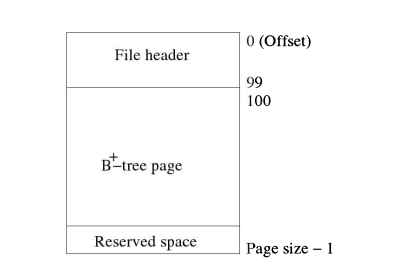
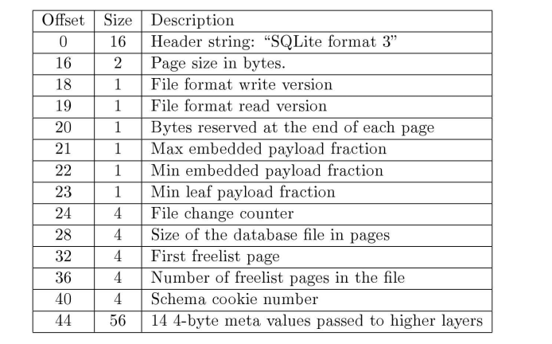

# SQLite3 存储以及ACID原理

我一直想知道如何处理磁盘存储，最近学习了一下SQLite3的做法，这是学习笔记。

首先多亏了操作系统的抽象，对于一个磁盘上文件，我们可以简单的想象成
是一个无限大的数组，基于这一层认知，我们就知道，如果我们想要分配和
管理这一个数组，那么就需要有一个系统，专门负责分发和回收。

这其实和内存管理是一致的，常见的内存管理通常也会把内存划分为不同大小的块，
然后分发给程序，管理磁盘则也是一样，可以把数组划分为不同大小的块，
然后分发给程序。

只不过，区别在于，对于内存操作，我们的最小修改和读取单位可以是byte，
而对于磁盘，则不行，机械硬盘通常有一个最小的读写单位，叫做sector(扇区)，
一般来说，大小为512bytes，对于较新的磁盘，一般都是4096bytes。

如果SQLite3想要使用不同大小的page，也不是不可以，不过对于数据库来说，
最好是使用相同大小的page，管理page的模块就叫pager。

SQLite3 把所有的数据都存储在一个文件里，文件的开头100byte，存储了
数据库的元信息，比如格式，page的大小，文件格式版本等等。

SQLite3 使用B+树来保存PRIMARY INDEX及数据，用B树来保存SECONDARY INDEX。

## ACID

ACID是数据库事务的四个特性：

- 原子性（atomicity，或称不可分割性
- 一致性（consistency）
- 隔离性（isolation，又称独立性）
- 持久性（durability）

SQLite3 通过对整个数据库文件上锁，外加journal/WAL来保证这四个特性。

SQLite3 的锁主要分为读和写，读锁是可以共存的，但是写锁是互斥的，也就是说，
同时只有一个地方能写入，这也就保证了隔离性，再加上日志，就实现了ACID。

对于 journal 和 WAL 是如何工作的，分别可以参考 [journal](https://www.sqlite.org/atomiccommit.html) 和 [WAL](https://www.sqlite.org/wal.html)
的文档。

---

ref:

- https://en.wikipedia.org/wiki/Disk_sector
- https://www.sqlite.org/atomiccommit.html
- https://www.sqlite.org/wal.html
