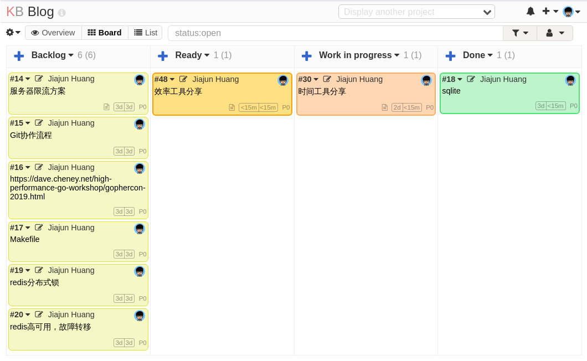

# 推荐三个时间管理工具

最近比较忙，一忙起来，就没完没了，各种事情来找，怎么把事情安排的有条不紊呢？这个时候就需要借助一些时间管理工具了。

我今天介绍三个，他们分别是Google Calendar，Kanboard和Microsoft TODO。

## 日历软件Google Calendar

我们平时工作中，有很多需要协同的地方，比如大家约好什么时候需要一起开一个会议，或者需要在什么时候进行一次面试，
这些事情，往往是多方参与的，如果大家使用群聊，也可以实现这个目标，但是协同起来往往很难，而且群聊，最新的消息
总是会把老消息冲刷掉。这个时候，日历软件就可以登场了，通过日历，我们可以多方协定某个时间段一起来做一件事情，
而且时间是否又重叠和冲突，在软件上一目了然。

我以前会在Calendar上放一些其他的任务和提醒，但是有一些每天循环的事情，放在日历上就会占满整个屏幕，因此后来我改成
放TODO上。这里我个人使用的是Google Calendar，日历软件还有很多其它选项，比如微软家的，苹果家的等等，但是最好整个
公司都用同一个体系，这样协调比较方便，当然也可以通过邮件发送ics来同步。

## 看板

看板和TODO软件有一个比较大的不同，就在于TODO只有两种状态：TODO和Done。而看板有中间状态。我一开始使用的是Trello，
但是Trello之所以被抛弃，是因为执行自动化的次数居然是有限的，一旦超过就要付费，而且付的是美元，换算成RMB就不那么
划算了。

我找替代品的几点要求是：

- 能执行自动化操作
- 有看板支持
- 能打标签
- 最好能自托管，但是别太麻烦

wekan和Trello界面上特别接近，但是看起来搭建特别复杂，然后看到了kanboard，发现很久之前自己搭建过，再次使用，发现
完全符合自己的需求。

说回正题，我个人认为看板很适合管理一些需要一些时间来做的事情，比如工作中要做某些事情，要看一些书，要写某些博客，
比如下图就是我管理要写的博客的看板：

一共分了4栏，backlog放突然想到要做的事情，Ready放准备好但是还没开始的，WIP放正在做的，Done放做完了的。然后配合自动化：

- 当卡片放到4列时，自动换颜色
- 卡片放到WIP时，设置开始时间
- 放到Done后30天未动，自动归档
- WIP设置不能同时超过5个任务

还有一些其它规则。

这样进行管理之后，要做的事情，在做的事情一目了然，然后配合一些Category或者标签，就可以分门别类。

当然Kanboard还有很多其它功能，比如各种分析图，泳道等等，我都没用上，目前暂时还用不上那么复杂的功能，我建议去看一下
[官方文档](https://docs.kanboard.org/en/latest/)

## TODO

最开始我是不分任务长短，全都放在一个叫做TODO的看板里，里面混杂了各种任务，比如工作上要做的事情，我自己的一些编程
方面的事情比如服务器要维护一下呀等等，但是用了一段时间发现，有一些任务不适合放看板里，因为很短，比如：

- 打电话询问客服关于xxx的事情
- 取快递
- 预约体检

等等，这些事情其实并不需要很久，他们很简单，只需要TODO和Done两种状态，还有一类就是我最开始放日历软件里的循环事情，
这两类事情，我决定找一个TODO软件来放，试用了一批软件之后，最后决定放Microsoft TODO里，选择它的主要原因还是在于
颜值和跨平台（我用Linux，至少要有web版）。

TODO软件很多，除了Microsoft TODO还有提醒事项、Tasks、滴答清单等等，选择一个自己喜欢的合适的就好。

## 总结

最后，我来说一下我是如何用这三个软件来管理各种事情的：

- 日历：主要是工作上使用，公司基本把我的日历塞满了，各种会议，所以我只另外订阅了一些节假日信息
- 看板：凡是需要多阶段的，或者耗时超过30分钟的，我就会向一个TODO的看板里添加，然后配合Category。比如
TODO看板放自己和工作要做的事情；Blog看板放要写的博客；还有看板放一些其他的近期和远期目标等等。
- TODO：凡是循环提醒的，或者是10分钟就能做完的事情，就放TODO里。

以上就是我的时间管理工具，工具本身并不重要，最重要的是借助工具对自己的事情和要做的事情进行一个梳理和安排以及追踪，
希望本文能对你有所帮助。
