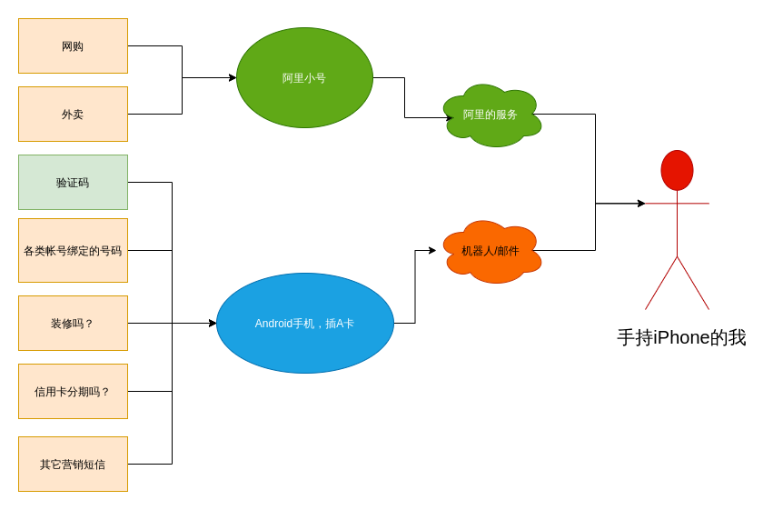

# 用闲置的安卓手机做垃圾电话短信过滤

我几乎每天都要收到垃圾短信和电话，基本都是：你买房吗？你装修吗？你分期吗？你改套餐吗？你...超级烦人，对于短信，iOS和
Android都有不错的解决方案，但是对于垃圾电话来说，没有一个好用的方案，即使安装了手机管家，也没有什么用，相反我成了
电话标注的一个数据源，它并没有帮助到我避免被打扰，只能采取打一个拉黑一个的方案，但是敌在暗处，我在明处，防不胜防。

但是，怎么能让为非作歹之人逍遥法外，我们老实人却没有应对方案？所以我要用机器来对付他们。一开始在群友的建议下，去看了
一下SIM900这类模块，但是我最后放弃了，原因是：

- 大部分都是用排线啊什么的和机器交互，我没搞过，也不想在电脑上插着这么一个东西
- 万一运营商做了检测，把我号封了就傻了，这个经常被骚扰的电话，之所以没有注销，就是因为绑定了太多东西
- 网上这些模块，大部分都是自己做的，看起来小作坊，不可靠的样子，万一坏了都没有售后
- 编程界面都是用一套AT协议

考虑到我 [之前做过一个来电拒接App](https://jiajunhuang.com/articles/2020_12_23-call_screening.md.html) ，这年头谁家里
还没有几个闲置的安卓手机呢？所以我就把我的三脚猫安卓编程知识搬了出来，首先看图，便于理解：

首先可以看到，我们日常的联系方式有短信和电话，这下面又可以分为很多种：

- 电话
    - 亲朋好友来电，这年头大家都不怎么打电话了，大部分都是微信等各类IM软件
    - 快递，但是这年头，快递一般也不打电话给我，都是直接放快递柜，或者如果电话没打通，他们就会放柜子里
    - 外卖，这个我们需要接听
    - 信用卡、移动联通电信的营销电话，这个我们想要直接拒绝
    - 各类垃圾电话，我们想要直接拒绝
- 短信
    - 验证码，这个我们需要收到
    - 各类营销短信，我们想要直接拒绝

可以看到，基本上，对于电话，我们只想收到外卖和亲朋好友的电话。他们的特征是什么呢？亲朋好友我们大概率存了电话联系人，所以可以
利用这点；对于外卖来说，很难区分快递、外卖电话和垃圾电话。我采用的方案是分流，由于垃圾售楼部卖的是我的真实号码A，而我
点外卖和注册各类软件，都是用的阿里小号，所以很自然就区分开来了。外卖和快递，电话的话，小号会直接转接到我的手机号，其余
打到我真实号码A的电话，如果不在通讯录内，并且一定时间内没有重拨，那么基本上就是各类垃圾电话。

对于短信，也是一样的，Android和iOS都有还不错的垃圾短信过滤方案，但是由于我用安卓来做过滤，我不想每天带着两个手机，因此
我需要判断是否垃圾短信，把真实的信息发送给自己，我采用黑名单和白名单一起工作的方式，基本上可以达到我的目的：只收验证码，
但是又可以主动查看所有消息。

这一套方案我用Android加服务器两端一起实现。Android我用Kotlin实现，直接在之前做的来电拒接软件上修改，
使用 `CallScreeningService` 加上自定义的规则来判断是否拒绝，此外来电时，都会向服务器报告，服务器将没有直接
拒绝的电话通过Telegram机器人发送消息给我，短信则是直接上报给服务器，Android端通过监听 `SMS_RECEIVED` 广播之后，
获取对应短信然后上报给我的服务器，服务端通过规则来判断，对于判断不是垃圾短信的，通过Telegram机器人发送消息给我。
来电的判断规则在Android端做的原因是系统规定必须在一定时间内响应。

更具体的规则，由于好不容易改变了我在明处敌在暗处的处境，我就不公开了，万一碰上一个会编程的营销，我就惨了。

最后，总结一下。这套方案目前已经跑了1天了，收到了2条漏处理的垃圾短信，过滤了5条垃圾短信，拒接了2个垃圾电话。
接下来需要继续根据垃圾短信完善一下黑白关键字名单，此外我加上了正则表达式匹配判断，垃圾短信过滤就会越来越准确。

这个方案的缺点就是比较费手机，需要一个闲置的Android机器一直在线(但是这年头谁还没有几个呢)，另外当断开WiFi时，短信无法上报，
还有一个缺点就是我没做发送短信的功能。不过这些我暂时都不需要。

从此世界清净了。
