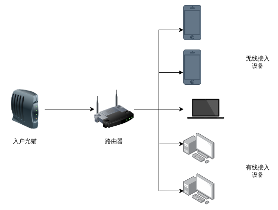
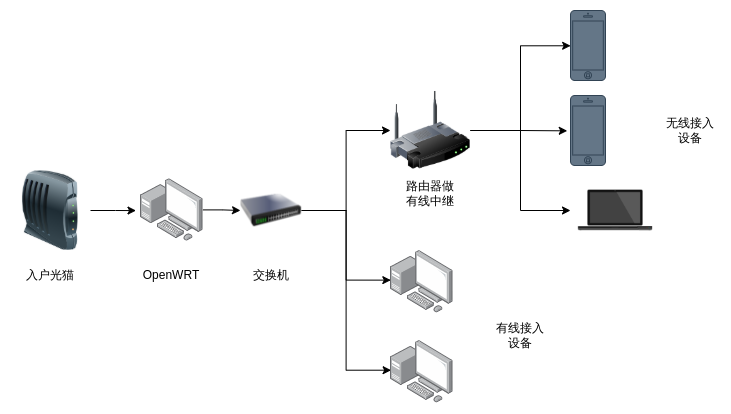

# 使用 OpenWRT 搭建软路由

绝大部分的家庭网络拓扑，都是很直接的光猫到路由器，然后分别接入有线和无线设备，如下图所示：

但是一般来说，家用路由器性能都比较拉跨，高端路由器又很贵，而且即便是高端路由器，配置也不咋滴，
但是谁还没有一个高端点的电脑呢？于是软路由计划就此展开。

## 软路由方案及硬件准备

通常路由器都是使用ARM处理器，而且都是搭配自己的硬件来卖，我们自己用电脑来搭，就叫软路由。软路由
有通常有两种形式：

- 把一台电脑直接刷 OpenWRT x86版本
- 在电脑上开一个虚拟机，并且把网口透传进去

但是他们都有一个要求：至少要有两个网口，一个用于做WAN口，一个用于做LAN口。由于不想把宿主机刷成
OpenWRT，所以我选择的是第二种方案，由于我的台式机只有一个网口，于是购入了一个双口千兆网卡和一个
五口千兆交换机以及网线数根，共花费170元，当然也可以购买四口千兆网卡插电脑上，但是明显我这个方案
性价比要高很多。

## 系统搭建

我使用 KVM 虚拟机，用 virt-manager 操作，很简单。步骤如下：

- [设置好PCI 穿透](https://wiki.archlinux.org/title/PCI_passthrough_via_OVMF) 。这一步有点难，不过目前大部分机器都支持 IOMMU 了，也不是特别难。
- 下载 OpenWRT x86 镜像，放到虚拟机镜像存储的路径
- 新建一个虚拟机，磁盘选择刚才下载的路径，然后把默认分配给虚拟机的网卡删掉
- 给虚拟机加上我们插入的 PCIe 网卡
- 开机

就这么简单，接下来还有一个比较难的步骤，OpenWRT 配置。

## OpenWRT 配置

OpenWRT 不是开箱即用的，至少都需要折腾一下网口的配置。现在一般光猫都自己拨号了，所以我们把网线插上之后，
要自己找到哪一个是WAN口，哪一个是LAN口。在两个网口的情况下，OpenWRT会默认选择一个做LAN口，一个做WAN口，
但是我们得自己确认清楚哪一个对应哪一个。此处注意，要把LAN口放在 br-lan 下，这里我折腾了好久。

如果需要拨号，那么就需要在WAN口设置好PPPoE拨号，否则，就选择DHCP从光猫那里获取网络连接。

最终，我的网络拓扑结构如下：

## 全局域网科学上网+广告拦截

这里我就不详细说了，科学上网用的是 OpenClash，讲真，配置起来也不容易，这样整个局域网都能自动上网了，广告拦截
选择的是 adblock。他们都有 luci 界面可以使用。

## 总结

使用了软路由以后，获得了如下好处：

- 网络稳定很多
- 全局自动科学上网
- 全局自动广告拦截
- 可以拦截一些国内厂商的上报
- OpenWRT的可扩展性让路由器有更多玩法，比如DDNS、下载机等等

整个过程很折腾，但是折腾完了以后很好用，我是非常推荐的。
