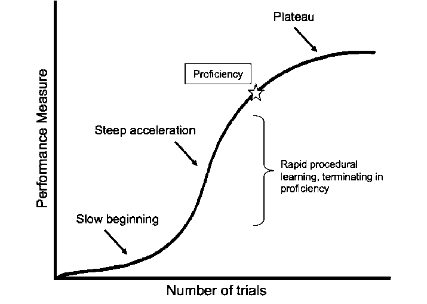

# 你好 2022(2021 年终总结)

2021年又要结束了，今年的主旋律是去杠杆，到年底基本上把杠杆降到了可以驾驭的程度，目前的杠杆率可以应对2022年的
装修了，算是完成了年初定下的目标。技术上，今年把 Redis 源码读了一遍，把 Nginx 读了一小部分，Android 开发由于
觉得拼 UI 太无聊，并且对我来说也没有太多使用场景，后来放弃了。总体上感觉技术进步不如往年大，不过这也符合预期，
年年都能有 "翻番" 的感觉，给个10年那岂不是上天了，不过这并不意味着没有了成长空间，后面我会说到。

对于时代来说，个人只是区区沙砾，对于个人来说，时代就是他的全部。每一年，都是值得记录的一年。

## 切换到远程工作

这是今年工作和生活上发生的最重大的改变，在此之前我就决定要找一份远程工作。于是加入现在的公司，离开深圳，开始了
远程工作之旅，在此要感谢公司和领导的理解和支持。终于可以分享一下自己的经验，可以说，这是一个不会让人后悔的决定，
之后我应该不会再想去现场上班了。

相比之下，远程工作节省了很多不必要浪费的时间，生活质量上也有很大的提升，比如：

- 不再需要浪费时间通勤，家里就是办公室，所有的摆设都是自己想要的样子，也不用担心用台式机、大显示器搬家难
- 在家里办公很安静，不会受到打扰，可以专心的写代码
- 对于吃，自己家的油水就是好，还可以定期回家搜刮和购买自家种的蔬菜、鸡蛋、山茶油等
- 对于住，不再需要和房东斗智斗勇(还记得以前在上海实习的时候，碰到的恶心二房东)，终于有了一个大阳台供我折腾，小菜农今年迎来了大丰收
- 生活在自己想要生活的城市，一切都是那么熟悉。不再需要隔几年又搬家一次了。

当然远程工作也不是什么都好，比如：

- 人毕竟是群居动物，经常一个人在家，有时候会觉得有些孤单。我的解决方案是周末就回家串门，偶尔和朋友聚餐，公司也会组织定期团建。问题基本解决。
- 沟通也的确更耗费时间，但是我们本来就是分布式团队，我们的方案就是提前约会议，定期沟通，所以这个问题也不大。

综合下来我觉得远程工作是一个非常值得尝试的工作方式。

## 攀爬人生的大山

去年买了房子，今年买了车子，明年要装修。之后还有很多人生的大山需要一座一座的攀登。我想，一定要在财务上做好明确的
规划和应对计划。所以今年花了很大精力去杠杆，到目前杠杆率已经比较低了，包袱少了，应对以后的大山就会更加轻松了。

一个家庭，就像一个公司一样，适当的财务规划是非常重要的。财务规划，要匹配当前的状况和未来的发展计划，要能够留下
足够的经费进行研发和再投入以扩大生产，同时还要留下足够的现金流以应对风险，必要的时候还需要考虑使用杠杆，当然我想
说一句，杠杆率太高很难受，风险也高，尽量不要碰。

在执行规划的时候，总是会遇到很多困难。比如买车这个事情，凡是这种大件，购买的时候一定会有多方的意见，归纳起来，可以整理为：

- 面子：这个就是世俗传统的面子，虚荣心。比如，买合资车，是不是就觉得更有面子，开出去不会觉得心虚？是不是觉得国产车拿不出手？甚至纯粹的就因为价格太低就觉得不行？
- 里子：也就是经济实力，或者预算多少。这一方面主要是考虑现金流和未来远期现金流。

以买车为例，车是一个不断贬值的东西，但是车是一个很有用的东西。我不想损耗太多的现金流，但是我想搞一个车来开，这就是
我的原始需求。我一度在面子和里子之间举棋不定，最后在兄弟们的力荐之下，经过多次的选车试车，最终我选择了一个很棒的国产车。
开下来半年的体验来说，现在的国产车早已不是当年的国产车了，整体体验都是非常好。而同等配置下，为了合资车的牌子，需要
多花费很多。一旦克服这一点心理障碍，就可以获得很大的收益（省到就是赚到）。

爱面子是人之常情，很多时候，我们都要为面子买单，比如豪车、豪宅、各种奢侈品。当经济条件达到了对应程度的时候，那叫
享受生活，像我这种正是需要发展经济的年轻人来说，学会把里子放在第一位来思考是非常重要的，学会了解自己真正的需求，才能
不被消费主义左右，但是这一点是很难的，因为人不是个体，个人也许可以超脱于面子之外，但是当把你放在一群爱面子的人群中，
又如何能轻易超脱其外呢？

正如 古斯塔夫·勒庞 所说 “人一到群体中，智商就严重降低，为了获得认同，个体愿意抛弃是非，用智商去换取那份让人备感
安全的归属感”。这一点就是我在买车的时候，观察自己的行为和经历得到的体悟，这一点也是之后我想要克服的地方。

学会智商在线，学会理性思考，学会了解真正的需求，冲着真正的问题所在去，才能更进一步，做出正确的决策，要实用主义，不要面子主义。

## 技术

今年在技术上，主要做到了：

- 写了48篇博客，今年的更新频率不如往年，不再是 “高产似母猪”
- 读完了 Redis 源码
- 学习了一部分 Nginx 源码
- 读了一些使用的库的源码
- 学习了 PostgreSQL 的使用

相比于往年来说，博客产量的确更少，因为感觉很多东西都写过了，太初级的也没有必要写。不过我决定以后也不再需要写那么多了，
一年做到52篇左右就足够了，毕竟技术博客是一个用来记录所学所想的东西，当学习曲线趋于平缓的时候，博客产量也无法违抗客观规律。

不过这并不意味着没有了增长空间，当一个学习曲线趋于平缓的时候，我们可以开辟另外一个领域的学习曲线，对于个人来说，试错成本很低。

比如我试过 flutter，发现没有原生能力还是不行，于是尝试原生 Android，但是发现这也太无聊了（个人兴趣不在这里），于是
放弃，学过 Rust 很多次了，但是发现学来不知道能用来做啥，于是放弃。可以看到，其实试错成本不高，大概率就是一些书钱，
以及一部分时间，当然时间是挺宝贵的，不过相比于远期损失，这也不算大。

## 2022 年的目标

2021 年已经过去，我的学习计划和 TODO 上还有很多很多事情要去做。2022 年，我想做的事情有：

- 学习前端。很多时候都感觉自己的想法被前端知识束缚了，毕竟我的前端知识还停留在老掉牙的jQuery年代，比如自己要用的一些 XXX 管理系统。
初步咨询了一下，拟定为学习 Vue 3 这一套。

- 继续学习Nginx，之前因为一些事情把 Nginx 源码学习给耽误了，2022 年需要继续搞完。学完之后，可以开始学习 TiDB 了。这两个方向，
一个是网络，一个是存储，都是很重要的东西，而且我有兴趣。

- 深入学习 PostgreSQL。2021年学会了怎么用PG，但是对PG的了解还不够深入，2022年需要深入的了解一下PG，同时再次深入的了解一次MySQL，
初定目标是把两个数据库的文档都翻一遍。

- 学习数字货币相关知识。入行早的早已暴富，我又一次错过了暴富机会。不过没关系，有些机会注定了抓不住，数字货币在我们的生活中越来
越重要了，但很多时候我都听不懂里面的术语，2022年需要了解学习一下。

- 开始实践量化。之前一直有一些三脚猫量化想法没有去实践，2022年需要搞起来，毕竟实践出真知嘛。

- 重读经典。有很多很多书，我都还只读过一次，我想把它们依次再捡起来读一遍，此外还发掘了一些新的好书，书钱不能省，买起来。

- 继续学习投资。现在还在努力的学会如何真正的看懂一个企业，路漫漫其修远兮。

- 英语练习起来。很多年都没有使用英语了，现在工作中时常需要和国外的同事对需求，但是有时候想要表达一个事情，居然
想不起该如何描述，真的应该补补了。就把女票送我的听力书每天读一读吧，2022年的目标就是读完这本书。

## 总结

无论是生活，还是技术上，每学习一个东西，都会带来一些能力，把这些能力进行整合，应该能产生更强大的力量。当我们把自己当作
是一家公司一样去经营，就会发现有很多东西是可以优化的，比如如何决策，如何规划，如何布局。2022 年，我想要做到更好，更强大，
技术上要开始找到新的领域，经济上要保持稳健，要去读更多的书，尝试把这些东西整合在一起，看看会产生什么。

2022 年，加油！
