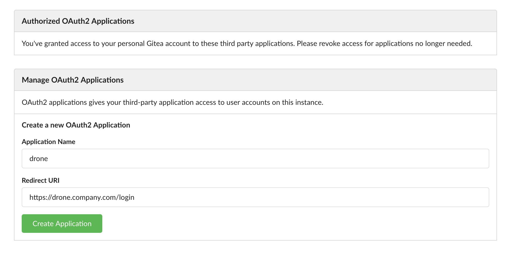
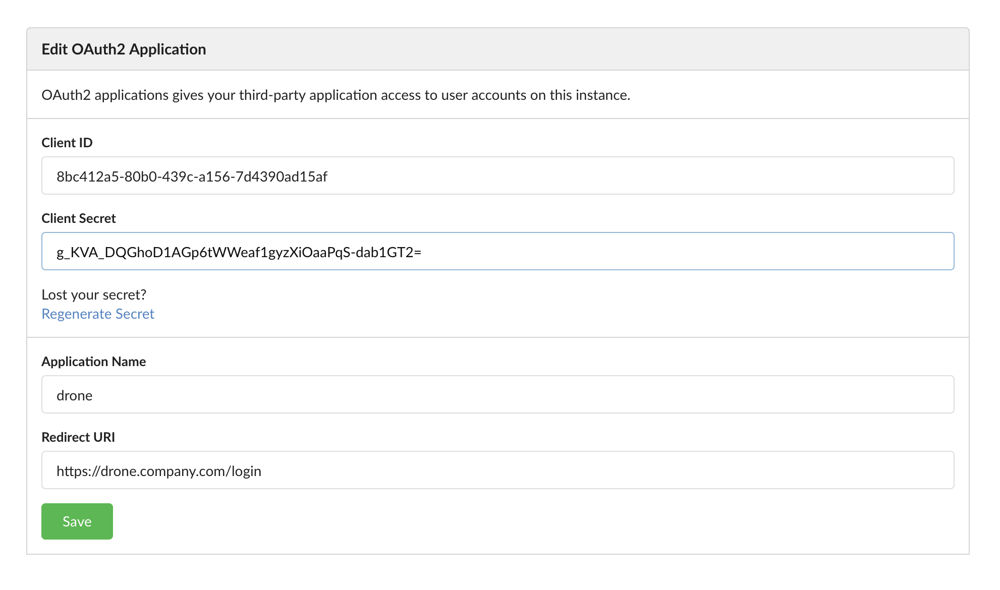
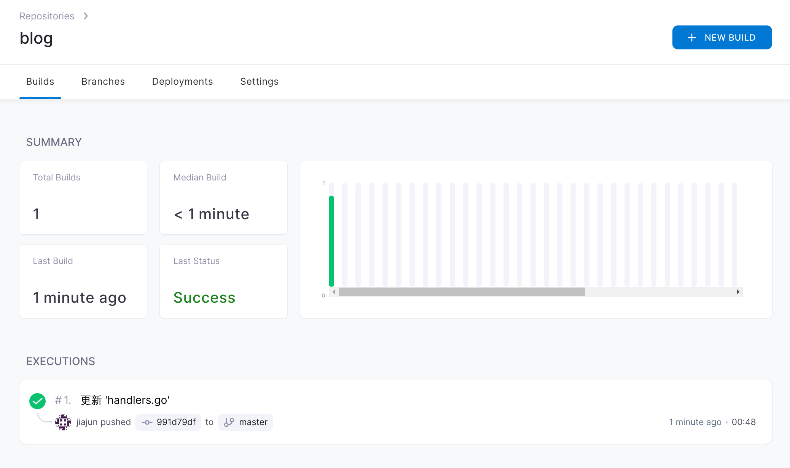

# 使用Drone CI构建CI/CD系统

我个人一直使用 `gitea` 来存放代码，之前部署一直都是用 `ansible`，每次在本地跑一个 `ansible-playbook` 命令，就在本地
编译、同步代码、同步配置、部署到服务端，服务端个人通常使用 `supervisor`，毕竟个人的小项目啥的，例如博客，就懒得Docker
镜像打包来打包去。

但是我一直没有在本地弄一个CI/CD系统，于是我搭建了一个。上一次使用DroneCI还是三四年前，那时候DroneCI刚开始开发，还处于
很不成熟的状态，现在已经成熟了很多。

## 配置 gitea OAuth app

根据 [文档](https://docs.drone.io/server/provider/gitea/)，首先要在 gitea 上
创建一个 OAuth Application 用于授权登录等，登录 gitea，点击右上角，`Settings`，
点击 `Applications`，拉到最下面，就是创建了：



填写完成之后，点击 "Create Application"，进入到下一步，保存页面上的配置，
然后保存。



另外需要生成一个共享密钥，用于Drone和Drone Runner之间鉴权。

## 下载安装 Drone

个人环境，用Docker来安装最方便：

```bash
$ docker pull drone/drone:2
```

启动Drone：

```bash
#!/bin/bash

docker run \
  --volume=/var/lib/drone:/data/apps/drone \
  --env=DRONE_GITEA_SERVER=Gitea地址 \
  --env=DRONE_GITEA_CLIENT_ID=上面的ClientID \
  --env=DRONE_GITEA_CLIENT_SECRET=上面的ClientSecret \
  --env=DRONE_RPC_SECRET=上面的共享密钥 \
  --env=DRONE_SERVER_HOST=CI域名 \
  --env=DRONE_SERVER_PROTO=https \
  --publish=0.0.0.0:8848:80 \
  --restart=always \
  --detach=true \
  --name=drone \
  drone/drone:2
```

这样，Drone就在本地跑起来了，此时我们需要配置一个域名，指向Drone所在机器的 8848
端口。

## 安装Runner

Drone 支持很多种Runner，比如跑在 k8s 里的 `Kubernetes Runner`，直接在机器上
执行的 `Exec Runner`，远程执行的 `SSH Runner`，不过个人使用，我选择 `Docker Runner`：

```bash
$ docker pull drone/drone-runner-docker:1
```

然后填好配置，启动：

```bash
#!/bin/bash

docker run --detach \
  --volume=/var/run/docker.sock:/var/run/docker.sock \
  --env=DRONE_RPC_PROTO=https \
  --env=DRONE_RPC_HOST=CI域名 \
  --env=DRONE_RPC_SECRET=上面的共享密钥 \
  --env=DRONE_RUNNER_CAPACITY=2 \
  --env=DRONE_RUNNER_NAME=ci-runner \
  --publish=8849:3000 \
  --restart=always \
  --name=runner \
  drone/drone-runner-docker:1
```

## 配置

接下来要做的事情，就是访问Drone，并且跳转登录后，激活你要使用的仓库，并且在
仓库中添加 `.drone.yml` 来触发CI/CD。比如我的，以前我是直接都在
`ansible-playbook` 里完成这些事情，但是现在有了CI/CD，我就可以这样：

```bash
---
kind: pipeline
type: docker
name: default

steps:
- name: vet & build
  image: golang:1.17
  environment:
    GOOS: linux
    GOARCH: amd64
    CGO_ENABLED: 0
    GOPROXY: https://goproxy.cn,direct
  commands:
    - git submodule update --init --recursive
    - go vet ./...
    - go build -trimpath .

- name: build dist
  image: node:14
  commands:
    - cd frontend/
    - npm ci
    - npm run build

- name: deploy
  image: plugins/ansible:1
  settings:
    playbook: deploy.yml
    inventory: hosts.ini
    private_key:
      from_secret: ansible_private_key
  when:
    event:
    - push
    - tag
```

然后在Drone中，点到该仓库的配置中，添加一个 `Secret`，将ssh密钥贴进去。

到这一步，就可以成功的触发构建了，往仓库中推一个代码试试，就可以看到已经开始
构建并且部署了。



## 总结

这篇文章记录了我搭建个人使用的 CI/CD 系统的过程，通过使用 Gitea + Drone CI
完成自动化集成、交付和部署，从而解放劳动力不再需要手动构建和部署。
