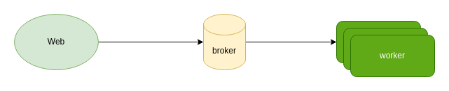
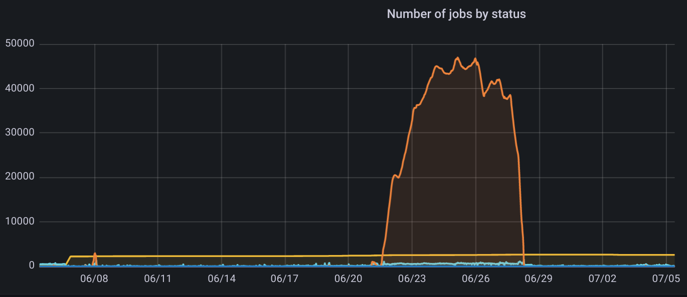

# 任务队列简介

在很多系统中，为了解耦，或者处理需要较长时间的任务时(例如，有些网络请求可能很慢，或者有一些请求属于CPU密集型，需要
等待一段时间)，我们通常会引入任务队列。典型的任务队列由下面三部分组成：



- 第一部分是生产者，常见的有两种，一种由用户触发，例如web应用中，用户验证邮箱时，需要发送请求到邮件供应商；另外一种由
机器触发，例如定时任务，我一般称之为 scheduler。
- 第二部分是message broker，属于一个中间件。broker 的作用，是用来持久化消息，并且提供一些例如 ACK，超时重试等功能的，
主要用来保存各种消息/任务相关的状态。
- 第三部分是消费者，通常在应用中都是worker。worker负责从broker中取出对应的消息或者任务，并且根据类别执行对应的代码进行消费。

## 常见broker

通常，我们会使用这些中间件做broker(也还有其它选择，但是不那么普遍)：

- Redis
- SQS
- RabbitMQ
- RocketMQ
- Kafka

对于broker，我们通常要求能做到：

- 持久化，不能broker宕机之后，消息全丢失了
- FIFO(或大致有序)，这样可以保证任务基本上是按照入队顺序进行消费的，有一些可以保证严格有序，有一些只能保证大致有序
- 保证消费一次/最少消费一次/ACK，这样可以保证任务得到消费
- 优先级 Priority，这样可以区分不同功能的优先顺序，如果broker不支持，也可以在框架层配置多个queue来实现
- dead letter，用于存储执行失败的一些任务
- 延时任务，用于执行一些需要等待一段时间的任务

并不是所有的broker都具备上述的功能，例如 Redis 就没有ACK，也没有优先级，但是 Redis 作为日常使用来说，仍然是够用的。

## 入队阻塞 和 出队阻塞

在入队和出队时，我们都可以选择是否需要阻塞，这取决于我们的业务场景，例如当队列满时，入队阻塞会导致对应web请求卡住；
对应的，当队列为空时，出队阻塞会导致消费者阻塞。对于一般的应用来说，我们都会选择出队阻塞。

## 队列监控

对于任务队列本身，我们也许要进行一些监控，主要包括：

- 健康检查
- worker 数量、状态
- 总任务数量/排队中、完成、失败、执行中、延时任务数量以及百分比
- 队列数量/每个队列中任务数量以及百分比
- 任务执行时间、状态

## 流量削峰

当我们进行监控之后，偶尔我们会看到一些流量顶峰，这个时候就涉及到一个问题：流量削峰。



出现流量峰值的时候，通常是用户突然激增，或者搞活动，其实并没有很好的办法。通常，如果是搞活动，也就是预料之中的事情，
我们能做的也就是两件事：

- 应用层控制流量，进行限速。这样就不会产生大量的任务。
- 提前扩容，提前将worker机器扩容(通常是水平扩容，也就是加机器，也可以垂直扩容，也就是升配置)

对于突发的流量激增，我们能做的也就是紧急扩容，如果做得好的话，可以配合监控做自动扩缩容，这就对infra层有一定的考验。

## dead letter

任务队列中，不可避免的会出现一些任务执行失败的场景，为了复现，我们通常需要一个专用的队列用于存储该任务，通常就是我们所说的
dead letter。对于dead letter，我们通常是检查 dead letter 的日志，找到根本原因之后，再次将该任务入队重试。dead letter本身
存在的意义也就是存储任务执行失败的信息，例如参数、日志，方便排查问题，以便重现和修复。

任务失败时，除了立即移到dead letter queue，我们还可以配置重试策略，例如重试3次，3次都失败以后，移到dead letter queue中。
对于任务重试，我们通常都会采用指数回退进行延时。

## 任务粒度和调度

对于最简单的情况，一个任务就是一个任务，这种情况下，任务的粒度非常小，例如给用户发送邮件。还有一种情况，一个任务下可能
包含多个子任务，这种情况下，为了简化应用层代码，通常我们都会在任务框架中实现，例如：

```bash
TaskA - Job1
      - Job2
      - Job3
      - ...
```

也就是一个任务中包含了多个子任务，子任务之间还有可能会有依赖的情况，例如创建虚拟机这个任务就包含多个子任务，并且最后
一步启动虚拟机的前提一定是前面的步骤都执行完了。

当子任务之间有依赖时，最简单的办法就是线性执行，依赖描述中写明执行顺序，我们按照顺序一个一个来。还有一种复杂一些的办法，
就是采用有向无环图，将任务之间不会互相依赖的，做到并发执行，但是后者的难度通常会高不少。

## 总结

这一篇文章中，介绍了任务队列典型的架构、常见的broker，以及任务队列中会涉及到的一些场景和概念，希望对大家有所帮助。
